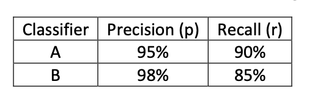

# Machine Learning Strategy

After building our neural network, we must tune hyper parameters or optimize the NN architecture, with an appropriate goal.

Ideas to tune our model like:

# Orthogonalization

When we change a component of an algorithm, we do not want other components to be changed. We can be easier to improve our algorithm with an orthogonal system.

There are 4 assumptions need to be true when designing a supervised learning system, and there are also solutions to meet them orthogonally:

1. Fit **training set** well on cost function: Try a bigger NN or use a better optimization algorithm like Adam.
2. Fit **dev set** well on cost function: Use regularization or a bigger training set.
3. Fit **test set** well on cost function: Use a bigger dev set.
4. Performs well in **real world**: If not, dev set is not set correctly or cost function is not evaluating the right thing (reset dev set or change cost function).

# Single Number Evaluation Metric

## Two Metrics

In a Cat vs Non-Cat classification problem, there are four probabilities for our predicted results:

Accorading to the four probabilities, there are two metrics to measure the model performance.

**Precision:** 

True cats proportion in all predicted cats.

**Recall:** 

Cats proportion in all correct predicted examples.

## Single Metric

Supposed there are two classifiers:

**Classifer A:** Good at finding cats though blurred cat pictures, but wrong predictions are more.

**Classifer B:** Eliminates all not sure cat pictures, however, many true but blurred cat pictures are missed.

Generally, we cannot select a best classifier according to the two metrics, so we can use a **harmonic mean** of them, which called **F1-Score**.

As the following table shown, we can use classifier as our expected classifier.

# Satisfying Metric and Optimizing Metric 

Assuming we have three classifiers here:

In this case, accuracy and running time are both the evaluation metrics.

**Accuracy Should Be Optimizing Metric:** We want the classifier's accuracy is as higher as possible.

**Running Time Should Be Satisfying Metric:** Running time is not the premier metric we want to improve, and in this case, the only requirement on running time is under 100 ms. Once we satisfy this requirement, we do not need to improve running time anymore.

**Note:** There is supposed to be only one optimizing metric and all others are satisfying metrics.

# Guidelines of Train/Dev/Test Set

## Distrubutions & Sizes

**Distribution of Train/Dev/Test Set:** The three data set must be from the **same distribution** and be taken **randomly** from all the data.

**Size of Train/Dev/Test Set:** (Refer to Chapter 6: Utilities of Deep Learning). Aside, set **dev set** to be big enough to **detect differences** in algorithms/models and set test set to be big enough to give high confidence in the overall performance of your system.

**When to Adjust Dev/Test Set:** If doing well on your dev/test set does not correspond to doing well on your application, change your dev/test set. For instance, your dev/test set are all HD pictures, but user images are blurred, so that you must change your dev/test set to make your application a better performance.

## How to Divide Different Distribution

Assuming we have two types of data sets:

Quantity of HD images (from web) is **200,000**

Quantity of blurred images (from app) is **10,000**

Although images from app are so less than images from web, in reality most of images are blurred, so we must increase training and test on blurred images.

**For training:** HD images from web are abundant so we can train with them, but blurred images are also crucial or else the algorithm will have a poor performance on blurred images.

**For dev/test:** In reality, all images inputed are blurred, so it is no need to test for HD images. Just put all remaining images to dev/test set.

Dividing result: 

Training set: **Web (200,000)** & **App (5000)**

Dev set: **App (2500)**

Test set: **App (2500)**

# Adjusting Metric: Increasing Punishment

We have two classifier algorithms, and their error rate ratios here:

Although algorithm A has a less error, but it is letting through a lot of pornographic images, which we never want to happen. That means what cause the 3% error are almost pornographic images.

To prevent it, we need to adjust the error metric from:

into:

So that, a pornographic image will be regarded as 10 misclassified images.

# Comparing to Human-level Performance

ML progresses slowly when it surpasses human-level performance because the human-level is close to Bayas optimal error *(the best possible error, i.e. any functions mapping from x to y cannot surpass the certain level of accuracy)*, especially for natural perception.

Also, when ML is under the human-level, it can be improved through:

- Getting labeled data from humans
- Gaining insight from manual error analysis: *Why did a person get it right?*
- Further analysis of bias/variance

## Avoidable Bias

Sometimes, the goal of ML is to meet the human-level, particularly like perception tasks, so it is fine that algorithm's error is not near 0. By comparing with human-level, we can know whether there is a avoidable bias that we need to eliminate.

For the following example:

**Scenario A:** There is **7% gap** between the training set and the human level error (very **larger** than gap between training and dev). It means our model is under fitting, witch is a **high bias problem**, so we need to use bias reduction techniques like a bigger NN or a longer training.

**Scenario B:** There is only **0.5% gap** between the training set and the human level error (**less** than gap between training and dev). So, what we should do now is reduce the difference between the training set error and the dev set error. We can see it as **high variance problem**, using techniques like regularization or a bigger training set.

## How to Choose an Appropriate Human-Level Error

Human-level error can be seen as a proxy of Bayas error. How should we choose an appropriate value as human-level error that is also the proxy of Bayas error?

Example: Medical Image Classification

The definition of human-level error depends on the purpose of the analysis. If we need to classify different radiology images and predict the according diagnostic classification decision, we should use 0.5% as human-level error, so Bayas error is lower or equal to 0.5%.

## Surpassing Human-level Performance

Dealing with structured data, ML may generally have a better performance, such as:

- Online advertising
- Product recommendations
- Logistics (like predicting transit time in airports)
- Loan approvals

If we use human-level error as Bayas error proxy, once training error and dev error are less than human-level error, we cannot know whether high bias problem or high variance problem there is by directly conventionally comparing the difference of different errors, but it does not mean this model cannot be improved, such as Scanario B in the following table:

## Summary

**Note:** There is another possibility of the great gap between training error and dev error is **data mismatch**. To clarify whether the problem is big variance or data match, we can add a new data set called **Training-Dev Set** which has same distribution as training set but not used for training.

So, the gap between **training error** and **traing-dev error** is **big variance**, and the gap between **training-dev error** and **dev error** is **data mismatch**.

How to address data mismatch? Learn it in the below part.

# Analyzing Error

> If our cat classifier is 10% error on test set, should we try to make the cat classifier do better on dogs?

It is necessary to make error analysis before blindly training on dog pictures.

1. Get up to 100 mislabeled dev set examples
2. Count up how many are dogs

If dogs are only 5% of the 100 examples, the performance improvement is up to 0.5% (error from 10% to 9.5%).

## Using Spreadsheet to Evaluate Multiple Ideas in Parallel

There are many other ideas on misrecognization, and we can list them in a spreadsheet to compare together.

| Image No.  | Dog  | Great Cats (Lions, Panthers, etc...) | Blurry | Instagram | Comments |
| ---------- | ---- | ------------------------------------ | ------ | --------- | -------- |
| 1          | ✓    |                                      |        | ✓         | Pitbull  |
| 2          |      |                                      | ✓      | ✓         |          |
| 3          |      | ✓                                    | ✓      |           |          |
| ...        | ...  | ...                                  | ...    | ...       |          |
| % of total | 8%   | 43%                                  | 61%    | 12%       |          |

Through this statistic, we can learn that great cats and blurry pictures are the main reason in misrecognization.

## Cleaning Up Incorrectly Labeled Data

**For Training Set:** DL algorithms are quite robust to random errors (mislabeled error) in the training set.

**For Dev Set:** 

There are two different classifers, and here are their performances on dev set:

|           Error Type           | Classifer A | Classifer B |
| :----------------------------: | :---------: | :---------: |
|     Overall Dev Set Error      |     10%     |     2%      |
| Errors due to Incorrect Labels |    0.6%     |    0.6%     |
|   Errors due to Other Causes   |    9.4%     |    1.4%     |

Although their Mislabeled error have the same ratio, reducing it for classifer B will have a better improvement than for classifer A.

Goal of dev set: Help you to select between two classifers A & B.

### How to correct incorrect dev/test set examples?

1. Dev and test set must be applied the same process to make sure they continue to come from the same distribution.
2. We may also need to examine examples that recognized correctly, because it may be just luck.
3. After correcting, training set and dev/test set may now come from slightly different distributions.

# Process Building a ML System

For example, we are going to build a speech recognition system:

- Choose dataset: Noisy background, Accented speech, Far from microphone, Young children's speech, Stuttering (like work "uh", "oh", "um", ...)
- Set up dev/test set and metric
- Build an initial system **quickly**
- Use Bias/Variance analysis to prioritize next step.

**Guideline:** Build your first system quickly, and then iterate.

# Addressing Data Mismatch

If there is a huge difference (gap) between **training-dev set** and **dev set**, it may be data mismatch.

To address the mismatch data, there are two ways:

- Carry out error analysis introduced above to try to understant difference between training and dev/test sets.
- Make training data more similar to dev/test set.

## Artificial Data Synthesis

If we need to make a in-car speech recognition system, it is hard to collect data of in-car audio for training.

However, we can synthesize in-car audio artificially.

**Problem of artificial data synthesis:** Assuming that there are 10,000 hours voice but only 1 hour car noise, the synthesized data might be just a small subset of the set of all in-car audio.

# Transfer Learning

If we have a trained image recognition network that can recognize cats, birds, etc..., we want to transfer the network and make it able to read X-ray scans (in radiology diagnosis) now.

**To transfer this network:** Remove the output layer (including weights), initialize new random weights and retrain with radiology data.

- Training the original network including all layers and all parameters.
- Change data set to a new X, Y set.
- Initialize weights of the last layer.
- Retrain this network.

## Pre-train & Fine-tuning

In fact, when we have plentiful data, we can retrain more than 1 layers of the original network and retrain all parameters in the network.

If we retain all parameters, the stage we training the original network can be called **pre-training**, and the stage we change data set and re-training can be called **fine-tuning**.

For example, we have trained a speech recognition system that can output transcripts, and we want to trigger words detection system (trigger words like "Hey, Siri." "Ok, Google.").

We removed the output layer, and add new output neuron (or even some new layers).

## When to Use Transfer Learning (Task A -> Task B)

1. **Task A and B have the same input X:** Cannot transfer a image recognition network to a voice recognition network.
2. **A lot more data for Task A than Task B:** Transfer learning is usually used when there is little data for training.
3. **Low level features from A can be helpful for learning B:** For example, when transferring an image recognition system to an X-ray scan recognition system, learning image recognition ability can teach the algorithm enough about images features.

# Multi-task Learning

If an image has multiple labels and we want our algorithm can learn them at the same time, we can use multi-task learning.

## Labels

In this example, an image can have multiple labels like pedestrians, cars, stop signs and traffic lights. So, we use a four dimensional vector as $y$ and $Y$ is a 4 by m matrix.

## Network & Loss Function

Build NN like:

As there are four labels in one image, so we need the network has four outputs (make the output layer four neurons).

For loss function, we can calculate loss for every label and compute the sum.

$J=\frac{1}{m}\sum_{i=1}^{m}\sum_{j=1}^{4}L(\hat{y}_j^{(i)}, y_j^{(i)})$

**Note:** If some labels are not marked in an image, we just ignore it. For example, we use "?" to represent unlabeled situations.

In the first example, we only labeled the first and the second labels, so we only calculate losses for the two label and add them up.

## When to Use Multi-task Learning

1. **A set of tasks that can benefit from having shared lower-level features:** In the example of autonomous driving, pedestrians, cars and traffic lights can help the algorithm to recognize stop signs because they are features of roads.

2. **Not always true, every task has the similar amount of data:** Assuming that we have 100 tasks ($A_1$...$A_{100}$), and every task have 1000 examples. For one single task, 1000 training examples are a small amount for training, however, when we training other 99 tasks, which aggregate 99000 examples, can give a lot of knowledge to augment every single task.

   

3. **Possible to train a big enough neural network that can do well on all the tasks:** If we do not want multi-task learning to have lower performance than training a separate NN for each task, we need to training a so big network that can very rarely hurt performance.

# End-to-end Learning

Without manual handling voice data features, using NN to ouput transcripts (or output phonemes first and then output transcripts) directly from audio is called end-to-end learning, but **a large data set** is necessary to training a good algorithm with the end-to-end approach.

## Pros & Cons

So, collecting enough data is a crucial point for end-to-end learning.
