# Convolution Neural Network

When dealing with a large image (such as a cat picture wih 1000*1000 pixels and 3 RGB channels, totally 3 million arguments), it is inefficient to train with normal neural network like below:

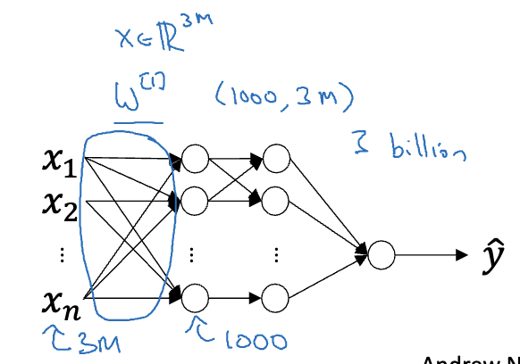

We can use convolution neural network to deal with data set like that.


# Convolution Operation

Convolution operation can capture vertical or horizontal edge features of images.

## Arithmetic Principle

Given a grey-scale map like:

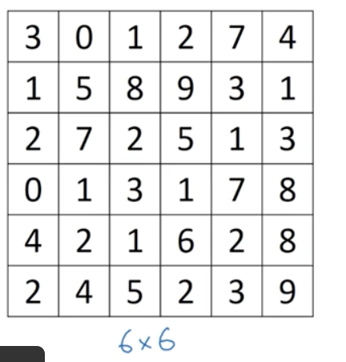

For instance, if we want to detect vertical edges in this image, we can construct a filter (or called convolution kernel) like:

$filter=\begin{bmatrix}
1 & 0 & -1 \\
1 & 0 & -1 \\
1 & 0 & -1
\end{bmatrix}$

**Starting Convolution:** We have a 3 by 3 (so, kernel size is 3) filter now. We select first 3 rows and 3 columns of the input image (i.e. X[0:3, 0:3]) as a slice, and element-wisely multiple the slice with the filter, and add up the result matrix into a single integer.

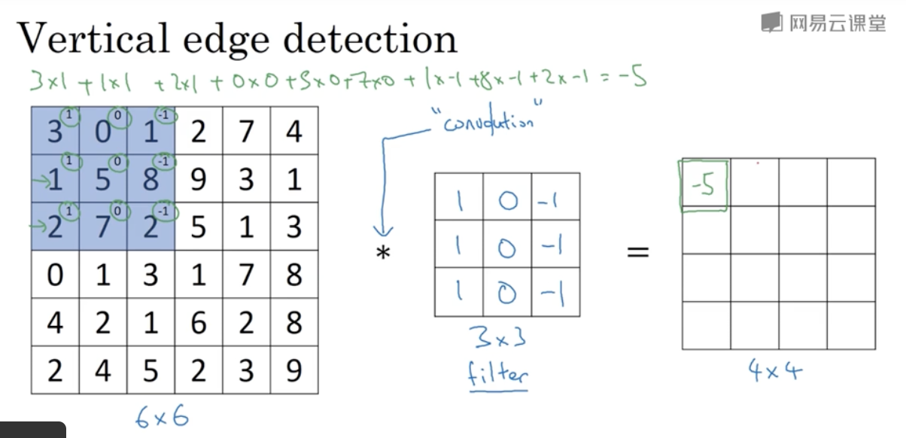

Move the selection one step right (now slice is X[0:3, 1:4]) and repeat the operation above.

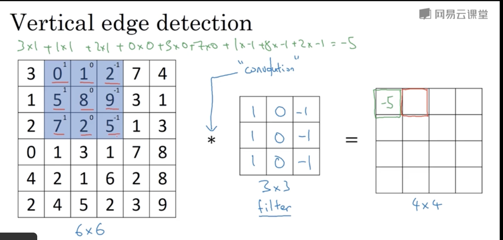

Until we iterate the whole input matrix, we will get the result like:

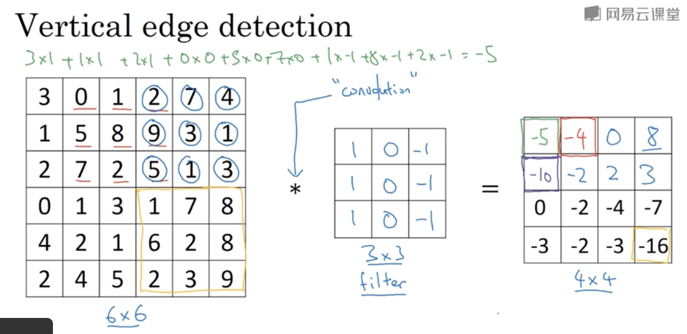


When we increase the contrast ratio, we can clearly see a vertical feature on the result matrix:

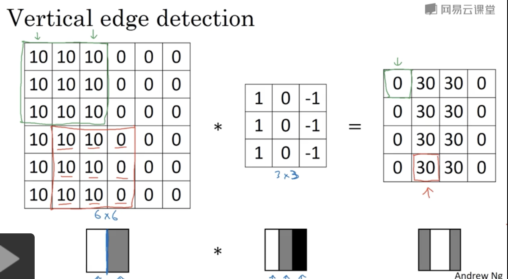


## Convolution Kernel

Let's focus on the kernel (filter) we just used.

### Vertical Filter

We put all 1 on the left column and all -1 on the right column, so we can detect the direction of the edge.

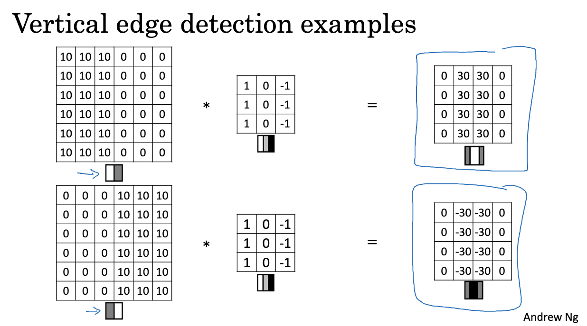


### Horizontal Filter

Similar to the vertical filter, we can construct the horizontal filter like:

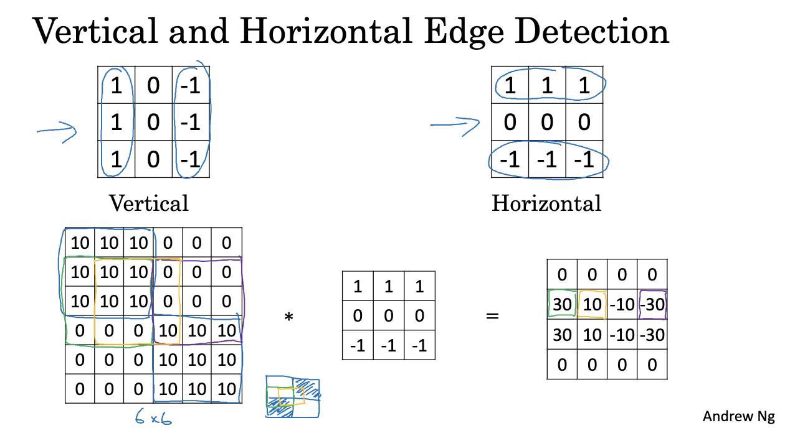

### Training Filter

We can use parameters to fill out the filter, and get the appropriate parameters through gradient descent.

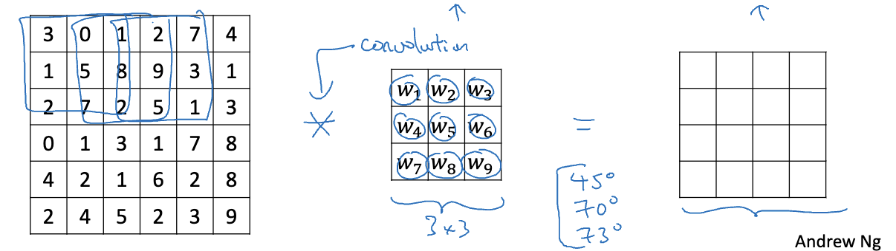


## Padding & Stride

We can conclude that the size of result matrix can be computed with:

$length=\lfloor \frac{n+2p-f}{stride}+1\rfloor$

where:

$n$ is input length,

$p$ is padding,

$f$ is kernel length.


### Padding

In the normal, the result matrix is samller than the original input matrix. If we pad the input matrix with zeros first and then do convolution operation, we can make the result matrix size same as the input matrix.

For instance, we have input matrix 6 by 6, kernel size 3 by 3. Padding one row or one column zeros at four directions of this matrix, we can get a 8 by 8 matrix. Now, the result length is $\frac{6+2\times 1-3}{1}+1=6$.

#### There are two types of convolution according to whether padding is zero or not:

- **Valid:** No padding. 

  Input (6 by 6) * Kernel (3 by 3) -> Output (4 by 4)

- **Same:** Appropriate padding to make output size same as the input size.

  Input (6 by 6 padding to 8 by 8) * Kernel (3 by 3) -> Output (6 by 6)

  Calculate padding using $p=\frac{(n-1)*stride-n+f}{2}$.

   

### Stride

Stride is the step we move the selection. In the above examples, we always let stride 1.

### Out of the Border

Assuming we have input matrix size 6 by 6, when stride=2, the selection may be out of the matrix. In fact, we **must** assure that the section totally in the matrix, so we can only give up selecting the edge data.

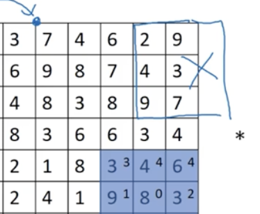

So, the output size is 2 by 2. That is why we need compute floor for the output length.


## Different from Mathematical Convolution

In the math, convolution operation needs to flip the kernel matrix first, but we generally do not do that in deep learning.

In fact, the operation convolution without flipping kernel is called cross-correlation in math.


# Multi-channel Convolution

An RGB image matrix's dimension is generally $HEIGHT*WIDTH*CHANNEL$.

For instance, suppose that the input image size is $6\times 6\times 3$.

Its output is still a 2D matrix.

So, the kernel should also be 3D like $3\times 3\times 3$.

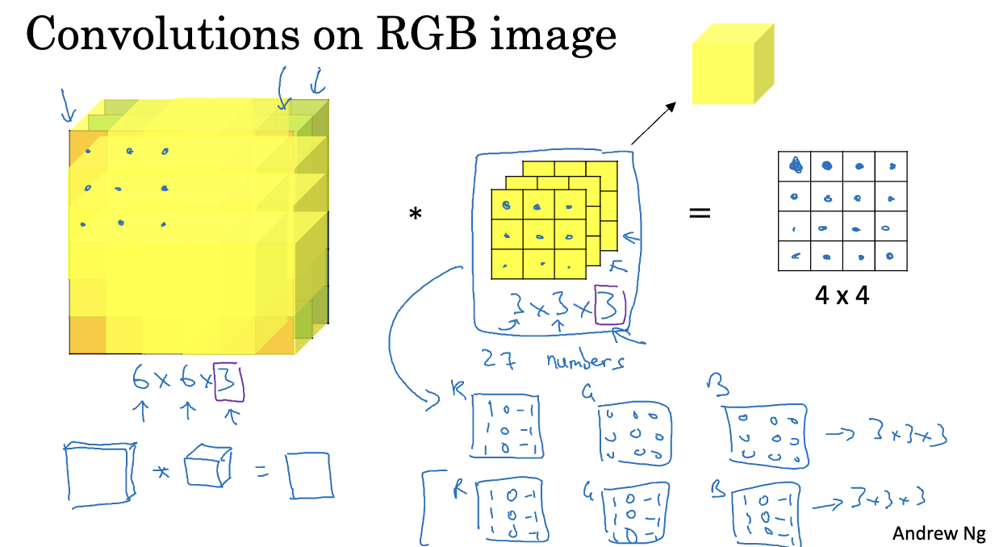

If you want to detect RED channel only, you can make G and B channel's kernel all zeros.


## Multiple Filters

We can have multiple filters for an input and get multiple outputs.

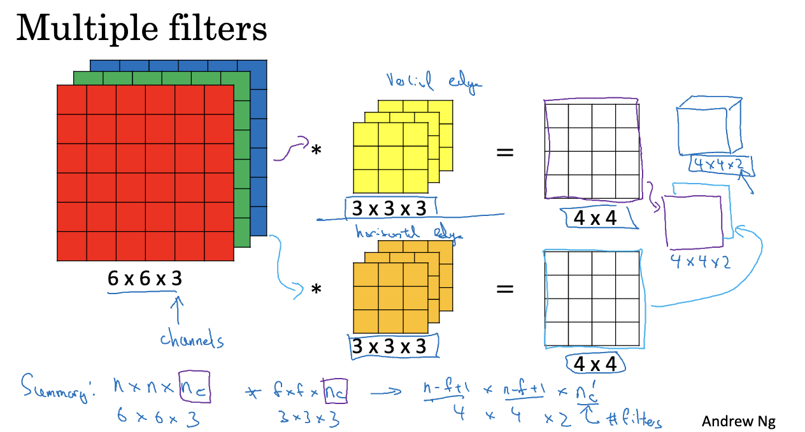

In the above example, we use "yellow" filter to detect vertical edges and use "orange" filter to detect horizontal edges.

Combine all outputs together, we can get a 3D output when multiple filers.


# Convolution Network

## Single Convolution Network

A convolution layer can be represent as $z^{[1]}=w^{[1]}a^{[0]}+b^{[1]};a^{[1]}=g(z^{[1]})$.

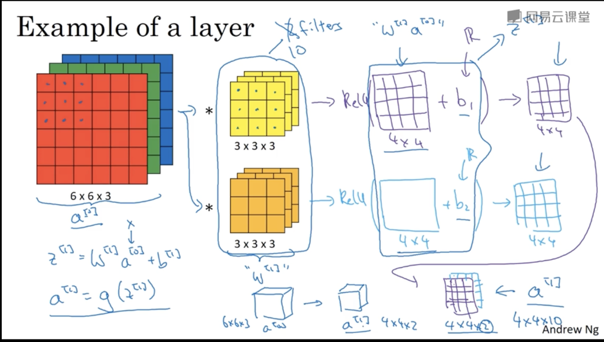

$a^{[0]}$: Input Matrix

$w^{[1]}$: Filter(s)

$b^{[1]}$: Every output should add with a bias constant.


### How many parameters?

>  If you have 10 filters that are 3x3x3 in one layer of a neural network, how many parameters does that layer have?

One filter has $3\times 3\times 3=27$ parameters, and every output adds one bias parameter $27+1=28$. There are 10 filters, so $28\times 10=280$.


## Notation Summary

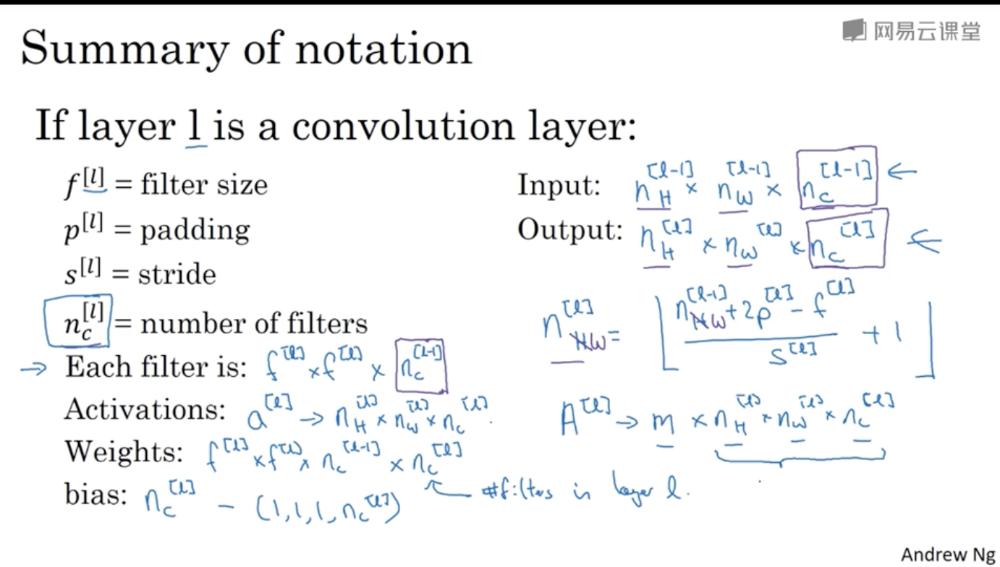

## Simple ConvNet

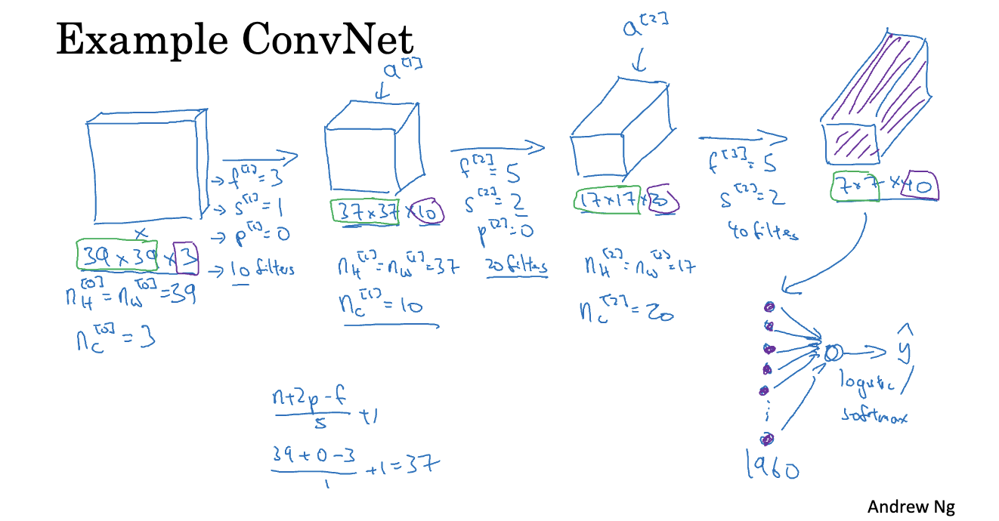

There are three types of layers:

- Convolution layer (CONV)
- Pooling layer (POOL)
- Fully connected (FC)

## Pooling Layer

Pooling layer computation is similar to convolution layer's selection moving, but pooling layer computation does not element-wisely multiply and sum.

### Max Pooling

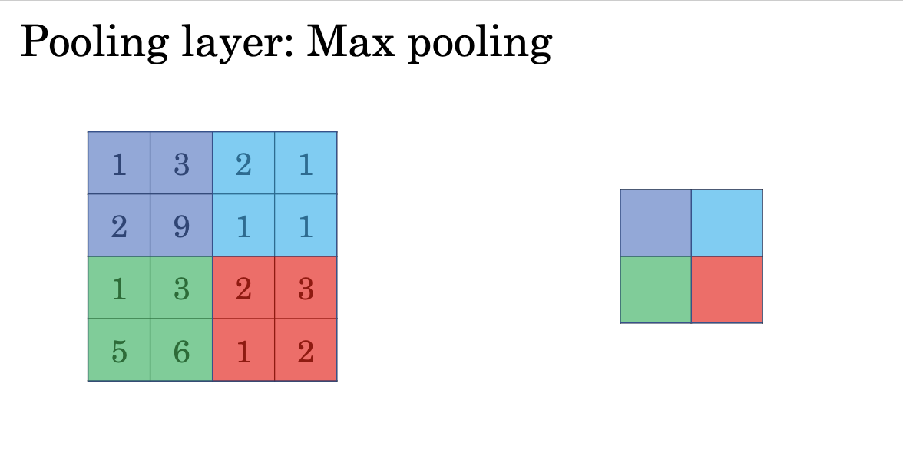

For a 2x2 max pooling filter, we just compute $max(X_{slice})$.

If inpute data has multiple channels ($n_c > 1$), we need to compute every layer separately, and combine them to a $2\times 2\times n_c$ matrix.


### Average Pooling

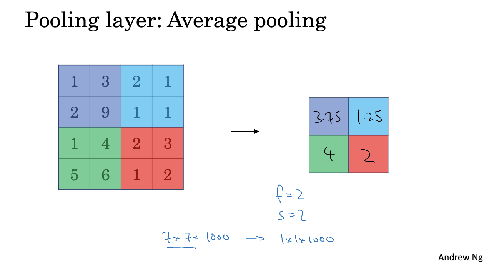

Similar to max pooling, the average pooling compute the average for input's slice.


## CNN Example (LeNet-5)

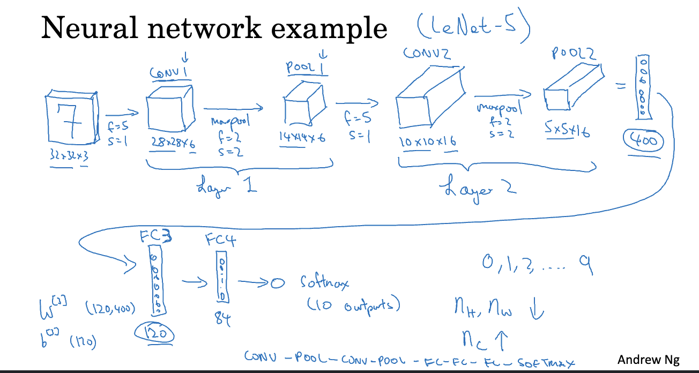

## Advantages of CNN

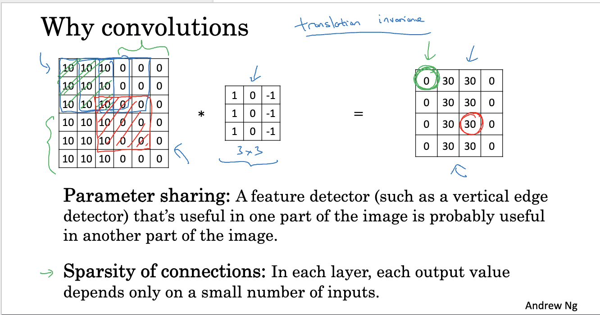


# Using PyTorch to Build CNN

Import PyTorch modules.

```python
import torch
from torch import nn
from torch.utils.data import DataLoader, TensorDataset
```


Build a simple NN.

We want to build a SAME CNN. Unfortunately, `nn.MaxPool2d`'s padding argument can only pass integer, so we need to calculate padding ourselves.

```python
# Calculate padding for 'SAME' padding
def calculate_same_padding(input_size, kernel_size, stride):
    pad = ((input_size - 1) * stride + kernel_size - input_size) // 2
    return pad
```

```python
class CNNNetwork(nn.Module):
    def __init__(self):
        super().__init__()
        self.flatten = nn.Flatten()
        self.cnn_stack = nn.Sequential(
            nn.Conv2d(in_channels=3, out_channels=6, kernel_size=5, stride=1, padding='same'),
            nn.ReLU(),
            nn.MaxPool2d(3, stride=1, padding=calculate_same_padding(64, 3, 1)),  # padding mode 'same'
            nn.Conv2d(in_channels=6, out_channels=16, kernel_size=5, stride=1, padding='same'),
            nn.ReLU(),
            nn.MaxPool2d(3, stride=1, padding=calculate_same_padding(64, 3, 1)),
            nn.Flatten(),
            nn.Linear(in_features=64 * 64 * 16, out_features=6)
        )

    def forward(self, x):
        x = self.cnn_stack(x)
        return x
```


Hyperparameters, loss function and optimizer.

```python
model = CNNNetwork()
learning_rate = 0.0001
epochs = 150
minibatch_size = 64

loss_fn = nn.CrossEntropyLoss()
optimizer = torch.optim.Adam(model.parameters(), lr=learning_rate)
```


Load dataset.

```python
# train_set_x_orig, test_set_x_orig, etc. are numpy arrays.

X_train = torch.tensor(train_set_x_orig).type(torch.float32)  # dim: (example, img_H, img_W, channels)
X_test = torch.tensor(test_set_x_orig).type(torch.float32)  # dim: (example, img_H, img_W, channels)

Y_train = torch.tensor(train_set_y_orig.reshape(train_set_y_orig.shape[1], ), dtype=torch.long)  # dim: (labels, )
Y_test = torch.tensor(test_set_y_orig.reshape(test_set_y_orig.shape[1], ), dtype=torch.long)  # dim: (labels, )

train_dataset = TensorDataset(X_train, Y_train)
test_dataset = TensorDataset(X_test, Y_test)

train_loader = DataLoader(train_dataset, batch_size=minibatch_size, shuffle=True)
test_loader = DataLoader(test_dataset, batch_size=minibatch_size, shuffle=True)
```


Training and test process.

```python
def train_loop(dataloader, model, loss_fn, optimizer):
    model.train()
    for batch, (X, Y) in enumerate(dataloader):
        pred = model(X.reshape(-1, 3, 64, 64))  # Input dimension must be (examples, channels, img_H, img_W)
        loss = loss_fn(pred, Y)

        loss.backward()
        optimizer.step()
        optimizer.zero_grad()

        if batch % 10 == 0:
            print(f"[{batch * minibatch_size + len(X):>5d}/{len(dataloader.dataset):>5d}] Loss: {loss.item():>7f}")

def test_loop(dataloader, model, loss_fn):
    model.eval()
    test_loss, correct = 0, 0

    with torch.no_grad():  # This is required to prevent computing dw, db and so on
        for X, Y in dataloader:
            pred = model(X.reshape(-1, 3, 64, 64))
            test_loss += loss_fn(pred, Y).item()
            correct += (pred.argmax(1) == Y).type(torch.float).sum().item()

    test_loss /= len(dataloader)
    correct /= len(dataloader.dataset)

    print(f"Test loss: {test_loss:>7f}\nTest accuracy: {correct*100:>0.1f}%\n")
```


Start iteration.

```python
for t in range(epochs):
    print(f"Epoch {t+1}:")
    train_loop(train_loader, model, loss_fn, optimizer)
    test_loop(test_loader, model, loss_fn)
print("Finished!")
```


Test.

```python
index_of_test_set = int(input(f"Enter the index of test set (0~{m_test-1}): "))
with torch.no_grad():
    pred = model(X_test[index_of_test_set].reshape(1, 3, 64, 64))
    plt.imshow(test_set_x_orig[index_of_test_set])
    print(f"Class: {pred.argmax(1).item()}")
```


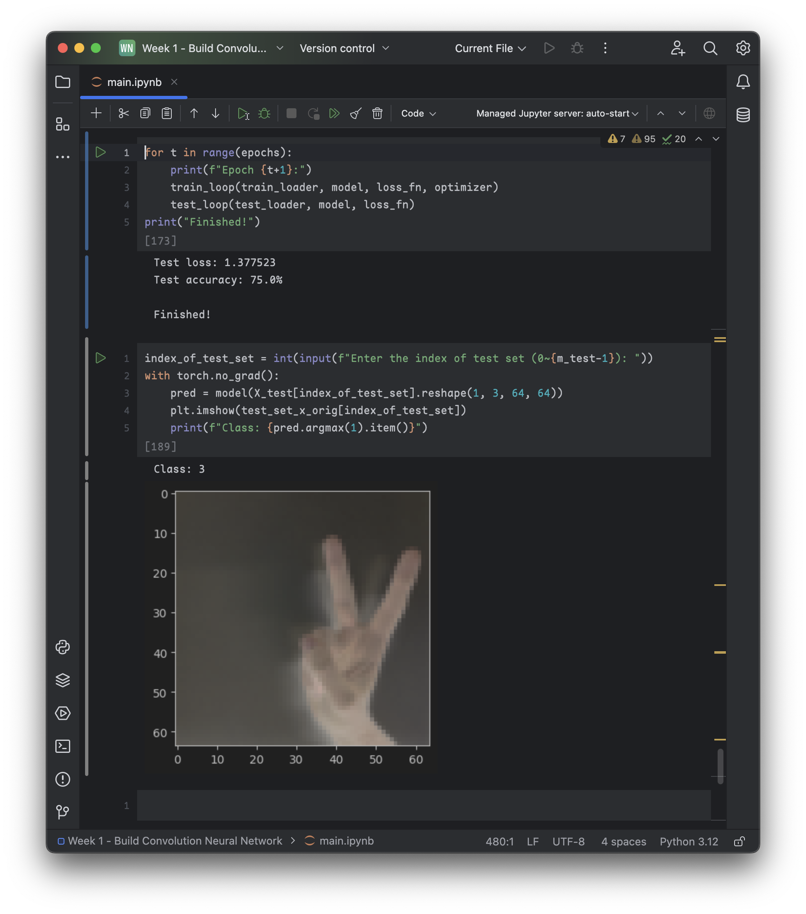

Oops :(
