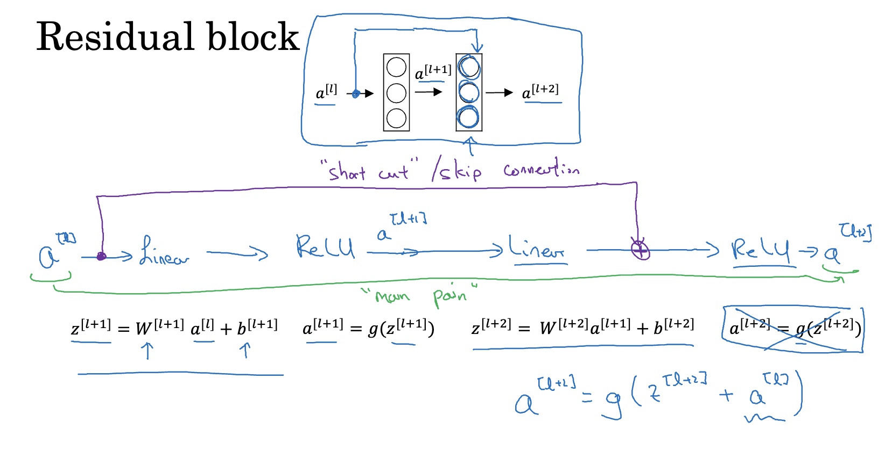
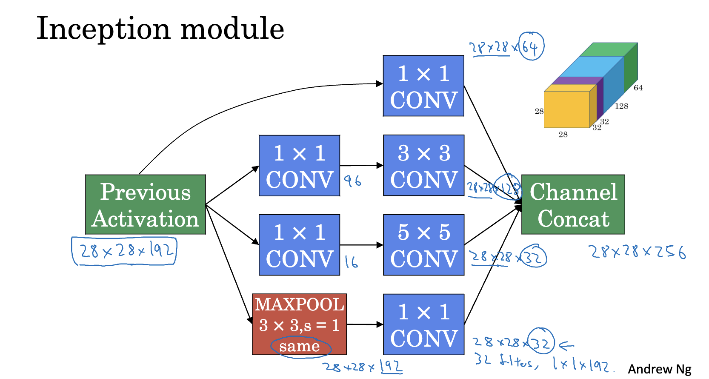

# Deep CNN: Classic Networks, ResNet & Inception Net

For our CV tasks, we can directly take neural network architectures that work well on other CV tasks, and thus some excellent architectures are introduced here.

# Classic Networks

## LeNet-5

**Feature:** Deeper layer, $n_H$ and $n_W$ lower, $n_c$ larger.

A typical pattern of LeNet-5 that is also used in many other networks: **CONV (or maybe multiple CONVs)-POOL-CONV-POOL-...-FC-FC**

An example of LeNet-5:


## AlexNet

**Features:** Millions of parameters, which can handle pretty similar basic blocks.

AlexNet has more layers than LeNet-5, an example is:


## VGG-16

**Features:** VGG-16 has 16 layers to weight (CONV and FC), which is a very huge network, but its conposition is simple, just built with many components.

 

**Composition:** A few CONV layers are followed by a POOL layer to reduce height and weight of the image, and the CONV layers doubles every times regularly, so the reducement of image size and the increase of channels is systemic.


# Residual Network (ResNet)

A very deep network may have bad performance, but for ResNet, we can train a very deep network (such as 50 layers) with a good performance.

## Residual Block

ResNet is composed of residual blocks.



There is a short cut from input layer to the final layer's activation in the block. So, $a^{[l+2]}=g(z^{[l+2]}+a^{[l]})$.

### When Different Dimensions

We can multiply a parameter matrix $W_s$ by $a^{[l]}$. If $a^{[l+2]}$ is 256 dimensions but $a^{[l]}$ is just 128 dimensions, we can make a 256*128 dimensional $W_s$, and fill it with zeros. $W_s$ can be trained with gradient descent.

## Performance of ResNet


ResNet will not have error increased with deep layer network.

Deeper layers can cause weight decay, but in ResNet, when $w^{[l+2]}$ is down to 0, $a^{[l+2]}$ will be $g(w^{[l+2]}a^{[l+1]}+b^{[l+2]}+a^{[l]})=g(0+a^{[l]})=a^{[l]}$ (assuming $b^{[l+2]}$ is also 0 and $g$ is ReLU). So, ResNet is not affected by weight decay caused by too deep layers.

## Implementing in PyTorch

To implement short cut in PyTorch, we can extend `nn.Module` and define a new class named `AddShortcut`.

### Align Dimension

We leaned to use a $W_s$ matrix to align dimensions, but in PyTorch, we usually use a 1 by 1 CONV to do that, which can be easier to implement.


This is implementation of identity block (which can ensure input and output same dimension)

```python
class IdentityBlock(nn.Module):
    def __init__(self, f, filters, in_channels):
        super().__init__()
        F1, F2, F3 = filters
        self.stack = nn.Sequential(
            nn.Conv2d(in_channels=in_channels, out_channels=F1, kernel_size=1, stride=1, padding='valid'),
            nn.BatchNorm2d(num_features=F1),
            nn.ReLU(),
            nn.Conv2d(in_channels=F1, out_channels=F2, kernel_size=f, stride=1, padding='same'),
            nn.BatchNorm2d(num_features=F2),
            nn.ReLU(),
            nn.Conv2d(in_channels=F2, out_channels=F3, kernel_size=1, stride=1, padding='valid'),
            nn.BatchNorm2d(num_features=F3)
        )

    def forward(self, x) -> Tensor:
        return nn.Sequential(
            self.stack,
            AddShortcut(X_shortcut=x),  # `X_shortcut` is the input X of this block
            nn.ReLU()
        )(x)
```


Define `AddShortcut` class like:

```python
class AddShortcut(nn.Module):
    def __init__(self, X_shortcut):
        super().__init__()
        self.X_shortcut = X_shortcut

    def forward(self, x) -> Tensor:
        # Use a 1x1 CONV to align dimension (W_s).
        ws_stack = nn.Sequential(
            nn.Conv2d(in_channels=self.X_shortcut.shape[1], out_channels=x.shape[1], kernel_size=1,
                      stride=self.X_shortcut.shape[2] // x.shape[2], bias=False)  # Assuming X's dimension is (example_number, channels, height, width); Do not forget to set `bias=False`.
        )
        return x + ws_stack(self.X_shortcut)
```


# 1 ✕ 1 Convolution (Network in Network)

## What Does a 1 by 1 filter Do?


Each pixel in the image will multiply by 2 (the 1 by 1 filter). If the image has multiple channels, the multiple product matrices will be added and produce a one channel matrix. After that, the output has an activation compution (like ReLU).

## Compressing or Enlarging Channels

The output's channel number depends on the number of filters. So, we can compress a 192 channels matrix to 32 channels:


Do not forget that we add non-linear compution (ReLU) on 1 ✕ 1 convolution.

# Inception Network

The motivation of Inception Network is to help you “decide” filter size or to choose what layer to use between CONV and POOL.


Now we have built an inception layer, when we concatenated these filters' outputs, the network will know which layer combination is best through training.


## Too High Computational Cost

We need to compute an output for every filter, which will cause a problem of a huge computational cost.

**A Simple Comparison**

- Computational cost for 32 filters of 5✕5✕192 CONV


$(28\times 28\times 32)\times (5\times 5\times 192)=120\text{M}$

- Computational cost for 32 filters of 5✕5✕16 CONV with 16 filters of 1✕1✕192 CONV acted as a bottleneck


$28\times 28\times 16\times 192=2.4\text{M}$

$28\times 28\times 32\times 5\times 5\times 16=10\text{M}$

$2.4\text{M}+10\text{M}=12.4\text{M}$


We will find that 1 by 1 convolution can reduce the computational cost a lot.


## Building an Inception Network

An inception module like this:



Combining many of that, we can build an inception network.


There are many branches (marked in green) in this network, which include POOL, 1 by 1 CONV and some FC, whose outputs are softmax. These are features of this particular network (called as GoogLeNet since it developed by Google). These branches can prevent overfitting, and they make hidden units and intermediate layers compute features.


# Strategy of Insufficient Dataset: Transfer Learning & Data Augmentation

## Transfer Learning

We can download weights that others had trained for a long time, and use them as a good initialization.


Assuming that we want to train a three-classification model based on the above network and downloaded weights, we can just replace the last sigmoid layer with a three nodes sigmoid layer:


The layers (including their parameters) ahead the output layer has been frozen. 


What we need to do is saving the parameters for frozen layers, seen it as a function and connected it with new layers.

If we have sufficient dataset, we can reduce layers to freeze:


## Data Augmentation

For few dataset, we can make some new dataset based on existed dataset.

Some common augmentation methods:


An other way is color shifting:


