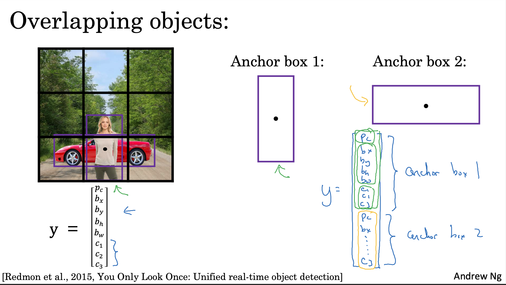
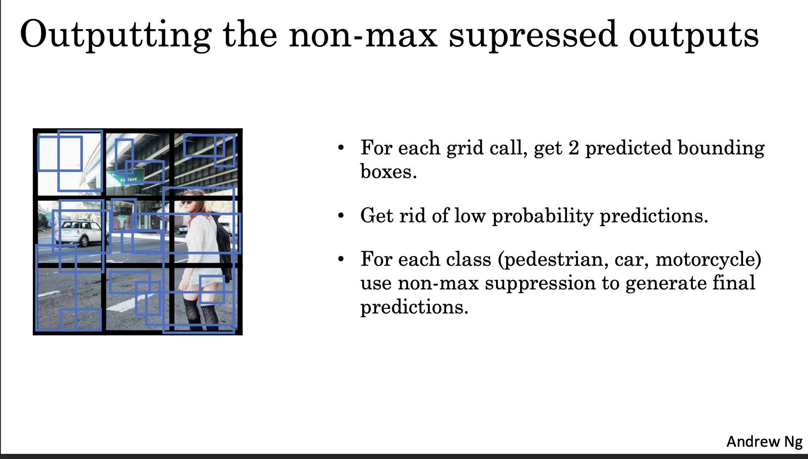
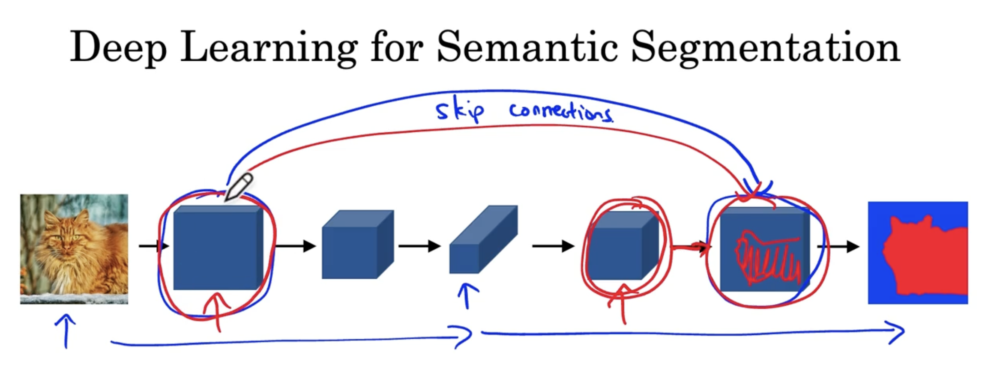

# Object Detection

In this chapter, we can learn how to mark objects in a picture and recognize these objects.

# Target Label for Localization

We use the center point of the object for localizing.

To localize an object in an image, mark it with a box and classify it, we can put the all information into one target label.

## Location and size

Seen the image as size 1 by 1, we can use relative values to mark positions and sizes.

So, in the final output label, we will use four data $b_x$, $b_y$, $b_h$ and $b_w$ for box marking.

## Classification

If we have 3 kinds of objects to detect (pedestrian, car and motorcycle), we can use one value to indicate wether objects appear or not ($p_c=1\text{ or }0$, 0 means there is only a background, and **all other values of $y$ can be ignored**). And use 3 values ($c_1, c_1, c_3$) to indicate what objects appear in this picture, turning them to 1 if those objects appears or to 0 otherwise.

For example, if only a car in this picture: $c_1=0,c_2=1,c_3=0$, and if a car and a pedestrian appears together: $c_1=1,c_2=1,c_3=0$.

## Loss Function

Because there are multiple values in $y$, we need to compare every value one by one, so our new loss function may look like:

## Landmark Detection

For facial expression detection or body posture detection, we want many points to be posited, so there will be many coordinates in label vector $y$.

# Sliding Windows Detection

Our goal is inputting an image, and outputting all objects's size, coordinates and types.

To find all objects in the image, we can use a sliding window to iterate the whole image, which is similar to sliding the filters on input matrices in convolution operation.

When the object is just right positing in the sliding window, we can capture it.

However, if we use a small stride, every step will have a ConvNet propagation, the computational cost will be too huge. To make it more efficient, we can use the convolutional implementation of sliding windows.

## Convolutional Implementation of Sliding Windows

In sliding window algorithm, every window has a output $y$ (including the probability of each classification), so we need do some change to the original softmax CNN:

We use 1✕1 convolution to replace FC layers, and when the step of sliding window becomes more, the output of network can be:

Each box of the output corresponds to each window.

Now, we can get the result of predictions of sections the sliding window passed.

# YOLO Algorithm

We know that sliding window algorithm cannot output the accuracy bound boxes, and YOLO (standing for *You Only Look Once*) can resolve this problem.

## How YOLO Find Object Bound

For a 100✕100 input image, we divide it into many squares.

Of course, you can use other grid dividing methods more than 9✕9.

Every cell has a output vector $y$. When an object's center point is inside of a certain cell, the relative position of that object is recorded in the label of the certain cell.

For the bounding box, we can feel relax to mark it though it exceeds borders of cells. Therefore, $b_x$ and $b_y$ must be inside the cell (whose values are between 0 and 1), however $b_h$ and $h_w$ can be greater than 1.

## IoU (Intersection over Union)

When multiple bounding boxes overlap, we can use IoU to measure the level of overlap.

$IoU=\frac{\text{Size of Intersection}}{\text{Size of Union}}$

## Non-max Suppression

Maybe we have divided so many cells:

There are not only one cells will have labels with respect to one object (like green boxes or yellow boxes above).

Usually, we will only reserve one bounding box for an object. So, we can adopt the following strategy:

## Anchor Boxes

There may be two or more objects inside one cell. To detect them all, we can use anchor boxes to capture them together.

For the output $y$, it dimension becomes $3\times 3\times 2\times 8$ or just $3\times 3\times 16$.

If IoU of an anchor box and the object's bounding box is higher than any other anchor box's, we can assign the object to that anchor box.

Example:

## A YOLO Network

Assuming that we have two anchor boxes and 9 cells, our output will be 3✕3✕2✕8 or 3✕3✕16.

Because there is only one object that is in the green cell, $y$ of the green cell will be:

The first anchor box is too high, so the first $p_c$ is 0, and the second $p_c$ corresponds to the short anchor box, and we can see prediction there.

Usually, we may need clear up our prediction result:

Here, we use non-max suppression to only reserve one box for each object.

# Region Proposals: R-CNN

When using sliding window algorithm, we may detect some areas where nothing exists, such as what the following example shows:

So, we can run a segmentation algorithm:

And run CNN only on these obvious areas.

## Faster Algorithm

 

# U-Net

U-Net is a semantic segmentation algorithm, which can tell us information about every pixel.

There are some application of semantic segmentation algorithm:

## Building Labels for Semantic Segmentation

We labeled every pixel, and our output will also include all pixels of the input image.

So, our network will look like:

We may notice that height and width are elongated after convolution processes in the network. **Transpose convolution** is used to elongate the input. (We can also use any other way to elongate the input, and transpose convolution is just one of ways.)

## Transpose Convolution

Using a large filter to do transpose convolution with input, the output will be larger than input and filter.

### Output Size

Assuming:

input: $n=2\times 2$

f: $f=3\times 3$

stride: $s=2$

padding: $p=1$

So, output length is $(n-1)\cdot s-2p+f=4$. (The formula of transpose convolution's output length is calculated with the inverse function of the formula of general convolutions.)

### Computing Process

Every element of filter multiplies one element of input, and put the result on the output.

Padding areas should not be filled with numbers.

Then we go $s$ steps.

 

 

**Note:** For overlapped areas, we should add them up.

## Skip Connections

When we use convolution to shorten the data and make it more channels, the algorithm can get information about the object's features (such as the algorithm will know there is a cat at the right bottom but do not know the precise position). So, we can add a skip connection like what ResNet does to point out the position information to the algorithm.

## Architecture

**Note:** The figure above hides width of layers. The rectangle only indicates the height and the channel of a layer.

This network looks like a big "U" (so we call it U-Net), where the left side is CONV and MAX-POOL layers that we are familiar with and the right side uses transpose CONV decreases the number of channel and adds layers in the left to reserve position information. 

