# Face Recognition & Neural Style Transfer

**Face Recognition: ** We've known how to make algorithm "see" a face in an image, and in this chapter, we will learn to recognize different people's faces.

**Neural Style Transfer:** An interesting algorithm that transfers an image's style to another image, such as making a portrait Picasso style.

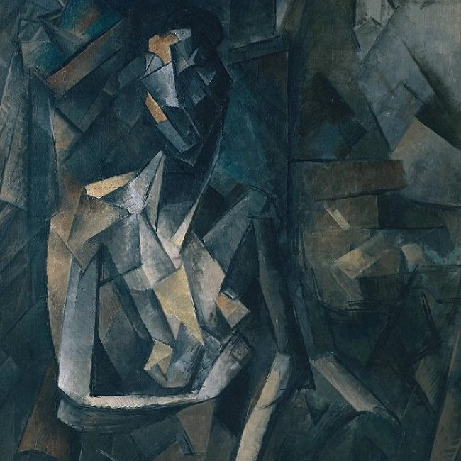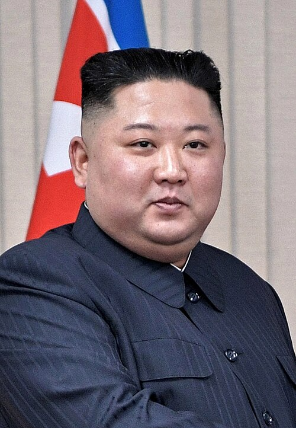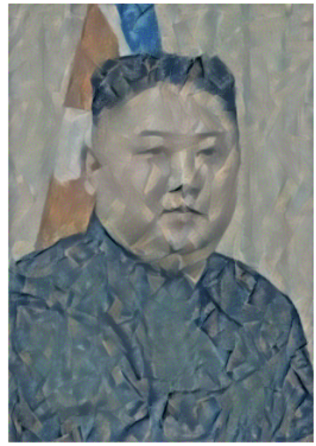


# Face Recognition

## Face Verification vs. Face Recognition 

Assume that we have a database of K pairs of face image and name/ID.

### Verification (1 : 1)

Input an image and name/ID;

Output whether the input image is belonging to the person of the input name/ID.


### Recognition (1 : K)

Input an image;

Output the name/ID if the input image is any of the K persons or outputting "not recognition".


## Face to 128-Dim Vector

As the headline title shown, the way to implement face verification or face recognition is using CNN to convert an input face image to a 128 vector, and the algorithm recognizes different faces by comparing the output vectors.


### One-shot Learning

Different from other computer vision experiments we've done, in the face recognition task, we must learn from only one example and the algorithm can then recognize the person again. We call this type of learning one-shot leaning.


### Similarity Function

We want to make a similarity function that can output two face images' difference.

$d(img1, img2)=\text{degree of difference between images}$

We can set a threshold value $\tau$:

If $d(img1,img2)\le\tau$: same

​			      $\gt\tau$: different


### Siamese Network

To implement the similarity function, we can use a siamese network (i.e. using two same neural network to process two images), and compare two outputs then.

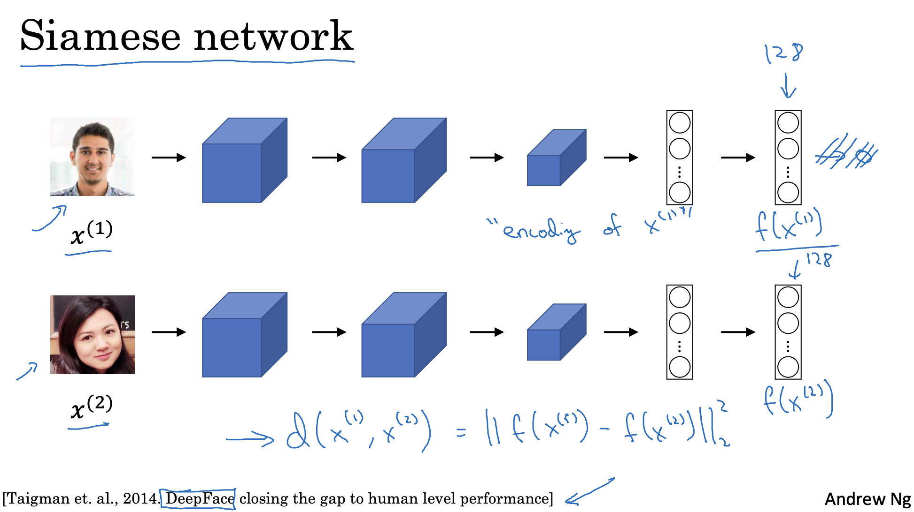

Our goal is: if two inputs coming from a same person, $||f(x^{(i)})-f(x^{(j)})||^2$ is small;

if different persons, it is large.

To achieve our goal, we need build a special loss function, calling it triplet loss function.

### Triplet Loss

Define three input types:

**Anchor (A):** A clear portrait of the target person.

**Positive (P):** Another image of the target person but which looks like different from the anchor image.

**Negative (N):** A portrait of a totally different person.

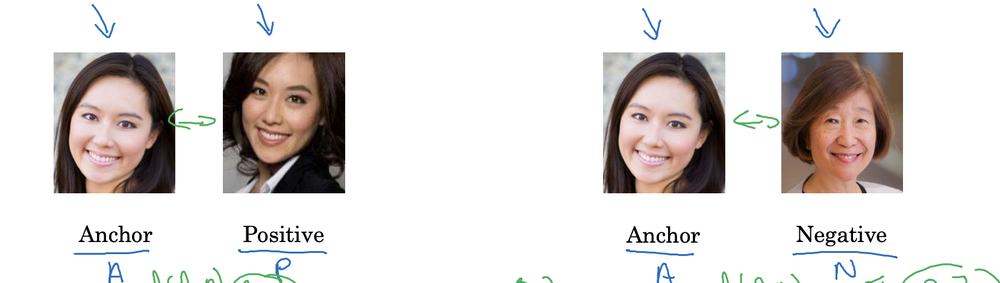

For example, we want $d(A,P)=0.3$ and $d(A,N)=0.7$.

So, we need $d(A,P)\le d(A,N)$, where using "less equal to" not "less than" to prevent gradient descent unstable when $d(A,P)$ is close to $d(A,N)$.

Besides, $d(A,P)$ and $d(A,N)$ may be zeros together, so we can define a "margin" value $\alpha$:

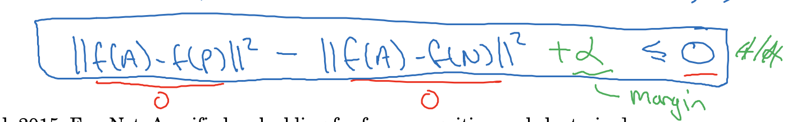

So, the difference between $d(A,P)$ and $d(A,N)$ will always be greater than $\alpha$.


Finally, when the inequality is true, we want loss to be zero, so the triplet loss function is:

$L(A,P,N)=max(||f(A)-f(p)||^2-||f(A)-f(N)||^2+\alpha,0)$

Cost function: $J=\sum_{i=1}^mL(A^{(i)},P^{(i)},N^{(i)})$


**Note:** During training, if A,P,N are chosen randomly, $d(A,P)+\alpha\le d(A,N)$ is easily satisfied.

Choose triplets that are “hard” to train on.


### Supervised Learning

Now we have built the CNN network to outputting 128-dim vector and defined the triplet loss function to improve the similarity function. To train the similarity function, we can prepare some dataset and label them.

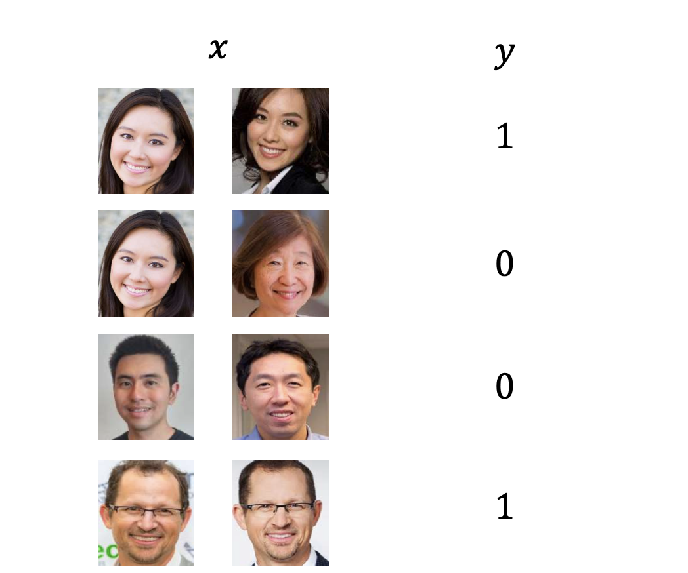

## Implementing Face Recognition

In the real life scene, we can **precompute** face vectors and compare them directly when the camera shots a face.

We just used squared norm to compute loss. To make the similarity function have a probability output, we can use the following formula to compute differences:

$\hat{y}=\sigma(\sum_{k=1}^{128}w_k|f(x^{(i)})_k-f(x^{(j)})_k|+b)$

Where we can use a 128-dim weight vector and a bias to get a more precise prediction.


Implement an Inception network outputting 128-dim vector:

```python3
# Generated by GPT-4o
class InceptionBlock(nn.Module):
    def __init__(self, in_channels, f1, f3_in, f3, f5_in, f5, pool_proj):
        super(InceptionBlock, self).__init__()

        # 1x1 Convolution (Preserves fine details)
        self.branch1 = nn.Sequential(
            nn.Conv2d(in_channels, f1, kernel_size=1, bias=False),
            nn.BatchNorm2d(f1),
            nn.ReLU()
        )

        # 1x1 Conv -> 3x3 Conv
        self.branch2 = nn.Sequential(
            nn.Conv2d(in_channels, f3_in, kernel_size=1, bias=False),
            nn.BatchNorm2d(f3_in),
            nn.ReLU(),
            nn.Conv2d(f3_in, f3, kernel_size=3, padding=1, bias=False),
            nn.BatchNorm2d(f3),
            nn.ReLU()
        )

        # 1x1 Conv -> 5x5 Conv (Captures larger textures)
        self.branch3 = nn.Sequential(
            nn.Conv2d(in_channels, f5_in, kernel_size=1, bias=False),
            nn.BatchNorm2d(f5_in),
            nn.ReLU(),
            nn.Conv2d(f5_in, f5, kernel_size=5, padding=2, bias=False),
            nn.BatchNorm2d(f5),
            nn.ReLU()
        )

        # 3x3 MaxPool -> 1x1 Conv (Preserves spatial information)
        self.branch4 = nn.Sequential(
            nn.MaxPool2d(kernel_size=3, stride=1, padding=1),
            nn.Conv2d(in_channels, pool_proj, kernel_size=1, bias=False),
            nn.BatchNorm2d(pool_proj),
            nn.ReLU()
        )

    def forward(self, x):
        # Concatenate results from all branches along the depth axis (dim=1)
        return torch.cat([
            self.branch1(x),
            self.branch2(x),
            self.branch3(x),
            self.branch4(x)
        ], dim=1)
```

```python3
class FRModel(nn.Module):
    def __init__(self):
        super().__init__()
        self.inception_net = nn.Sequential(
            # Initial Convolutional Layers with Small Kernel
            nn.Conv2d(3, 64, kernel_size=3, stride=1, padding=1, bias=False),
            nn.BatchNorm2d(64),
            nn.ReLU(),
            nn.Conv2d(64, 128, kernel_size=3, stride=1, padding=1, bias=False),
            nn.BatchNorm2d(128),
            nn.ReLU(),
            nn.MaxPool2d(kernel_size=3, stride=2, padding=1),

            nn.Conv2d(128, 192, kernel_size=3, stride=1, padding=1, bias=False),
            nn.BatchNorm2d(192),
            nn.ReLU(),
            nn.MaxPool2d(kernel_size=3, stride=2, padding=1),

            # Inception Modules with Higher Depth
            InceptionBlock(192, 64, 96, 128, 16, 32, 32),
            InceptionBlock(256, 128, 128, 192, 32, 96, 64),
            nn.MaxPool2d(kernel_size=3, stride=2, padding=1),

            InceptionBlock(480, 192, 96, 208, 16, 48, 64),
            InceptionBlock(512, 160, 112, 224, 24, 64, 64),
            InceptionBlock(512, 128, 128, 256, 24, 64, 64),
            InceptionBlock(512, 112, 144, 288, 32, 64, 64),
            InceptionBlock(528, 256, 160, 320, 32, 128, 128),
            nn.MaxPool2d(kernel_size=3, stride=2, padding=1),

            # Dilated Convolutions for Facial Features
            InceptionBlock(832, 256, 160, 320, 32, 128, 128),
            InceptionBlock(832, 384, 192, 384, 48, 128, 128),  # 输出 = 1024
            nn.Conv2d(1024, 1024, kernel_size=1, stride=1, padding=0, bias=False),  # 通道数修正
            nn.BatchNorm2d(1024),
            nn.ReLU(),

            # Global Average Pooling
            nn.AdaptiveAvgPool2d((1, 1)),

            # Fully Connected Layer
            nn.Flatten(),
            nn.Linear(1024, 128)
        )

    def forward(self, x):
        return self.inception_net(x)
```

For triplet loss function,  we can directly use PyTorch built-in class:

```python3
triplet_loss = nn.TripletMarginLoss(margin=0.2, p=2)  # margin is the alpha value, and p=2 indicates to use squares norm to compute loss
```

# Neural Style Transfer

NST involves three images: Content (C), Style (S) and Generated (G).

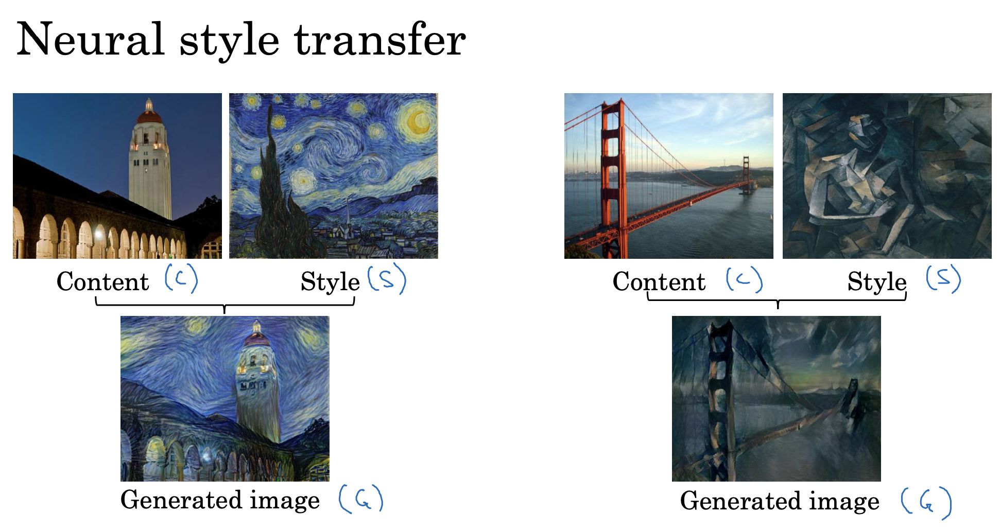

What we do is preparing a pre-trained deep convolution network like VGG-19, inputting the content image and the style image in forward propagation, intercepting intermediate layers' outputs from content image and style image's forward propagations as targets to compute losses, and using gradient descent to update  the generated image's pixels.


## What Each Layer Do For Deep ConvNets

We need to choose appropriate layers for loss functions, so we need to know what each layer learns, such as, we can choose a edge detection layer for content loss and choose some detail detection layers for style loss.

This is an example of a deep CNN:

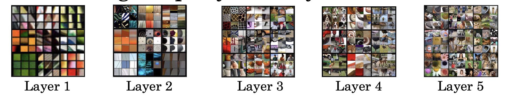

We can find that shallow layers only detect edges, shapes and basic colors, and deep layers can capture more details and objects.


## Cost Function for NST

Cost function is the critical part in NST. The cost function is the sum of the content cost function and the style cost function.

$J(G)=\alpha J_c(C,G)+\beta J_s(S,G)$

where alpha and beta are content weight and style weight, usually choosing $\alpha=1,\beta=10^6$.

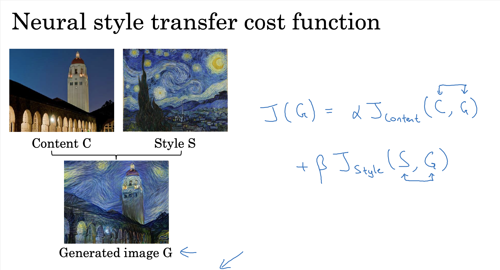

G is the generated image. In face, we can just use the content image as a generated image or randomly initiate the generated image. Then, we can use gradient descent to minimize $J(G)$.

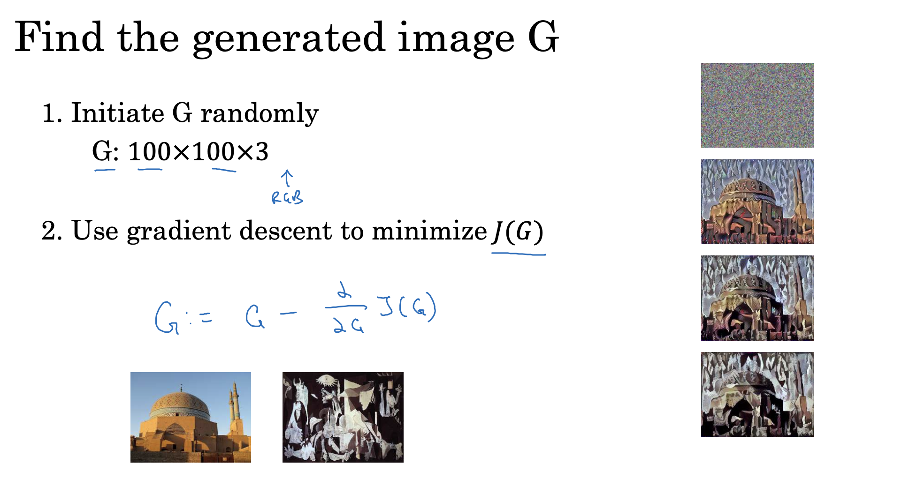

## Content Cost Function

Content cost function can evaluate the error between the current generated image and the content image, and its evaluation criteria is the output value of a selected layer.

It looks like:

$J_c(C,G)=\frac{1}{2}||a^{[l](C)}-a^{[l](G)}||^2$

VGG-19's architecture is:

```
VGG(
  (features): Sequential(
    (0): Conv2d(3, 64, kernel_size=(3, 3), stride=(1, 1), padding=(1, 1))
    (1): ReLU(inplace=True)
    (2): Conv2d(64, 64, kernel_size=(3, 3), stride=(1, 1), padding=(1, 1))
    (3): ReLU(inplace=True)
    (4): MaxPool2d(kernel_size=2, stride=2, padding=0, dilation=1, ceil_mode=False)
    (5): Conv2d(64, 128, kernel_size=(3, 3), stride=(1, 1), padding=(1, 1))
    (6): ReLU(inplace=True)
    (7): Conv2d(128, 128, kernel_size=(3, 3), stride=(1, 1), padding=(1, 1))
    (8): ReLU(inplace=True)
    (9): MaxPool2d(kernel_size=2, stride=2, padding=0, dilation=1, ceil_mode=False)
    (10): Conv2d(128, 256, kernel_size=(3, 3), stride=(1, 1), padding=(1, 1))
    (11): ReLU(inplace=True)
    (12): Conv2d(256, 256, kernel_size=(3, 3), stride=(1, 1), padding=(1, 1))
    (13): ReLU(inplace=True)
    (14): Conv2d(256, 256, kernel_size=(3, 3), stride=(1, 1), padding=(1, 1))
    (15): ReLU(inplace=True)
    (16): Conv2d(256, 256, kernel_size=(3, 3), stride=(1, 1), padding=(1, 1))
    (17): ReLU(inplace=True)
    (18): MaxPool2d(kernel_size=2, stride=2, padding=0, dilation=1, ceil_mode=False)
    (19): Conv2d(256, 512, kernel_size=(3, 3), stride=(1, 1), padding=(1, 1))
    (20): ReLU(inplace=True)
    (21): Conv2d(512, 512, kernel_size=(3, 3), stride=(1, 1), padding=(1, 1))
    (22): ReLU(inplace=True)
    (23): Conv2d(512, 512, kernel_size=(3, 3), stride=(1, 1), padding=(1, 1))
    (24): ReLU(inplace=True)
    (25): Conv2d(512, 512, kernel_size=(3, 3), stride=(1, 1), padding=(1, 1))
    (26): ReLU(inplace=True)
    (27): MaxPool2d(kernel_size=2, stride=2, padding=0, dilation=1, ceil_mode=False)
    (28): Conv2d(512, 512, kernel_size=(3, 3), stride=(1, 1), padding=(1, 1))
    (29): ReLU(inplace=True)
    (30): Conv2d(512, 512, kernel_size=(3, 3), stride=(1, 1), padding=(1, 1))
    (31): ReLU(inplace=True)
    (32): Conv2d(512, 512, kernel_size=(3, 3), stride=(1, 1), padding=(1, 1))
    (33): ReLU(inplace=True)
    (34): Conv2d(512, 512, kernel_size=(3, 3), stride=(1, 1), padding=(1, 1))
    (35): ReLU(inplace=True)
    (36): MaxPool2d(kernel_size=2, stride=2, padding=0, dilation=1, ceil_mode=False)
  )
  (avgpool): AdaptiveAvgPool2d(output_size=(7, 7))
  (classifier): Sequential(
    (0): Linear(in_features=25088, out_features=4096, bias=True)
    (1): ReLU(inplace=True)
    (2): Dropout(p=0.5, inplace=False)
    (3): Linear(in_features=4096, out_features=4096, bias=True)
    (4): ReLU(inplace=True)
    (5): Dropout(p=0.5, inplace=False)
    (6): Linear(in_features=4096, out_features=1000, bias=True)
  )
)
```

We choose fourth CONV layer (index 7) to compute content loss, so $l=7$ in the above formula.

## Style Cost Function

Different from content cost function, style cost function does not care about pixel locations. We need to compare correlation between activations across channels.

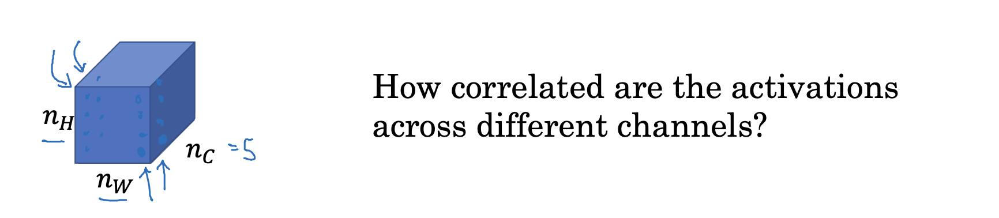

For a CONV layer output, we can compute correlation between two channels by computing a gram matrix.

$G^{[l](S)}_{kk'}=\sum_{i=1}^{n_H^{[l]}}\sum_{j=1}^{n_W^{[l]}}a_{ijk}^{[l](S)}a_{ijk'}^{[l](S)}$

$G^{[l](G)}_{kk'}=\sum_{i=1}^{n_H^{[l]}}\sum_{j=1}^{n_W^{[l]}}a_{ijk}^{[l](G)}a_{ijk'}^{[l](G)}$

where $k$ and $k'$ is the number of channel, $k=1,...,n_c^{[l]}$

So, our style cost function is:

$J_s^{[l]}(S,G)=\frac{1}{(2n_H^{[l]}n_W^{[l]}n_C^{[l]})^2}\sum_k\sum_{k'}(G^{[l](S)}_{kk'}-G^{[l](G)}_{kk'})$


### Multiple Layers

We usually choose multiple layers in the CNN and compute their sum as the final cost.

We previously chose the 7th layer to compute content loss. For style loss, we can choose layers distributed throughout the CNN. For example, we use the following list as style loss layers:

```python3
[(2, 2), (7, 3), (16, 1), (25, 1), (34, 2)]
```

This is a Python list, where the first number is layer index and the second is lambda (weights of each layer) in each tuple.

So, our cost function looks like:

$J_s(S,G)=\sum_l\lambda^{[l]}J_s^{[l]}(S,G)$

## How to Implement in PyTorch

1. Load a pre-trained VGG model

   ```python3
   vgg_model = models.vgg19(weights=models.VGG19_Weights.DEFAULT).to(device)
   ```

2. Prepare model features and choose layers for cost functions

   ```python3
   model = vgg_model.features # Throw away classifier part of this model
   content_layer_num = 7
   style_layer_nums = [(2, 2), (7, 3), (16, 1), (25, 1), (34, 2)]
   ```

3. Initialize generated image with randomly generated noise pixels

   ```python3
   def generate_noise_image(content_image, noise_ratio = 0.6):
       """
       Generates a noisy image by adding random noise to the content_image
       """
   
       # Generate a random noise_image
       noise_image = torch.rand(content_image.size())
   
       # Set the input_image to be a weighted average of the content_image and a noise_image
       input_image = noise_image * noise_ratio + content_image * (1 - noise_ratio)
   
       return input_image
   ```

4. Normalize model inputs for VGG model

   ```python3
   def normalize_image(image):
       """
       Normalize the input image (content, generated or style)
       """
   
       cnn_normalization_mean = torch.tensor([0.485, 0.456, 0.406]).view(-1, 1, 1)
       cnn_normalization_std = torch.tensor([0.229, 0.224, 0.225]).view(-1, 1, 1)
   
       # Subtract the mean to match the expected input of VGG-19
       image = (image - cnn_normalization_mean) / cnn_normalization_std
   
       return image
   ```

5. A function to resize image and convert to PyTorch tensor

   ```python3
   def img_to_matrix(image_path):
       loader = transforms.Compose([
       transforms.Resize(300),
       transforms.ToTensor()])
   
       image = Image.open(image_path)
       image = loader(image).unsqueeze(0)
       image = image.to(device, torch.float)
       return image
   ```

6. A function to show image with matplotlib

   ```python3
   def imshow(img):
       img = img.cpu().clone()
       img = img.squeeze(0)
       img = transforms.ToPILImage()(img)
       plt.imshow(img)
       plt.axis("off")
       plt.show()
   ```

7. A function to compute gram matrix

   ```python3
   def gram(A : Tensor):
       _, c, h, w = A.size()
       A = A.view(c, h * w)  # Every row is a channel
       return torch.mm(A, A.t()) / (c * h * w)  # Divide (c * h * w) for regularation.
   ```

8. Compute loss function and gradient descent

   ```python3
   def train_loop(model, input_img, epochs = 180):
     	'''
     	model parameter here is vgg_model.features
     	'''
       model.eval()  # VGG model's weights should be changed
       model.requires_grad_(False)
   
       for module in model.modules():
         	# PyTorch built-in VGG model has some in-place operations;
           # These in-place operations will impact gradient descent
           if isinstance(module, nn.ReLU):
               module.inplace = False
   
       # Initially, G_x is a randomly noise image;
       # We will use gradient descent to change its pixels
       G_x = input_img.clone().detach().requires_grad_(True)
   
       # C_x and S_x should not be changed in geadient descent
       C_x = normalize_image(content_img).detach().requires_grad_(False)
       S_x = normalize_image(style_img).detach().requires_grad_(False)
   
       # Save activation values of selected layers
       C_activation_list = []  # In fact, this list has only one element in this example.
       S_activation_list = []
   
       # LBFGS is better than Adam on NTS
       optimizer = torch.optim.LBFGS([G_x])  # Warning! You should not put normalized G_x into optimizer!
   
       for layer_num, layer in enumerate(model.children()):
               C_x = layer(C_x)
               S_x = layer(S_x)
   
               if content_layer_num == layer_num:
                   C_activation_list.append(C_x.detach())
   
               for style_layer_num, _ in style_layer_nums:
                   if style_layer_num == layer_num:
                       S_activation_list.append(S_x.detach())
                       break
       
       # LBFGS optimizer needs a closure function, so we use an list object instead of a number to count epochs.
       epoch = [0]
       while epoch[0] <= epochs:
           def closure():
               with torch.no_grad():
                   G_x.clamp_(0, 1)  # If you do not clamp the input before each training, some negative or large values will be exploding and forming noise points finally.
   
               optimizer.zero_grad()
   
               # We will execute forward propagation manually.
               # G_x_forward is the intermidiate output value of each propagated layer.
               # Now, G_x_forward is the input value of the model, so we need to set it to a normalized generated image tensor.
               G_x_forward = normalize_image(G_x)
   
               # We will compute sums of loss
               content_loss = 0
               style_loss = 0
   
               # Use a variable to record current index of C_activation_list and S_activation_list
               C_list_idx = 0
               S_list_idx = 0
   
               # Compute content and style loss
               for layer_num, layer in enumerate(model):
                 	# Forward propagate and compute gradient automatically by PyTorch
                   G_x_forward = layer(G_x_forward)
   
                   # Compute content loss for selected layer
                   if content_layer_num == layer_num:
                     	# Of course, we can just use PyTorch's built-in mse_loss function to compute squared norm.
                       content_loss = nn.functional.mse_loss(C_activation_list[C_list_idx], G_x_forward)
                       C_list_idx += 1
   
                   # Compute style loss for selected layer
                   for style_layer_num, lambd in style_layer_nums:
                       if style_layer_num == layer_num:
                           J_l = nn.functional.mse_loss(gram(S_activation_list[S_list_idx]), gram(G_x_forward))
                           S_list_idx += 1
                           style_loss += lambd * J_l
                           break
   
                   # When our selected layers are all propagated, we can stop this model in advance.
                   if C_list_idx == len(C_activation_list) and S_list_idx == len(S_activation_list):
                       break
   
               content_loss *= alpha
               style_loss *= beta
   
               loss = content_loss + style_loss
               loss.backward()
   
               epoch[0] += 1
   
               if epoch[0] % 20 == 0:
                   print(f"Epoch = {epoch[0]}, Content Loss = {content_loss.item()}, Style Loss = {style_loss.item()}, Total Loss = {loss.item()}")
   
               return content_loss + style_loss
   
           optimizer.step(closure)
   
       with torch.no_grad():
           G_x.clamp_(0, 1)
   
       return G_x
   ```

Check the demo at https://huggingface.co/spaces/Treep/NeuralStyleTransfer

# Convolution in 1D, 2D and 3D

We have learned how to do convolution operations in 2D. We are going to know how to do it in 1D and 3D scenes.

## 2D vs. 1D

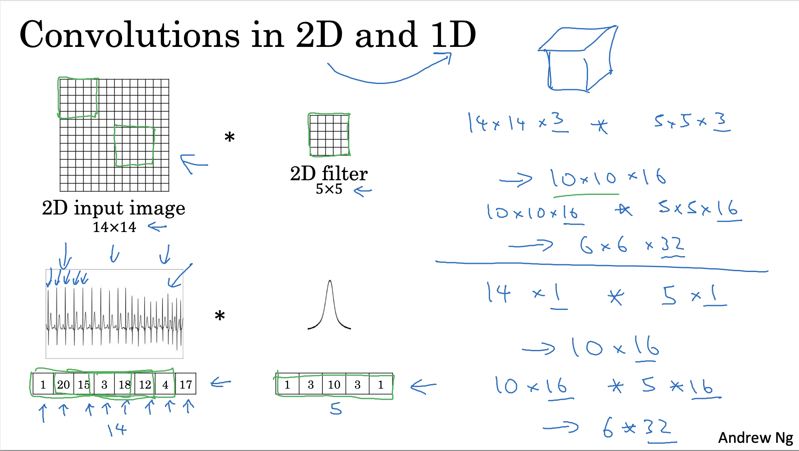

When the input becomes 1D, the filter is also 1D. It is similar to what we do in 2D.


## 3D Data

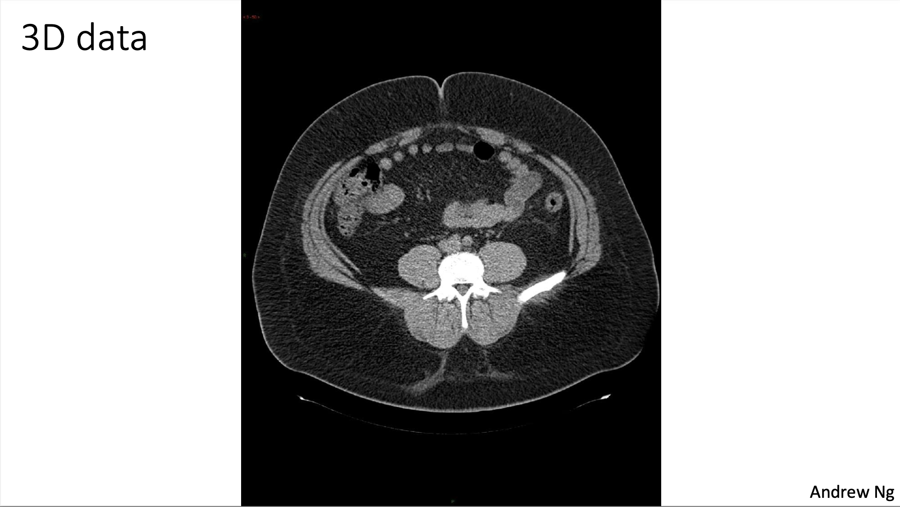

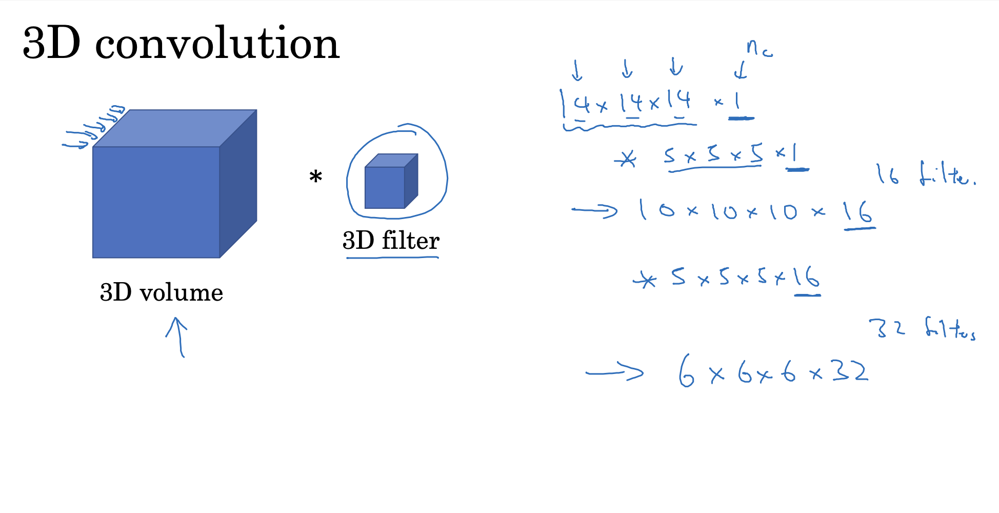

For a 3D input (not the multiple channel image), for example, a 14✕14✕14 input whose channel number is 1, we can use 16 5✕5✕5 filters with channel number 1. So, the output dimension is 10✕10✕10✕16.
