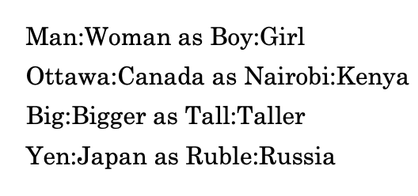

# Neural Language Processing and Attention Mechanism

Since RNNs are no longer widely used nowadays, I will introduce the Attention model and the Transformer model directly in the following two chapters.

# Word Representation

How to represent a word in the matrix calculation? Just index it!

Suppose we have a word dictionary that looks like:
$$V=\text{[a, aaron, ..., zulu, <UNK>]}$$
$$|V|=10,000$$

## One-Hot Representation

To represent all the words, we use **one-hot** to encode them in the order of alphabet.
It may look like:
![[assets/image-1755586481426.png]]

We use $O_{t}$ to denote the one-hot encoding for the $t-th$ word. Since there are 10,000 words totally in my word dictionary, $|O_{t}|=10,000$.

A **drawback** is obvious in one-hot representation. No mathematical **relation** between two words that have similar meaning. 

For example, we told a sentence "I want a glass of **orange juice**." to the algorithm, and it cannot learn the relation between "orange" and other fruits. When I ask the algorithm to fill the blank in "I want a glass of apple __ .", it won't tend to choose the word like "juice".

## Word Embedding

A solution to the drawback of the one-hot representation is word embedding.
Word embedding is a widely used method in NLP models nowadays even in the top-level models like GPT-5, Gemini 2.5 Pro and so on.

Let's focus on these six words, we classify them into some classes: Gender, Royal, Age, Food, Size, Cost...
![[assets/image-1755587664394.png]]

As what we did in the one-hot method, we use $e_{t}$ to denote each word's word embedding encoding vector. Assumed 300 classifications we set, $|e_{t}|=300$.

**Value of Embedding Vectors:** For a word embedding vector, the range of values is $[-1,1]$. And the absolute value describes the relation between this word and this classification. The positive or negative sign of the number represents the meaning of the word in two extremes.

For two similar words, like Apple and Orange, if we take the distance of the two corresponding vectors, it will be obviously smaller than other word pairs like King and Orange. 
Of course, higher dimension of vectors means higher accuracy when comparing two words.

Visualize word embeddings:
![[assets/image-1755588695270.png]]

### Example: Named Entity Recognition

Let's train an RNN model to recognize people's names in a given sentence.
Now, with word embedding, for sentences like:
![[assets/image-1755589096191.png]]

where we give the model the first sentence as training set and tell it "Sally Johnson" is a name, the model will get it and know that the words appeared before a "fruit farmer" may be a name.

We give the second sentence as test set now, expected the model can know "apple" is similar to "orange" by word embedding so that the words appeared before an "apple farmer" are highly likely to be a name. 

Also for a sentence like "Robert Lin is a durian cultivator", even though our training set has not the word "durian", the model will know "durian" is a similar word to "orange" and "apple" by word embedding and so is the word "cultivator".

### Analogy Task Using Word Embedding

A common task in NLP is analogy inference, e.g. known "Man -> Woman", complete "King -> ?".
Using word embedding, we can easily compute the relation distance between two words.
So, the analogy inference in word embedding is:
$$e_{\text{man}}-e_{\text{woman}}\approx e_{\text{king}}-e_{\text{?}}$$
To find the nearest word, we need to calculate:
$$\text{arg max}_{w}\ \text{sim}(e_{w},e_{\text{king}}-e_{\text{man}}+e_{\text{woman}})$$
where the similarity function is usually the cosine similarity, i.e.
$$\text{sim}(u,v)=\frac{u^Tv}{||u||_{2}||v||_{2}}$$

### Embedding Matrix

In practice, we are used to combine all word embedding vectors into a big embedding matrix $E$.

Assuming we have 10,000 words with embedding dimension 300, the embedding matrix is of dimension $300\times 10000$.

If we want to take a word vector such as $e_{j}$ from the embedding matrix, we can do a matrix multiplication: $E\cdot O_{j}=e_{j}$, where $O_{j}$ is the one-hot vector mentioned before.

![[assets/image-1755592290431.png]]

### Learning Word Embedding

There are some methods about **training a word embedding matrix**.

Supposed we have a dataset including tons of sentences, we aim to train the word embeddings from them. 

**Neural Language Model**

We can use a neural network to train word embeddings.

For a sentence in our dataset, "I want a glass of orange juice.", where the final word "juice" is regarded as the target word and the preceding words are inputed (called context words), the NN can predict the final word's embedding vector $e$ with softmax.

![[assets/image-1755663205489.png]]

We can also adjust the number of context words, such as using least 4 words, 4 words on left & right, least 1 word or nearby 1 word.

> There are also other word embedding learning methods like Word2Vec, Negative Sampling and GloVe, which are not introduced here because I won't focus on word embedding techniques.

## Debiasing Word Embeddings

In word embedding training, the model may learn lots of word biases due to the incomprehensive dataset.

![[assets/image-1755664010927.png]]

To eliminate biases, we can take the following steps:
1. Identify bias direction
If we want to debias gender bias of words, we can compute averages of gender-related words.
![[assets/image-1755664820699.png]]
2. Project non-definitional words to non-bias axis
![[assets/image-1755664905047.png]]

3. Equalize Pairs
Some gender-relative words are not symmetric about the non-bias axis. Make them equalize. Such as girl-boy.

# Beam Search

In Sequence to Sequence models, such as machine translation model, there may be not only single predicted result. Whichever the RNN or the Transformer (autoregressive) model, the output result can be seen as being generated word by word, so that we may choose the best word as the result every time naturally, which is call greedy search.

## Cons of Greedy Search

A greedy search does not always give the best result.

![[assets/image-1755788107355.png]]

For a given French sentence, we use an RNN encoder-decoder to translate it into English. 
As a human, we know the best translation is "Jane is visiting Africa in September". 
However, the model prefers the phrase "is going to" than "is visiting", so the probability of the worse translation "Jane is going to be visiting Africa in September" is higher in the softmax.

## Why Beam Search

We don't like the way choosing the best word at every time but need a new way picking the best sentence $y$ directly from all the possible results. That is:
$$\text{argmax}_{y}P(y|x)$$
However, the time complexity will explode if we check all the possible sentences. So, a compromise method is come up with, which is the beam search. 
Similar to greedy search, the beam search picks words at each time. But not just picking one word, the beam search picks $B$ words once, and always maintain $B$ results in the future prediction.

![[assets/image-1755790402129.png]]
![[assets/image-1755790039873.png]]

For example, letting $B=3$, we intially chose the three words "in", "jane", and "september", which had the highest probabilities.
In the second round, we selected the best words again for the second position, and the results became "in september", "jane is", and "jane visits". A sentence starting with "september" was shifted out of the result list in this round.
By repeating this process again and again, we may eventually obtain the best sentence, while all other slightly worse predictions are gradually eliminated in the successive rounds.

## Refinements to Beam Search

The optimizing method we used in beam search is:
![[assets/image-1756304815008.png]]

For a computer, a long cumulative product may reduce computational accuracy. So, we can convert it to a sum form by applying the logarithm:
![[assets/image-1756305802509.png]]

Furthermore, the accuracy of a short sentence is typical lower than that of a long sentence, so we can do **length normalization**:
![[assets/image-1756306062849.png]]

A normalization term is here, where $\alpha$ is a hyper-parameter that makes the penalty on the length smoother. We are used to setting $\alpha=0.7$.

# Bleu Score

We want to know the performance of a translation model, so a **scoring method** should be come up with, which compares the machine translation sentence and a reference sentence (may translated by a human professor) and gives us a score.

## Occurrence Counting

> For example:
> **French:** Le chat est sur le tapis.
> **Reference 1:** The cat is on the mat.
> **Reference 2:** There is a cat on the mat.
> **A good MT output:** The cat the cat on the mat.
> **A bad MT output:** the the the the the the the

To evaluate the MT output, we can count the occurrences of the same words in the reference and MT output.

However, if we just start counting without any limit, for the word "the", the bad MT output will have **7/7 score** that is higher than the good MT output with **3/7 score**.

So the bleu score chooses a counting limit from the **maximum occurrence of the word in all references**.

The reference 1 has two words "the", so we let that word's limit of occurrence be 2. The good MT output is 2/7 bleu score, so is the bad MT output.

## Bleu Score on Bigrams

We can evaluate two continuous words once in a sentence.
For the same example, we obtain the bleu score on bigrams:
![[assets/image-1756353866798.png]]
Accumulate the column `score`, the bleu score on bigrams of the good MT output is 4/6 (6 is the sum of the column `count`).

## Combined Bleu Score

For a more precious score, we can evaluate the sentence on n-grams. We choose a range to `n`, such as 1 to 4, notating the bleu score on n-grams as $p_{n}$. The combined bleu score is:
$$\text{BP}\exp\left(\frac{1}{4}\sum_{n=1}^{4}p_{n} \right)$$
where $\text{BP}$ is a coefficient standing for **brevity penalty** to prevent too **short** output.
BP is calculated by:
$$\text{BP}= \left\{ \begin{array}{cl}
1 & : \ L_o > L_r \\
\exp(1-\frac{L_r}{L_o}) & : \text{otherwise}
\end{array} \right.$$
where $L_{o}$ is the length of the MT output, and $L_{r}$ is the length of the reference.

# Attention Mechanism

## Why Attention

Reviewing the RNN encoder-decoder language model, with a longer sentence, the performance of the model reduces.
![[assets/image-1756430275349.png]]
![[assets/image-1756430258172.png]]

For human, we only pay attention to **a few of relative words** when translating instead of all the words.
![[assets/image-1756430639798.png]]

For example, we only pay attention to "jane", "visite" and "l'Afruque", then we know the first translated word should be "Jane".

So, whatever how long the sentence is, attention model can choose the most relative words over the whole sentence.

## Overview of Attention Mechanism

In an encoder-decoder RNN model, of which the encoder is a Bi-RNN like a Bi-LSTM and the decoder is a Uni-RNN (one direction) like an LSTM.

![[assets/image-1756457385449.png]]

1. Prepare the states of the input sentence $a^{<t'>}$ by the encoder Bi-RNN
2. Prepare the states of the output $s^{<t-1>}$ by the decoder RNN
3. Compute the amount of attention $\alpha^{<t,t'>}$ for every input word using $a^{<t'>}$ and $s^{<t-1>}$
4. See the amounts of attentions as weights and compute a context amount $c^{<t>}=\sum_{t'=1}^{T_{x}}\alpha^{<t,t'>}a^{<t'>}$, which is the output of an attention block in a translation model
5. Input $y^{<t-1>}$ , $s^{<t-1>}$ and $c^{<t>}$ to Decoder RNN and output $y^{<t>}$

## Amount of Attention $\alpha^{<t,t'>}$

Computing $\alpha^{<t,t'>}$ is a crucial step in attention mechanism.

![[assets/image-1756456500957.png]]
Each block in encoder RNN produces **an amount of attention $\alpha^{<t,t'>}$**. $\alpha^{<t,t'>}$ is the amount of attention $y^{<t>}$ (decoder's output) should pay to $a^{<t'>}$ (state of Bi-RNN block $t'$, which is a combination of $(\overrightarrow{a}^{<t'>},\overleftarrow{a}^{<t'>})$, where each of the amount $a$ is one direction's RNN state)
![[assets/image-1756457034011.png]]

To understand $\alpha^{<t,t'>}$ in math, we can regard it as **a relative weight** of the $t'$-th word over the sentence, for the $t$-th output.

### Computing $e^{<t,t'>}$

The attention of each word should be learnable, so we use a one-layer FC network to compute an intermediate amount $e^{<t,t'>}$:

![[assets/image-1756461612009.png]]

### Normalizing $e^{<t,t'>}$

Known that $\alpha^{<t,t'>}$ is a weight, so the sum of it should be 1. We calculate the softmax of $e^{<t,t'>}$ to have the normalized $\alpha^{<t,t'>}$.
![[assets/image-1756461730601.png]]

## Example

> **The Week 3 Homework of The Course**
> Date Recognition with Attention Model (using PyTorch): https://github.com/ATreep/DateRecogAttentionModel

This example is based on an encoder-decoder RNN model.
![[assets/image-1756462331896.png]]

In the above model, we packaged the $\alpha^{<t,t'>}$ computing and the $c^{<t>}$ computing into an attention block.'

In each attention block:
![[assets/image-1756462614620.png]]

Note that we concatenated $s^{<t-1>}$ and $a^{<t'>}$, and input the concatenated vector to an FC layer.

## Attention in Transformer

In Seq2Seq domain, Transformer is more widely used than RNN. In Transformer, the Scale Dot-Product Attention is introduced (referring to the paper *Attention Is All You Need*). It will be introduced in the next chapter.