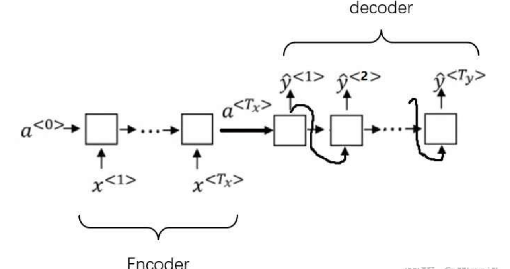
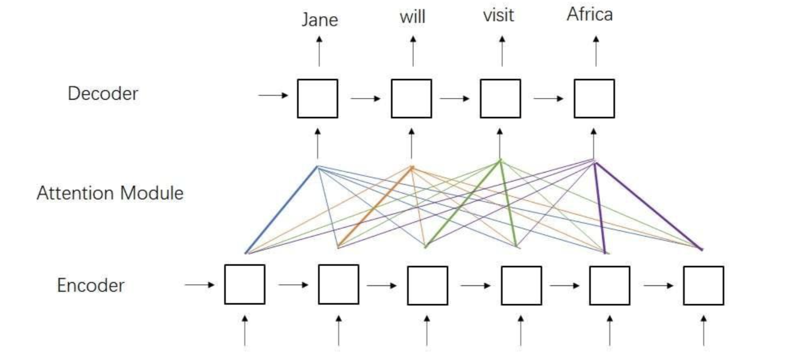
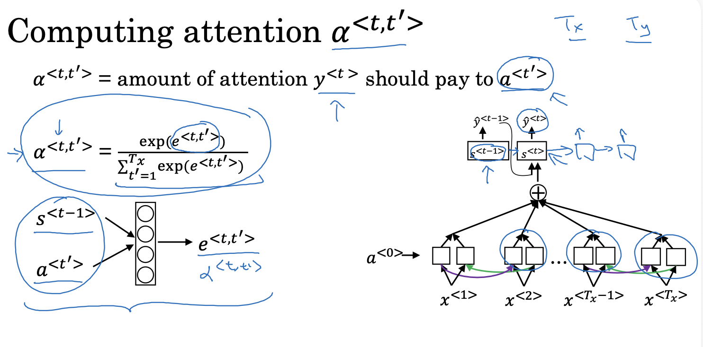
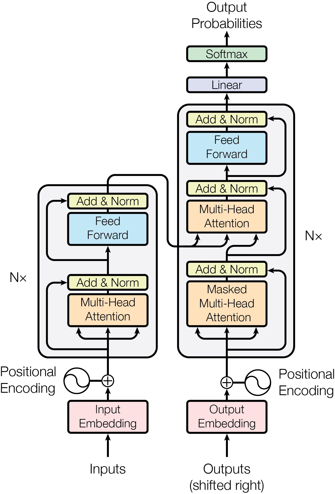

# Transformer Architecture

Before reading: this note is primarily based on the paper [*Attention Is All Your Need*](https://arxiv.org/pdf/1706.03762) (we will call it "the paper" for short in this note), partially based on Week 4 of Andrew Ng's Sequence Models course.

> I have implemented a simple Transformer-based machine translation model in PyTorch: [ATreep/ToyTransformer](https://github.com/ATreep/ToyTransformer).
> You can also find a commented Jupyter notebook here: [notebook](https://github.com/ATreep/ToyTransformer/blob/main/experiment_note.ipynb).
> 
> Implementation details are omitted in this document. Please refer to the repository for code example.

## Classic Seq2Seq Model

In the previous chapter, we learned how RNN+Attention models work on machine translation tasks.


*\* Encoder-Decoder Architecture of RNN*


*\* A Machine Translation Model Based on RNN+Attention*

An major drawback of the above architecture is its $O(n)$ time complexity, where $n$ is the input sentence length.

Since CNNs support parallel computation, how about combining parallel mechanism together i.e. **an Attention + CNN architecture**? Transformer adopts that, discarding the sequential RNN design.

# Scaled Dot-Product Attention

In RNN-based models, attention represents the relative importance of each word in a sentence.
The Transformer generalizes this mechanism using a Query-Key-Value formulation, analogous to **querying a database**.

## Understanding QKV

**Q=Query, K=Key, V=Value**

Assuming that our database has the following rows, which record ages of some people:

```json
{
	[1, 2, 0]: 18, // Amy 
	[1, 2, 0]: 20, // Another Amy
	[0, 0, 2]: 22, // Bob
	[1, 4, 0]: 19  // Candy
}
```

For keys, we use a 3 dimensional vector to represent names. The first (and second) key and the last key are more similar, because of the both girl's names, but the third name obviously a boy's name.

At this point, we have defined **keys** and **values**. Let's issue a **query**: find the average age of all girl names. The query vector can be $[1,0,0]$.

We use the query vector to dot product each key:

```
dot([1, 0, 0], [1, 2, 0]) = 1
dot([1, 0, 0], [1, 2, 0]) = 1
dot([1, 0, 0], [0, 0, 2]) = 0
dot([1, 0, 0], [1, 4, 0]) = 1
```

and compute the softmax of them:
$$\text{softmax}([1,1,0,1])=[ \frac{1}{3},\frac{1}{3},0,\frac{1}{3}]$$
The four amounts are weights of each data row i.e. attentions.
To get the target age value, we just use the attention vector dot products the **value** vector:
```
dot([1/3, 1/3, 0, 1/3], [18, 20, 22, 19]) = 19
```

### Formula

We have basically learned how the QKV attention works, but the scaled dot-product attention is slightly different from the example we just saw.

$$\text{Attention}(Q,K,V)=\text{softmax}(\frac{QK^T}{\sqrt{ d_{k} }})V$$

where:
- $Q,K,V$ are arrays of all q, k, v vectors (note that we can have multiple queries once)
- $d_{k}$ is the dimension of vector q and k (the two vector should have the same dimension). The scaling factor $\sqrt{ d_{k} }$ normalizes the dot product, preventing large values that would lead to vanishing gradients in the softmax function.

## Self-Attention

> In RNN, we computed the attention $\alpha^{<t,t'>}$ for the $t'$-th word in the input sentence. 
> 
> This attention amount means how much attention the output block $s^{<t>}$ needs to pay to the input word $x^{<t'>}$.
> 
> 
> In Transformer, we also need to compute attentions for each input word. 
> But now, our intention of computing attentions is to understand what each word plays a role in the whole sentence.
> 
> For example, in the French sentence "Jane visite l'Afrique en septembre.", the model computes attention between "l'Afrique" and all other words to determine its role in the sentence.

Self-Attention is a key operation in both Encoder and Decoder. It enables the model to capture dependencies between words by computing contextual relationships within a sentence.

To calculate the self-attention of word $x^{<i>}$, we can see it as the querying vector $q^{<i>}$:
$$A^{<i>}=\text{Attention}(q^{<i>},K,V)$$
If we put the whole sentence's self-attention together, in fact we can get the QKV attention formula just seen:
$$\text{Attention}(Q,K,V)=\text{softmax}(\frac{QK^T}{\sqrt{ d_{k} }})V$$

### Learnable $Q,K,V$

Each word's $q,k,v$ are computed by word embedding vectors because a word's $q,k,v$ should only be relative to this word itself. 
To improve accuracy, each word's $q,k,v$ should be learnable, obtained by applying learnable weight matrices $W^Q,W^K,W^V$ to the embedding vectors.

We have the perfect $Q,K,V$ in self-attention now:
$$\left\{ \begin{array}{cl}

Q=EW^Q \\

K=EW^K \\

V=EW^V

\end{array} \right.$$

## Multi-Head Self-Attention

We know that every input word is represented by an embedding vector of dimension $d_{\text{model}}$. In practice, $d_{\text{model}}$ can be large, e.g., $d_{\text{model}}=512$. 

To capture different types of relationships, the embedding vector (such as $d_{\text{model}}=512$) is split into $h$ smaller vectors (heads), such as $h=8$, usually an integer that can divide $d_{\text{model}}$ exactly. Each head computes attention independently, and the results are concatenated and projected using $W^O$:
$$\text{head}_{i}=\text{Attention}(Q_{i},K_{i},V_{i}),\ i=0,\dots,h$$
$$\text{head}_{i}=\text{Attention}(E_{i}W_{i}^Q,E_{i}W_{i}^K,E_{i}W_{i}^V),\ i=0,\dots,h$$
$$\text{MultiHeadSelfAttention}(E)=\text{Concat}(\text{head}_{1},\dots,\text{head}_{h})W^O$$
where $E_{i}$ is the $i$-th split small embedding matrix of all input words, and $W_{i}^Q$, $W_{i}^K$, $W_{i}^V$ and $W^O$ are learnable weight matrices.

> **The Dimensions of Split Embedding Matrix**
> 
> $\text{dim}E_{i}=(\text{q\_len},d_{\text{model}}/h)$ 
> 
> `q_len` is same as `k_len` that is the length of the input sentence in self-attention.

# Encoder & Decoder

Let's delve the architecture of Transformer.


The Transformer consists of two main components:
- The encoder (left) processes the input sequence and produces contextualized representations. 
- The decoder (right) consumes the these contextualized representations outputted along with its own inputs to generate the target sequence.

Both encoder and decoder are composed of $n$ identical layers.

## Positional Encoding

Let's focus on the circle symbol in the above picture.

> Unlike RNNs, Transformers do not inherently encode sequence order. To provide positional information, **positional encoding** are added to word embeddings before being fed into the encoder or decoder.

Have
- $pos$ as the position of a word vector in the embedding matrix (of which every row is a word vector);
- $i$ as the $n$-th dimension of a word vector

We want the positional encoding to satisfy:
-  two elements in a word vector are different, i.e. for a fixed $pos$, different dimensions $i$ must yield unique encodings;
- for a fixed dimension $i$, different positions $pos$ must correspond to encodings that preserve relative positional relationships: $f(pos+1)-f(pos)=f(pos)-f(pos-1)$.

In the paper, the positional encoding function is designed like:
$$\text{PE}(\text{pos}, 2i)=\sin\left( \frac{\text{pos}}{10000^{\frac{2i}{d_{\text{model}}}}} \right)$$
$$\text{PE}(\text{pos}, 2i+1)=\cos\left( \frac{\text{pos}}{10000^{\frac{2i}{d_{\text{model}}}}} \right)$$
> - With different $i$, the trigonometric function is of different periods, which satisfies the first condition.
> - According to the sum formula of trigonometric functions, such as$\sin(a+b)=\sin a\cdot \cos b+\cos a\cdot \sin b$, $f(pos+k)$ can become a linear function of $f(pos)$, which satisfies the second condition.

## *Add & Norm* Block and *Feed Forward* Block

Each sub-layer in the encoder and decoder is followed by an Add & Norm block, which applies residual connections and Layer Normalization.
So this block outputs:
$$\text{LayerNorm}(F(x)+x)$$

The Feed Forward block is a two-layer FC with a ReLU activation in between. By default, the hidden dimension $d_{ff}$ is set to 2048.
$$\text{FC}\to\text{ReLU}\to FC$$

## Self-Attention and Cross-Attention

Decoder contains two multi-head attention layers.


**Masked Multi-Head Attention:** We usually call it **Self-Attention**, where Q, K, V are derived from the decoder input $Y$ with **causal masking** applied.

**Multi-Head Attention:** Note that this block is different from the same name one in encoder. We usually call it **Cross-Attention**, where $Q$ comes from decoder's Self-Attention block output, and $K,V$ are from encoder output.

## Causal and Padding Masking

When computing attention, we may need to ignore certain words in a sentences.
This is done by replacing the corresponding attention scores ($\frac{qk^T}{\sqrt{ d_{k} }}$) with a large negative value (in practice, `-1e12` is often used instead of `-INF` in code).

$$\text{Attention}(Q,K,V)=\text{softmax}(\frac{QK^T}{\sqrt{ d_{k} }})V$$
Given attention scores for a sentence of length $n$, $(x_{1},x_{2},\dots,x_{n})$, the softmax for the $i$-th word is:
$$\text{softmax}(\frac{e^{x_{i}}}{e^{x_{1}}+\dots+e^{x_{n}}})$$
Masked words are assigned very small values, making $e^x\approx 0$, so they do not contribute to the attention computation.

Two types of masking are used in Transformer: **causal masking** and **padding masking**.

### Causal Masking

#### Autoregressive

In an RNN sequence model, during generating a sequence, each decoder block outputs one word at a time. 
In contrast, the Transformer generates sequences in a completely different way.


Encoder processes an input sequence $(x_{1},\dots,x_{s})$ to an intermediate sequence $(z_{1},\dots,z_{s})$.
Decoder receive the intermediate sequence along with its input sequence $(y_{1},\dots,y_{t})$ in which $y_{1}=<SOS>$. Finally decoder outputs $(y_{2},\dots,y_{t+1})$ in which $y_{t+1}=<EOS>$.

| Step           | 1       | 2            | 3                 | ... |
| -------------- | ------- | ------------ | ----------------- | --- |
| Decoder Input  | \<SOS\> | \<SOS\> Jane | \<SOS\> Jane will |     |
| Decoder Output | Jane    | Jane will    | Jane will visit   |     |

So, in the inferring stage, the mode is run $n$ times to get an output sequence with length $n$.
At every running time, the model gives us a new word (token).
This is autoregressive.

#### Why Masking

However, in the training stage, we often input the dataset matrix $Y$ directly into decoder. The input $Y$ may look like:

$$Y=\begin{bmatrix}
e_{11} & e_{12} & \dots & e_{1n} \\
\vdots & \vdots & & \vdots \\
e_{m1} & e_{m2} & \dots & e_{mn}
\end{bmatrix}$$
where $e_{ij}$ represents a word embedding vector of the $i$-th sentence and the $j$-th word in this sentence.

In decoder's Masked Multi-Head Attention block, $q,k,v$ are same equal to $Y$.
Assumed that $head=1$, when computing attention score for a sentence with length $n$, $QK^T$ is a $n\times n$ matrix.

Do not forget the database querying example. The $QK^T$ matrix here means that we have $n$ times queries ($n$ rows) where the $i$-th row is the relationship importances between the $i$-th word and others.

For each sentence in dataset, the $QK^T$ looks like:

$$QK^T=\begin{bmatrix}
s_{11} & \dots & s_{1n} \\
\vdots &  &  \\
s_{n1} & \dots & s_{nn}
\end{bmatrix}$$

When decoder receives only the first word, the model should not know the future words. 
So, the first matrix row should mask other $n-1$ attention scores $s_{12},\dots,s_{1n}$ except the first one.
Similarly, the second row should mask $s_{23},\dots,s_{2n}$ except the first two ones.

The masked matrix looks like:
$$\text{CausalMask}(QK^T)=\begin{bmatrix}
s_{11} & 0 & 0 & 0 & 0 & 0 & \dots & 0 \\
s_{21} & s_{22} & 0 & 0 & 0 & 0 & \dots & 0 \\
s_{31} & s_{32} & s_{33} & 0 & 0 & 0 & \dots & 0 \\
s_{41} & s_{42} & s_{43} & s_{44} & 0 & 0 & \dots & 0 \\
\vdots & \vdots & \vdots & \vdots & \vdots & \vdots & & \vdots \\
s_{n1} & s_{n2} & s_{n3} & s_{n4} & s_{n5} & s_{n6} & \dots & s_{nn}
\end{bmatrix}$$

**Conclusion:** Causal masking will obtain a lower triangular matrix.

### Padding Masking

When training a Seq2Seq model, we may preset a hyper parameter to limit the maximum input length $n$. If the input sentence's length is less than $n$, we should pad it to $n$ with a pad token like `<PAD>`.

So, we should ignore pad tokens in attention computation. Padding masking can preclude those tokens from impacting the result of attention computation.

# Checking Code Implementation!

We have covered the outline of the Transformer architecture, but this is just the beginning.
It is worthwhile to explore an actual code implementation. Feel free to check out my implementation, [ATreep/ToyTransformer](https://github.com/ATreep/ToyTransformer) , which was also mentioned earlier. I have also included a Jupyter notebook in the repository to make it easier for beginners to follow.