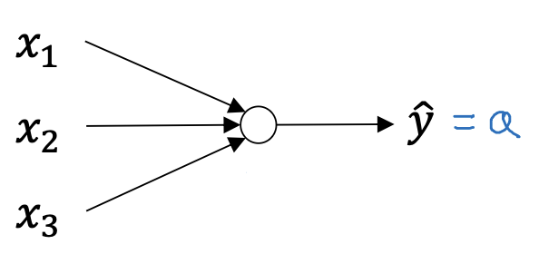
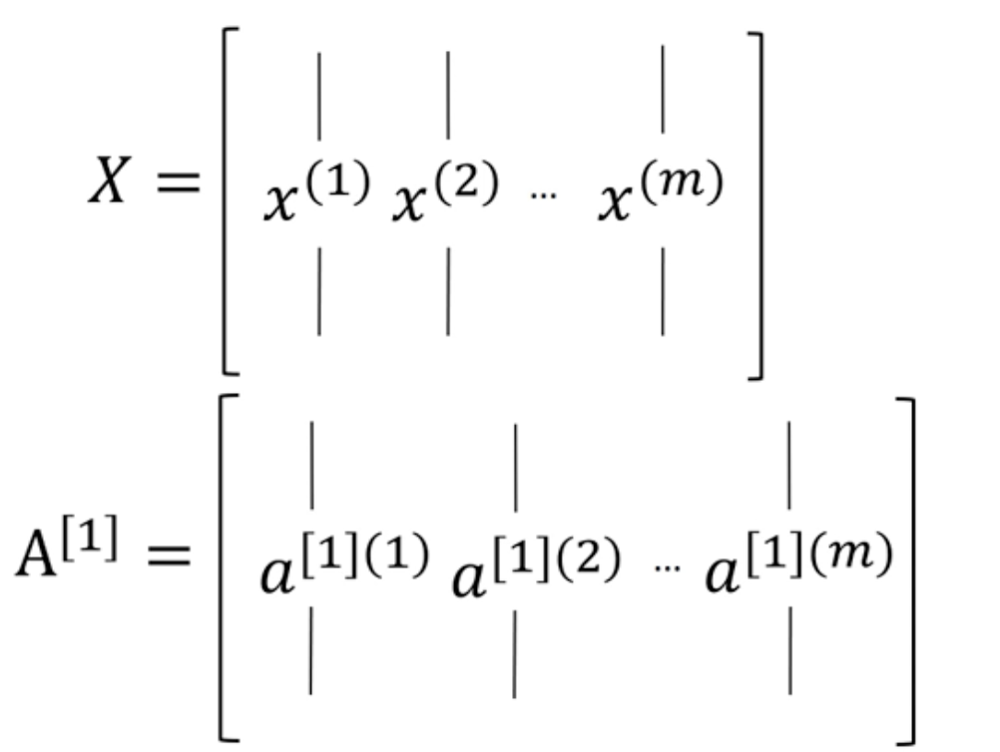

# One Hidden Layer Neural Network (NN)

**Input Layer (Represented by a[0]):** This layer has only $n$ features.

**Hidden Layer (Represented by a[1]):** True values from this layer cannot be seen in the training set. Every unit does a Logistic regression calculation (not strictly). Use $a^{[1]}_1$, $a^{[1]}_2$, $a^{[1]}_3$ and $a^{[1]}_4$ to represent every unit's calculation result.

**Output Layer (Represented by a[2]):** This is the final result of the neural network.

Ignoring the hidden layer, we call this neural network **2 Layer Neural Network**.

As comparison, the representation of a single logistic regression is like:

# Computation of NN

The overall process of getting the result of a NN like this:

## Computation in One Unit

In Logistic Regression, every unit does **a sigmoid computation** and its result is represented as $a^{[i]}_j$ where $i$ means the $i^{th}$ layer and $j$ means the $j^{th}$ unit in this layer.

### Representation with Matrix

In the above "NN", $w$ and $x$ are not a specific value but a variable because there are multiple features (three $x$) even though one example only.

$x_1$, $x_2$ and $x_3$ are in the input layer, and they can be represented as a 3x1 matrix $A^{[0]}$ (or be simply represented as $X$ in the hidden layer).

We can know:

$$A^{[0]}=\begin{bmatrix}
x_1 \\
x_2 \\
x_3
\end{bmatrix}$$

$$W = \begin{bmatrix}
w_1 \\
w_2 \\
w_3 
\end{bmatrix}$$

## Computation on Hidden Layer

For a 2 layer NN like below:

if we only focus on the **hidden layer**, the 4 units will produce 4 computations.

### Using Liner Algebra to Compute

The four compuations can be computed at one time with Liner Algebra.

In order to get a 4x1 matrix $Z^{[1]}$ like below (attention that the result of the hidden layer is $A^{[1]}=\sigma(Z^{[1]})$):

$$Z^{[1]}=\begin{bmatrix}
z^{[1]}_1 \\
z^{[1]}_2 \\
z^{[1]}_3 \\z^{[1]}_4 \end{bmatrix}$$

we can rewrite the above four formulas into one formula like:

$Z^{[1]}=W^{[1]}A^{[0]}+b^{[1]}, A^{[1]}=\sigma(Z^{[1]})$

> Use $b^{[1]}$ instead of $B^{[1]}$ because it is a 4-dimentional vector (4 hidden layer units). 

To get the correct shape of $Z^{[1]}$, we are supposed to control the shape of matrix $W^{[1]}$. 

Known that the shape of $A^{[0]}$ is 3x1(stated in the previous section), the shape of $W^{[1]}$ should be 4x3, which indicating 4 hidden layer units and 3 features.

For the shape of $W$ on hidden layer or output layer, **how many rows** indicates **how many units**, and **how many columns** indicates **how many inputs**. 

This note indicates what $W^{[1]}$, $A^{[0]}$, $B{[1]}$ and $Z^{[1]}$ are like.

## Formula Expression

For a NN like (1 example, 3 features, 2 layers, 4 hidden layer units):

### Initialization Weights & Biases

On hidden layer, there are four 3x1 weight matrixes $w^{[1]}_1$ to $w^{[1]}_4$ (combine to a 4x3 matrix $W^{[1]}$), and four biases (combine to a 4-dimension vector $b^{[1]}$).

On output layer, we need one 1x4 weight matrix $W^{[2]}$ and one constant $b^{[2]}$.

So, we have matrixes and vectors: $W^{[1]}$(4x3), $b^{[1]}$(4x1), $W^{[2]}$(1x4), $b^{[2]}$(1x1).

And inputs: $A^{[0]}$(3x1)

### Computing Result

$ Z^{[1]}=W^{[1]}A^{[0]}+b^{[1]} $ (4x1)
$ A^{[1]}=\sigma({Z^{[1]}}) $ (4x1)
$ Z^{[2]}=W^{[2]}A^{[1]}+b^{[2]} $ (1x1)
$ A^{[2]}=\sigma({Z^{[2]}}) $ (1x1)

# Multiple Examples in NN

In Logistic Regression, we need to compute every example's $\hat{y}$ and get its loss function, and finally get the cost function after finishing the computations of all examples.

Same as Logistic Regression, every example needs to compute its own $\hat{y}$ through the NN that has 2 layers or even more, such as the NN like above, and then do subsequent operations like getting the cost function, doing gradient decent, etc.

## Notation Association

We used `[num]` to indicates what layer the computation is on. To distinguish, use `(i)` to indicate which example is computing.

So, we know:

## Formula Expression

*for i = 1 to m:*

$ Z^{[1](i)}=W^{[1]}A^{[0](i)}+b^{[1]} $ (4x1)
$ A^{[1](i)}=\sigma({Z^{[1](i)}}) $ (4x1)
$ Z^{[2](i)}=W^{[2]}A^{[1](i)}+b^{[2]} $ (1x1)
$ A^{[2](i)}=\sigma({Z^{[2](i)}}) $ (1x1)

We can use **vectorization** to eliminate the for-loop.

According to linear algebra, we can just combine m $A^{[0](i)}$ (3x1) into one $A^{[0]}$ (3 x m), and the final $A^{[2]}$ (1 x m) is what we need.

Expression:

$ Z^{[1]}=W^{[1]}A^{[0]}+b^{[1]} $ (4 x m)
$ A^{[1]}=\sigma({Z^{[1]}}) $ (4 x m)
$ Z^{[2]}=W^{[2]}A^{[1]}+b^{[2]} $ (1 x m)
$ A^{[2]}=\sigma({Z^{[2]}}) $ (1 x m)

Justification for vectorized implementing of computing $Z^{[1]}$ with 3 examples and 4 hidden layer units:

# Other Activation Functions

In a neural network, we can choose activation functions for the hidden layer and the output layer. Except the sigmoid function, some more efficient activation functions are introduced.

In general, use g(z) to represent the activation function in NN. Activation functions of hidden layer and output layer can be **different**, so we need to use superscript to distinguish distinct activation functions such as $g^{[1]}(z^{[1]})$ for the hidden layer's activation function and $g^{[2]}(z^{[2]})$ for the output layer's.

## Hyperbolic Tangent Function

$tanh(z)=\frac{e^z-e^{-z}}{e^z+e^{-z}}$

As the figure shows, the values of tanh is between -1 and 1.

**Advantage:** For **hidden units**, tanh is a better choice than sigmoid, because the means of the activation function are more closer to **0** (for sigmoid function, the means are closer to 0.5).

But in the binary classification, for the output layer, to make $\hat{y}$ between 0 and 1, sigmoid function is necessary. So, we can use tanh for hidden layer and sigmoid for output layer.

## Rectified Linear Unit (ReLU)

We found that when z is larger or small, the slopes of both sigmoid and tanh are closer to 0, which does not benefit to the gradient descent. So, ReLU is introduced.

$a=max(0, z)$

Although it is inderivable when z=0, in practice, we hardly encounter the situation that z=0. The value of z=0 can be assigned to either 1 or 0.

**Advantage:** ReLU is most used for hidden layer. Its slope is far from 0, so the learning will be fast when using ReLU.

**Drawback:** ReLU may cause **inactive neuron problem** (dying ReLU) because the negative values are 0. For example,  for a one hidden layer neural network, if the computed result of $z^{[1](1)}$ is all negative at one iteration, $a^{[1](1)}$ will be a zero matrix and the neuron will not be updated either because $dw^{[1](1)}$ and $db^{[1](1)}$ are also zero.

## Leaky ReLU

The leaky ReLU sloves the problem that the negative part is always 0.

If your neural network cannot learn effectively with **ReLU**, switching to leaky ReLU may resolve the problem.

$a=max(0.01z, z)$ 

# Linear Activation Function

A linear activation function such as $g(z)=z$ is usually an inappropriate choice for hidden layer and output layer, because that will get the neural network be a simple **linear transformation**, no matter how many layers it has.

## Proof

We use NN to model non-linear relationships. If linear activation functions are used in hidden layer and output layer, the model will degrade to a simple logistic regression, linear regression, etc.

Assume that use $g(z)=z$ as the activation function for hidden layer and output layer, we can have:

$ Z^{[1]}=W^{[1]}A^{[0]}+b^{[1]}$
$ A^{[1]}=Z^{[1]} $
$ Z^{[2]}=W^{[2]}A^{[1]}+b^{[2]} $
$ A^{[2]}=Z^{[2]}$

Substitute $Z^{[1]}$ to $A^{[1]}$:

$A^{[1]}=Z^{[1]}=W^{[1]}A^{[0]}+b^{[1]}$

$A^{[2]}=Z^{[2]}=W^{[2]}(W^{[1]}A^{[0]}+b^{[1]})+b^{[2]}=(W^{[2]}W^{[1]})A^{[0]}+(W^{[2]}b^{[1]}+b^{[2]}))$

Let

$W'=W^{[2]}W^{[1]}$

$b'=W^{[2]}b^{[1]}+b^{[2]}$

So, we have:

$\hat{y}=A^{[2]}=W'A^{[0]}+b'$

**Conclusion:** The relationship between the output value and the input values is linear.

So, with the linear activation functions, the NN has degraded to a simple linear regression.

## Exception of Using Linear Activation Function

If we are training the **regression** model, we may use the linear activation function as the **output layer**'s activation function sometimes, because the output values of a regression problem (like predict housing prices) is a real number. In fact, the housing prices are all nonnegative numbers, you could even use ReLU for output layer.

# Gredient Descent in Neural Network

## Derivative of Activation Function

**Sigmoid:** $g'(z)=g(z)(1-g(z))$

> This can also be rewritten to $g'(z)=a(1-a)$, because we generally represent $g(z)$ as $a$ in the calculation process.

**Tanh:** $g'(z)=1-tanh^2(z)$

**ReLU:** $$g'(z)= \left\{ \begin{array}{cl}
0 & , \ z \lt 0 \\
1 & , \ z \gt 0
\end{array} \right.$$

**Leaky ReLU:** $$g'(z)= \left\{ \begin{array}{cl}
0.01 & , \ z \lt 0 \\
1 & , \ z \ge 0
\end{array} \right.$$

## Implementing Gredient Descent by Calculus

### Determining Notation for Unit Quantity of Each Layer 

To make the dimensions of matrixes more intuitive, use $n^{[0]}$, $n^{[1]}$ and $n^{[2]}$ to represent the quantity of units and $m$ for the quantity of examples.

For a NN the figure showing, 

$n^{[0]}=3$

$n^{[1]}=4$

$n^{[2]}=1$

### Forward Propagation

The forward propagation has been shown in the beginning parts, and the overall process is:

We can have the expressions below in sequence:

$ Z^{[1]}=W^{[1]}A^{[0]}+b^{[1]} $
$ A^{[1]}=\sigma({Z^{[1]}}) $
$ Z^{[2]}=W^{[2]}A^{[1]}+b^{[2]} $
$ A^{[2]}=\sigma({Z^{[2]}}) $

Dimensions:

$A^{[0]}: (n^{[0]},m)$

$W^{[1]}: (n^{[1]},n^{[0]})$

$b^{[1]}:(n^{[1]},1)$ 

$Z^{[1]}: (n^{[1]},m)$

$A^{[1]}: (n^{[1]},m)$

$W^{[2]}: (n^{[2]},n^{[1]})$

$b^{[2]}:(n^{[2]},1)$

$Z^{[2]}:(n^{[2]},m)$

$A^{[2]}:(n^{[2]},m)$

We can learn that the dimensions between hidden layer and output layer are so similar.

### Backward Propagation

Backward propagation is a calculus computing progress along the reverse direction of the forward propagation.

The calculation method of back propagation is the same as what we did in the logistic regression.

The calculation process below focuses on **one example**.

To use the gredient descent, we need to calculate $dw^{[1]}$, $dw^{[2]}$ and $db^{[1]}$, $db^{[2]}$.

#### Calculating on Output Layer

Assume that the activation function of the output layer is **sigmoid**.

$dz^{[2]}=\frac{dL(a^{[2]}, y)}{da^{[2]}}\frac{da^{[2]}(z^{[2]})}{dz^{[2]}}=a^{[2]}-y$

$dw^{[2]}=dz^{[2]}\cdot\frac{dz^{[2]}}{dw^{[2]}}=dz^{[2]}a^{[1]T}$

> Why we need to transpose the matrix $a^{[1]}$?
>
> The dimension of $dw$ should be the same as that of $w$ as the minus operation will be performed finally to adjust the value of $w$.

$db^{[2]}=dz^{[2]}\cdot\frac{dz^{[2]}}{db^{[2]}}=dz^{[2]}$

After calculation, **checking the dimensions** of matrixes is recommended to reduce exceptions in running the program.

#### Calculating on Hidden Layer

The activation function of the hidden layer is $g(z)$.

$dz^{[1]}=dz^{[2]}\cdot\frac{dz^{[2]}}{da^{[1]}}\cdot\frac{da^{[1]}}{dz^{[1]}}=w^{[2]T}dz^{[2]}\ast g'^{[1]}(z^{[1]})$

> Elementwise product (notated by *****) must be used between $da^{[1]}$ and $g'^{[1]}(z^{[1]})$, because in the equation $A=g(Z)$ A and Z are vectors in essence that used to operate multiple unit results in batch.
>
> On the output layer, elementwise product is also used in $dz^{[2]}=da^{[2]}\ast\sigma'(z^{[2]})$.

$dw^{[1]}=dz^{[1]}a^{[0]T}$

$db^{[1]}=dz^{[1]}$

#### Vectorized Implementation

Use vectorization to compute multiple examples in batch.

$dZ^{[2]}=A^{[2]}-Y$

$dW^{[2]}=\frac{1}{m}dZ^{[2]}A^{[1]T}$

$db^{[2]}=\frac{1}{m}np.sum(dZ^{[2]},axis=1,keepdims=True)$

> A Python numpy code was used here when expressing $db^{[2]}$, where using `axis=1` to calculate the sum horizontally and using `keepdims=True` to prevent from getting a numpy array with dimension $(n^{[2]},)$ instead of what we actually need that is $(n^{[2]},1)$.

$dZ^{[1]}=W^{[2]T}dZ^{[2]}\ast g'^{[1]}(Z^{[1]})$

$dW^{[1]}=\frac{1}{m}dZ^{[1]}A^{[0]T}$

$db^{[1]}=\frac{1}{m}np.sum(dZ^{[1]},axis=1,keepdims=True)$

### Random Initialization

#### Why Need Random Initialization

We used to initialize $W$ and $b$ to all zeros in the Logistic Regression chapter, however, for a neural network, if all computing units have same initial values (such as **all zeros**) on $W$ and $b$, the results of all units on a same layer will be **same**. As an impact of zeros' initialization, the multiple units will be useless.

So, make the initialization random can make the best of multiple units architecture and have a more precise prediction result.

And in fact, $b$ can still initialize with zeros with randomly initialized $W$.

#### Range of Random Numbers

Notice that the random numbers of $W$ should **not** be so **large** but should be close to **0** when the activation function is **tanh** or **sigmoid**.

When $x$ of tanh or sigmoid is so large or so small, the **slope** of the function is very **small**, which leads to an inefficiency on gradient descent.

So, we can randomly initialize $W$ in code like:

$W^{[1]}=np.random.randn((2,2))*0.01$

# Implementing in Python

Refer to the next document for the programing implementation of neural network.
