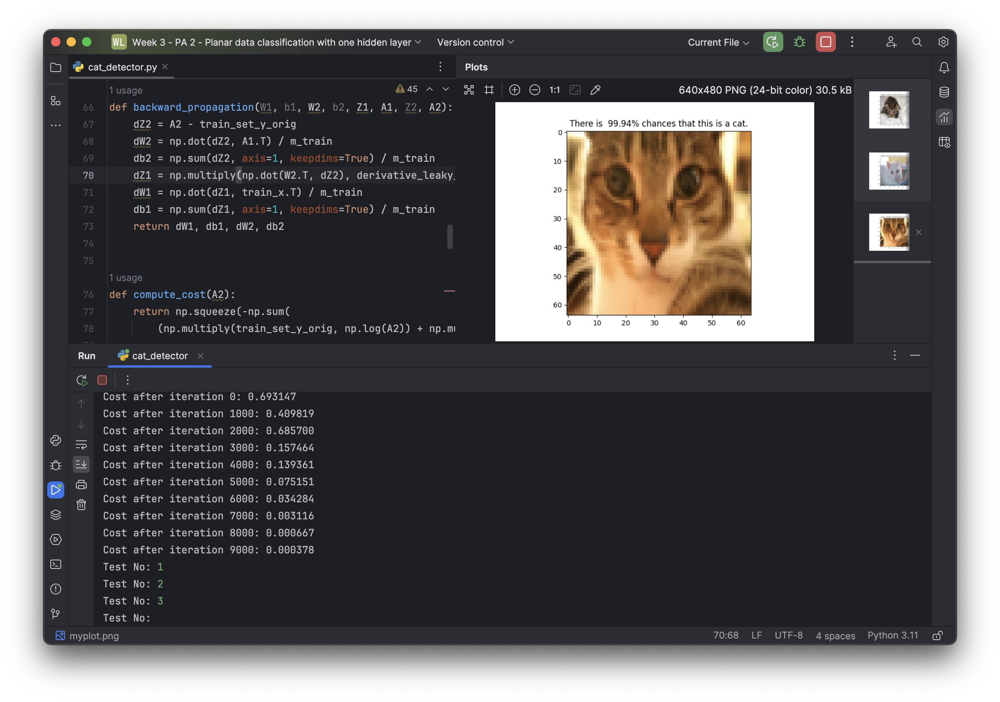
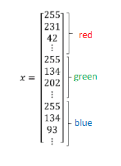
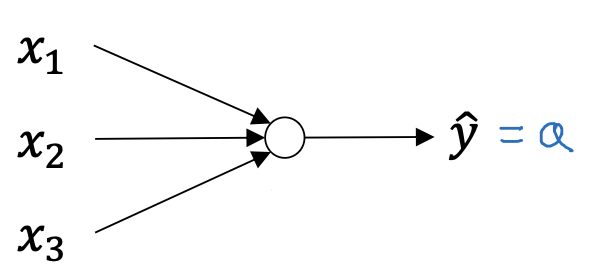
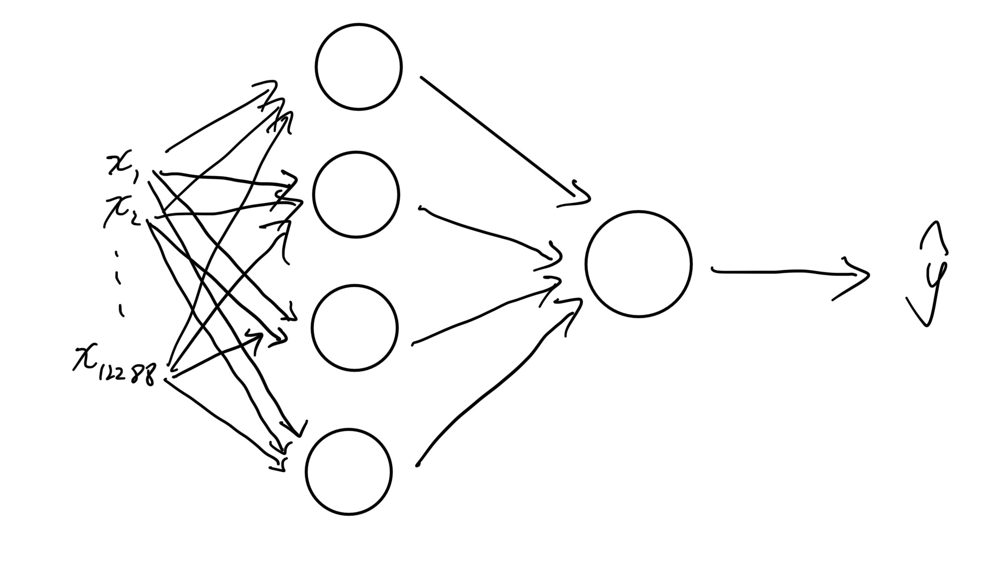

# Example: Cat Detection with Shallow Neural Network

Effect screenshot of the example:



# Data Set

The training set and test set provided for us are a serious of fixed size color pictures. To input them to our neural network, we can use three decimals to represent a pixel, which is (R, G, B) where each one is a decimal between 0 and 1 calculated by dividing an integer between 0 and 255 by 255. Combining all decimals into one matrix, we can have the data set.



One picture has 4096 pixels, so our training set matrix has 4096*3=12288 rows.

Both the training set and the test set have multiple examples, to implement vectorization, use one matrix column to represent one example. So, assuming that we have `m` examples , the dimension of $X$ is 12288 x m and the dimension of $Y$ is 1 x m (the value of $Y$ is either 1 or 0).

# Implementing with Simple Logistic Regression

We can use a simple logistic regression to implement the binary classification task.



The key code is following:

```python
def model(X, Y):
  n_x = X.shape[0] # 12288
  m = X.shape[1] # Quantity of examples
  learning_rate = 1.2
  
  # Initialize the weights and the bias
  W = np.zeros((n_x, 1))
  b = 0
  
  # Gradient descent
  for i in range(10000):
    # Do gradient descent for 10000 iterations
    
    Z = np.dot(W.T, X) + b
    A = sigmoid(Z)
    dZ = A - Y
    dW = np.dot(X, dZ.T) / m
    db = np.sum(dz) / m
    
    W -= learning_rate * dW
    b -= learning_rate * db
    
    return W, b
  
def predict(X_test):
  W, b = model(X_train, Y_train)
  Y_test = sigmoid(np.dot(W.T, X_test) + b)
```


# Implementing with Neural Network

With a simple logistic regression, the prediction function is linear, which is not precious.

A two-layer neural network will be used here to train a more fitting model that is non-linear.

## Building Framework for Neural Network

The neural network we will create like this:



The unit quantity for hidden layer is not fixed, recommending to adjust the quantity manually in multiple times for the best fitting.

Record the layer sizes in code:

```python
def layer_sizes():
  n_x = X_train.shape[0]
  n_h = 4
  n_y = Y_train.shape[0]
  return n_x, n_h, n_y
```


## Choose Activation Function

As a binary classification task, the activation function of the output layer is supposed to be **sigmoid**.

For the hidden layer, we can choose tanh, ReLU or Leaky ReLU. Through the tests, I think **Leaky ReLU** is best for this model. 

For reasons, there are my conclusions through my tests:

- Tanh will have low learning efficiency because the so many features (12288 features) make the values of $W \cdot X$ rather big.
- ReLU may encounter the "Dying ReLU" problem (high probability).

So, implement Leaky ReLU and its derived function now.

```python
def leaky_relu(x):
  return np.where(x > 0, x, 0.01 * x)


def derivative_leaky_relu(x):
  return np.where(x > 0, 1, 0)
```

If you choose tanh, you can just use `np.tanh` method to calculate its value, and its derived function in Python is following:

```python
def derivative_tanh(x):
  return 1 - np.power(np.tanh(x), 2)
```

## 

## Initializing Weights and Biases

In neural network, weights and biases need to be initialized randomly.

```python
def initialize_parameters(n_x, n_h, n_y):
  W1 = np.random.randn(n_h, n_x) * 0.01 # This scale coefficient should be adjusted based on the actual case
  b1 = np.zeros((n_h, 1))
  W2 = np.random.randn(n_y, n_h) * 0.01
  b2 = np.zeros((n_y, 1))
  return W1, b1, W2, b2
```

Known by practice, we can make scale coefficients like the following to avoid a too large value of $WX+b$:

```python
def initialize_parameters(n_x, n_h, n_y):
  W1 = np.random.randn(n_h, n_x) / np.sqrt(n_x) # dividing a square root of the matrix's row size
  b1 = np.zeros((n_h, 1))
  W2 = np.random.randn(n_y, n_h) / np.sqrt(n_h)
  b2 = np.zeros((n_y, 1))
  return W1, b1, W2, b2
```


## Forward Propagation

Before progarming the forward propagation in code, we need to write down the mathematical formulas during forward propagation.

Refer the following formulas:

$Z^{[1]}=W^{[1]}X+b^{[1]}$

$A^{[1]}=max(Z^{[1]}, 0.01 \cdot Z^{[1]})$

$Z^{[2]}=W^{[2]}A^{[1]}+b^{[2]}$

$A^{[2]}=\sigma(Z^{[2]})$

Code:

```python
def forward_propagation(W1, b1, W2, b2, x):
    Z1 = np.dot(W1, x) + b1
    A1 = leaky_relu(Z1)
    Z2 = np.dot(W2, A1) + b2
    A2 = sigmoid(Z2)
    return Z1, A1, Z2, A2
```


Cost can be calculated after forward propagation:

```python
def compute_cost(A2, Y):
    m = Y.shape[1] # Example quantity
    logprobs = np.multiply(np.log(A2), Y) + np.multiply((1 - Y), np.log(1 - A2))
    cost = -np.sum(logprobs) / m
    cost = np.squeeze(cost) # float(cost) may have been deprecated
    return cost
```


## Backward Propagation

Similar as forward propagation, we are supposed to write down the mathematical formulas first:

$dZ^{[2]}=A^{[2]}-Y$

$dW^{[2]}=\frac{1}{m}dZ^{[2]}A^{[1]T}$

$db^{[2]}=\frac{1}{m}np.sum(dZ^{[2]},axis=1,keepdims=True)$

$dZ^{[1]}=W^{[2]T}dZ^{[2]}*g'^{[1]}(Z^{[1]})$

$dW^{[1]}=\frac{1}{m}dZ^{[1]}X^{T}$

$db^{[1]}=\frac{1}{m}np.sum(dZ^{[1]},axis=1,keepdims=True)$

In code, we can use `np.multiply` to do element-wise product.

```python
def backward_propagation(W1, b1, W2, b2, Z1, A1, Z2, A2):
    m = Y.shape[1]
    
    dZ2 = A2 - Y_train
    dW2 = np.dot(dZ2, A1.T) / m
    db2 = np.sum(dZ2, axis=1, keepdims=True) / m
    dZ1 = np.multiply(np.dot(W2.T, dZ2), derivative_leaky_relu(Z1))
    dW1 = np.dot(dZ1, X_train.T) / m
    db1 = np.sum(dZ1, axis=1, keepdims=True) / m
    return dW1, db1, dW2, db2
```


## Gradient Descent

The process of gradient descent like following steps:

1. Prepare $W$ and $b$.
2. Compute $A^{[2]}$ (which is the finial predict result of the neural network) and other procedure values (like $Z^{[1]}$, $A^{[1]}$ and $Z^{[2]}$) by forward propagation.
3. Compute derivatives of $W$ and $b$.
4. Update $W$ and $b$ accorading to $dW$ and $db$.
5. Repeat steps 2~4 for many times.

We can also compute the cost in each iteration.

We can have the code easily:

```python
def update_parameters(W1, b1, W2, b2, dW1, db1, dW2, db2, learning_rate=0.0075):
    # Note: a smaller learning rate can improve prediction accuracy rate.
    
    W1 -= learning_rate * dW1
    b1 -= learning_rate * db1
    W2 -= learning_rate * dW2
    b2 -= learning_rate * db2
    return W1, b1, W2, b2
  

def nn_model():
    n_x, n_h, n_y = layer_sizes()
    W1, b1, W2, b2 = initialize_parameters(n_x, n_h, n_y)

    for i in range(10000):
        Z1, A1, Z2, A2 = forward_propagation(W1, b1, W2, b2, X_train)
        cost = compute_cost(A2, Y_train)
        dW1, db1, dW2, db2 = backward_propagation(W1, b1, W2, b2, Z1, A1, Z2, A2)
        W1, b1, W2, b2 = update_parameters(W1, b1, W2, b2, dW1, db1, dW2, db2)

        if print_cost and i % 1000 == 0:
            print("Cost after iteration %i: %f" % (i, cost))

    return W1, b1, W2, b2
```


## Test with Model

After calculating the trained weights and biases, we can run the forward propagation with them and collect the final result.

Create a function to use our model.

```python
def predict(W1, b1, W2, b2, x):
  Z1, A2, Z2, A2 = forward_propagation(W1, b1, W2, b2, x)
  return A2


def test():
  W1, b1, W2, b2 = nn_model() # Train the model
  Y_prediction = predict(W1, b1, W2, b2, X_test)
  loss = compute_cost(Y_prediction, Y_test) # Compute the loss of the model with the test set
```


## Problems Probably Encountered

- **Prediction result is 0 or 1.** The activation function of the output layer is **sigmoid**. If the computing result is too large, the value of sigmoid may become 0 or 1. To eliminate it, we can just make input values smaller by multiplying 0.1 or 0.01 etc. Notice that **too small** input values will also cause problems.
- **Learning is very and very slow.** The essence of this problem is that $dW$ is very near to 0 or even exactly 0. There are two reasons causing it. One is that $Z^{[1]}$ is too large or too small with activation function **tanh**. The other one is that $W$ or $X$ is **very near to 0** (they have multiplied a very small positive decimal like 0.0001 maybe).