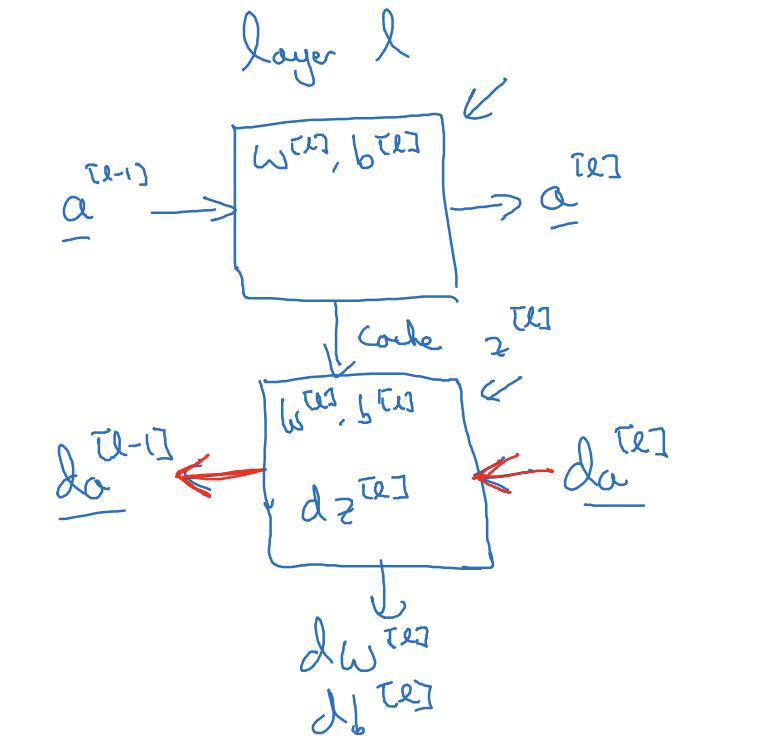
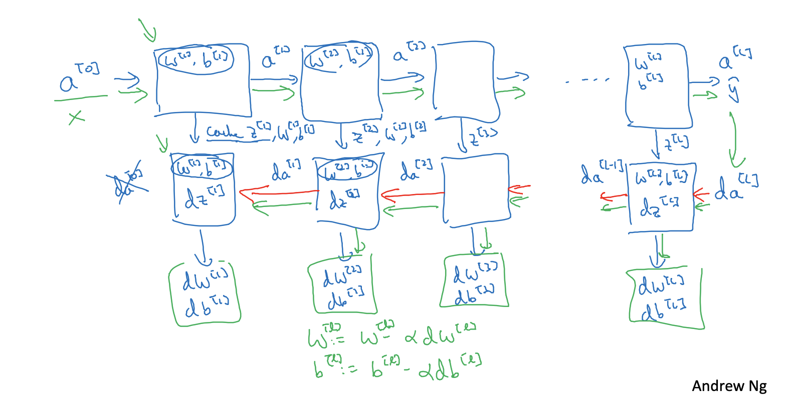

# Deep Neural Network

This essay will introduce deep neural network. For a deep neural network, the quantity of hidden layers generally more than 3.

In fact, the computations and implementation of deep neural network are similar to the one hidden layer neural network that has been introduced before, so that this essay looks like so shorter than the previous one.

# Representation of Deep Neural Network

Here it is a four layer neural network.

  

We can have some parameters (i.e. hyper parameters) from this figure.

$L=4$ (Quantity of Layer)

$n^{[l]}=$ Quantity of Units in Layer $l$

$n^{[1]}=5$

$n^{[2]}=5$

$n^{[3]}=3$

$n^{[4]}=n^{[l]}=1$

$n^{[0]}=n_x=3$

$a^{[l]}=$ Activations in Layer $l$

$a^{[l]}=g^{[l]}(z^{[l]})$

$w^{[l]}=$ Weights for $z^{[l]}$

$b^{[l]}$= Biases for $z^{[l]}$

# Blocks of Deep Neural Network

Building blocks is a way to represent processes of forward and backward functions.

## Example of One Layer

For layer $l$, we have $w^{[l]}$ and $b^{[l]}$ (random initialized).

### Forward Propagation

- Input $a^{[l-1]}$

- Output $a^{[l]}$ and  $cache(z^{[l]})$.

Vectorization:

$Z^{[l]}=W^{[l]}A^{[l-1]}+b^{[l]}$

$A^{[l]}=g^{[l]}(Z^{[l]})$

### Backward Propagation

- Input $a^{[l]}$ and $cache(z^{[l]})$
- output $da^{[l-1]}$, $dw^{[l]}$ and $db^{[l]}$

Vectorization:

$dA^{[l]}=-(\frac{Y}{A^{[l]}}-\frac{1-Y}{1-A^{[l]}})$ *applied in the output layer*

$dZ^{[l]}=dA^{[l]}\ast g^{[l]'}(Z^{[l]})$

$dW^{[l]}=\frac{1}{m}dZ^{[l]}A^{[l-1]T}$

$db^{[l]}=\frac{1}{m}np.sum(dZ^{[l]},axis=1,keepdims=True)$

$dA^{[l-1]}=W^{[l]T}dZ^{[l]}$

So, we can build the blocks for layer $l$ like:

## Example of Deep NN

# Parameters & Hyperparameters

## Parameters

Parameters are weights and biases, such as $W^{[1]}$, $b^{[1]}$, $W^{[2]}$, $b^{[2]}$, $W^{[3]}$, $b^{[3]}$...

## Hypermeters

Hypermeters are values that are set manually to impact parameters, such as learning rate ($\alpha$), iteration number, hidden layer number ($L$), hidden units ($n^{[1]}$, $n^{[2]}$,...), choice of activation function and so on.