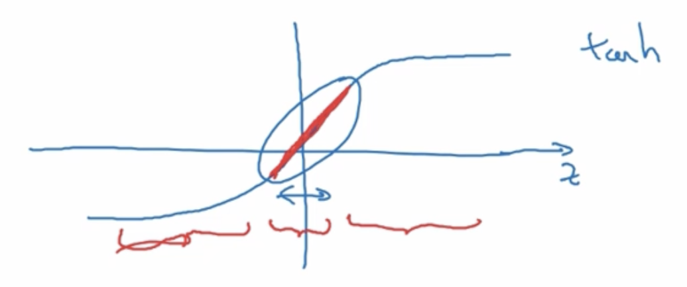
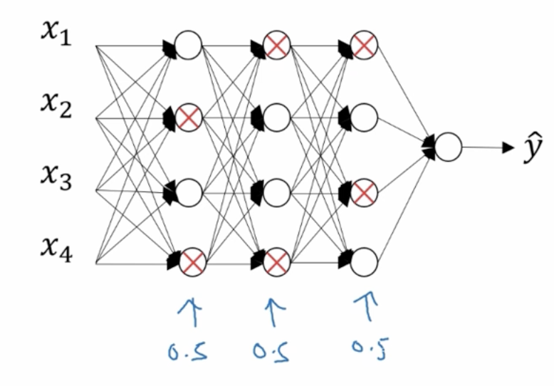
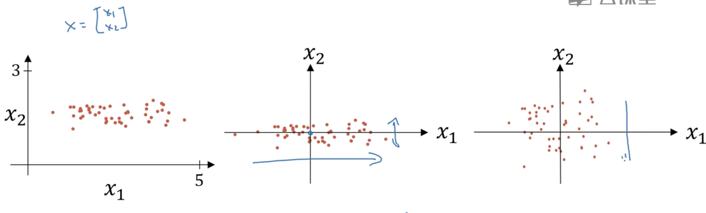
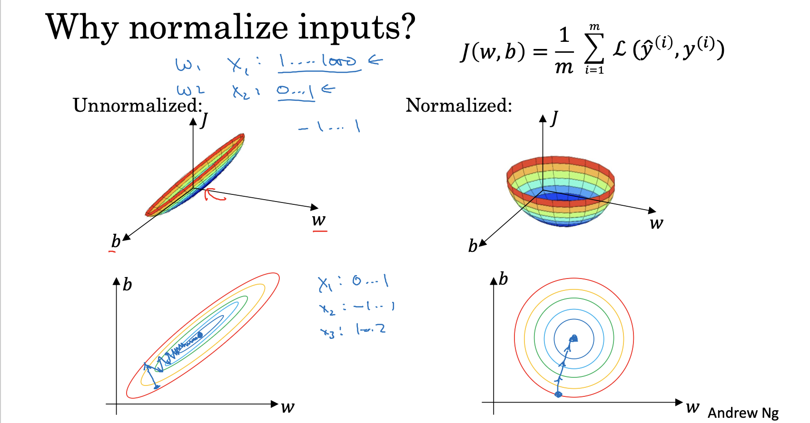

# Utilities of Deep Learning

In this part, data set dividing, bias & variance, regularization, weight initialization, and gradient validation is being introduced.

# Data Set

## Introducing to Dev Set

**Name:** "dev set" is an abbreviation of "development set", also called "Hold-out cross validation set". 

**Effect:** Dev set is used in tuning model's hyperparameters or structure after training.

**Note:** Dev set and test set should come from a same distribution.


## Dividing Data Set

Dev set and test set are supposed to be smaller than training set.

For a small data set, divide data set to 60/20/20 %.

For a big data set, such as having 1,000,000 data, divide data set to 98/1/1 or even 99.5/0.4/0.1%.

**Tip:** Test set can be removed (only dev set).


# Bias & Variance

A brief conclusion:

**High bias:** Underfitting

**High variance:** Overfitting


For example:

|                 | Example 1     | Example 2 | Example 3                 | Example 4               |
| --------------- | ------------- | --------- | ------------------------- | ----------------------- |
| Train set error | 1%            | 15%       | 15%                       | 0.5%                    |
| Dev set error   | 11%           | 16%       | 30%                       | 1%                      |
| Conclusion      | High variance | High bias | High bias & High variance | Low bias & Low variance |


## How to Adjust Bias and Variance?

Experiences here:

**High Bias Problem** 

- Look at training set performance
- Change network (try a bigger network, or search other NN architectures)
- Train longer


**High Variance Problem**

- Look at dev set performance
- Use more data to train the model
- Regularization
- Search other NN architectures


# Regularization

We can use regularization to prevent overfitting or high variance problem.

## L2 Regularization

Add a component to cost function:

$J(w, b)=\frac{1}{m}\sum_{i=1}^{m}L(\hat{y}^{(i)},y^{(i)})+\frac{\lambda}{2m}\sum_{l=1}^{L}\parallel w^{[l]}\parallel ^{2}_F$

Where 

-  $\lambda$ is regularization parameter (written as `lambd` in Python).
-  $\parallel w^{[l]}\parallel ^{2}_F$ is Frobenius Norm (similar to $\parallel w\parallel ^{2}_2$, i.e. Eclidean Norm or L2 Norm, however, Eclidean Norm can only be used with vectors), which equals to $\sum_{i=1}^{n^{[l]}}\sum_{j=1}^{n^{[l-1]}}(w_{ij}^{[l]})^2$. In Python, we can use `np.sum(np.square(parameters[f"W{l}"]))` to calculate it.


### Backward Propagation & Weight Decay

Cost function is changed, so $dw$ is also being changed.

$dw^{[l]}=(\text{from backprop})+\frac{\lambda}{m}w^{[l]}$

After changing, $w^{[l]}$ can be smaller than before, so L2 regularization is also called "weight decay".


### Principle of Regularization Preventing Overfitting

Regularization can get $w$ smaller, so that $z=wa+b$ is also smaller, and that activation function distributes around 0.

Take tanh as an example:



The center of tanh is like a linear function. If activation function is linear, the depth (#layer) and breadth (#unit) of NN can be omitted, so the prediction result is more like underfitting from overfitting.

## Dropout

Dropout aims to reduce breadth of neural network by eliminating units of each layer randomly.



This figure shows that units can be eliminated with a possibility of 50%. 

### Implementing Dropout (Inverted Dropout)

Eliminating should be applied on every layer, using layer $l=3$ as an example.

Do operations below in forward propagation.

- Define keep-prob=0.8 to indicate every unit in this layer can be reserved with a possibility of 80%.
- Define the eliminating matrix $d^{[3]}$, with the same shape as $a^{[3]}$, where 1 indicates reserved units and 0 indicates eliminated units.
- Let $a^{[3]}=a^{[3]}*d^{[3]}$ (Elementwise product). Now, some elements of $a^{[3]}$ is 0.
- $a^{[3]}=a^{{[3]}}\div \text{keep-prob}$. This is a key step, because eliminating some units can lead to the smaller output value of neural network (equivalently multiply about 80%), so, to get an effective output value, we need to divide keep-prob.
  - **Further explanation:** Why is the output value ($\hat{y}$) of neural network smaller? We have eliminated some neurons, so they became 0 in matrices $Z$, $A$, and $dZ$, $dA$, but their dimensions did not changed, and therefore the calculated value of matrix multiplication in the next layer can be smaller.

### Attention

- Matrix $d$ should be stored, because you need to apply in backward propagation, too. (Multiply $dA$ by $d$, and divide by keep-prob.)

- Do not use dropout (or other regularization method) if do not encounter overfitting.
- Recommend using dropout only in large layers (have more units than others), which means that set keep-prob to 1 in other layers that do not use dropout.
- Dropout has randomness, so cost function cannot be used for debugging (because cost function may different in every running).

## Other Methods

- **Data augmentation:** Augment training data to reduce error, such as the side face of a cat, or the other styles of writing a number.
- **Early stopping:** Early stop the gradient descent at a time that both data set error and training error are low.

# Normalizing Inputs

Normalize inputs of data set to produce a better prediction standard.

## Two Steps to Normalize Data Set



1. Subtract out the mean (or Zero out the mean)

   Move training set to the origin point.

   $\mu=\frac{1}{m}\sum_{i=1}^{m}x^{(i)}$

   $x:=x-\mu$

2. Normalize the variances

   Because the feature $x_1$ has a much larger variance than the feature $x_2$.

   $\sigma^{2}=\frac{1}{m}\sum_{i=1}^{m}x^{(i)}**2$ (The square of $x$ is elementwise.)

   $x/=\sigma^{2}$

Attention: Test set also needs to be normalized.


## Effect of Normalization

Cost function has two arguments, $J(w,b)$.

Unnormalized: 

Assume $x_1$ ranges from 0 to 1000, and $x_2$ ranges from 0 to 1, then the model will be more sensitive to changes in large values.

In gradient descent, if $w_1$ changes a little bit, $J$ will have a so large change (like the narrow direction of the figure below). On the contrary, $w_2$ needs so many times to get into the lowest point of $J$.



# Weights Initialization

## Vanishing/Exploding Gradients

If initialized $w$ < $I$ (or $w$ > $I$), with the number of layers much large, all layers' $w$ will multiply together, and $\hat{y}$ will be so small (or so large). Moreover, if the number of layer's units is so large (or data set has so many features), there is also vanishment/exploding.

## How to Initializing Weights to Ease Vanishment/Exploding

If hidden layer's activation function is that, just multiply its corresponding value with weights:

- ReLU: $\sqrt{\frac{2}{\text{Column Size}}}$
- Tanh: $\sqrt{\frac{1}{\text{Column Size}}}$

Example: `w[l]=np.random.randn(shape) * np.sqrt(2/n[l-1])`

# Gradient Validation

To avoid errors in backward propagation, we can judge whether the derivatives are correct or not with gradient validation.


## Calculus Principle

Known that:

$\frac{df}{d\theta}=\lim_{\epsilon \to 0}\frac{f(\theta + \epsilon)-f(\theta)}{\epsilon}$

So, we can choose a much small $\epsilon$ to estimate the derivative.

By experiment, the following equation has a more precise result:

$\frac{df}{d\theta}=\lim_{\epsilon \to 0}\frac{f(\theta + \epsilon)-f(\theta - \epsilon)}{2\epsilon}$


## Gradient Validation for Neural Network

### Concatenating Parameters Into One Theta

$\theta=[W^{[1]}, b^{[1]}, ..., W^{[L]}, b^{[L]}]$ *Reshape all parameter matrices into 1 dimension first, same as below.*

$d\theta=[dW^{[1]}, db^{[1]}, ..., dW^{[L]}, db^{[L]}]$


### Calculating Approximate Derivatives

Calculate the approximate derivative for each parameter, and make up all the approximate derivatives into one vector called $d\theta_{approx}$.

For each `i`:

$d\theta_{approx}[i]=\frac{J(\theta_1, \theta_2,...,\theta_i+\epsilon,...)-J(\theta_1, \theta_2,...,\theta_i-\epsilon,...)}{2\epsilon}$

where $\epsilon=10^{-7}$


### Calculating Difference between Gradient Vector and Approximate Vector

Use Eclidean norm to compute difference:

Check $\frac{||d\theta_{approx}-d\theta||_2}{||d\theta_{approx}||_2+||d\theta||_2}\approx 10^{-7}$

If the difference is much larger than $10^{-7}$ such as $10^{-3}$, the derivatives in the code may be wrong. We should look at every $d\theta_{approx}[i]$ to identify the wrong derivative.


Calculate difference in Python:

```python
difference = np.linalg.norm(grad_approx - grad) / (np.linalg.norm(grad_approx) + np.linalg.norm(grad))
```


### What to Pay Attention

- Only run gradient validation in debugging, because it is so slow.
- If use L2 regularization, do not forget the regularization component when computing cost function.
- Do not work with dropout, because that will produce an unclear cost function definition.

- Run at random initialization; perhaps again after some training.