# Optimization Algorithms

Ways to optimize shallow neural network like **Mini-batch**, **Momentum Gradient Descent**, **RMSprop** and **Adam Optimization Algorithm** are introduced.

# Mini-batch

## Introduction

We uses to compute all examples at once by combining them into a matrix $X$.

However, when the number of examples is too large, such as $m=5,000,000,000$, the **memory** may be not enough and vectorization is also **inefficient**. So, we can reduce the sizes of matrices and increase the count of loops.

Mini-batch means to divide examples into many same size groups, and every group is a part of training sets. For mini-batch group $t$, we mark the training set as $(X^{\{t\}}, Y^{\{t\}})$.

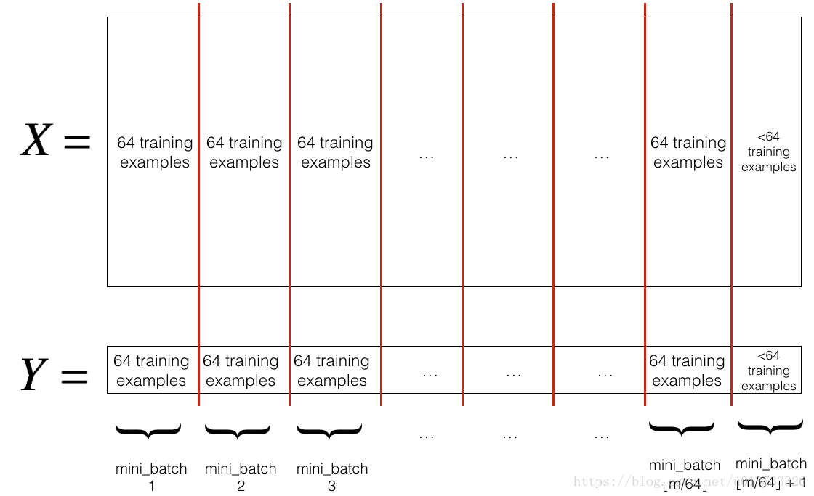

**Note:** To avoid a too strong dependence between the trained model and the training set order (**this may leads to falling into the local optimum point**), we usually **ramdomly shuffle (increasing noise)** training set before dividing mini-batches. There is an example to shuffle training set randomly:

```python
permutation = np.random.permutation(m)  # Generate a ramdom permutation from 0 to m-1
shuffled_X = X[:, permutation]
shuffled_Y = Y[:, permutation]
```

On **every iteration**, we need to generate a **new** random mini-batches.


## Extremes of Mini-batch (Stochastic or Batch)

The value range of mini-batch size is $[1, m]$. 

- When the size is **1**, every mini-batch has only one example, so the speed acceleration from vectorization is lost. We call this situation **Stochastic Gradient Descent (SGD)**.

- When the size is **m**, every iteration, all examples can be computed at once with vectorization. This is the traditional gradient descent we used, it can be called **Batch Gradient Descent** or just Gradient Descent.

### Comparison Between SGD and Batch Gradient Descent


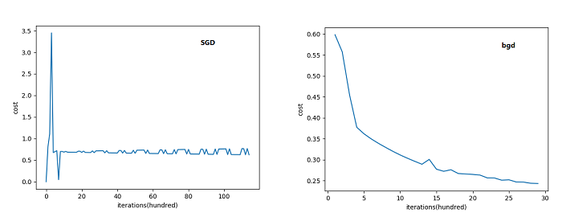

SGD's cost function descenting is **choppy** (in fact mini-batch's gradient descent is mostly more choopy than Batch Gradient Descent) but Batch Gradient Descent is more smooth. Because when mini-batch size is less than $m$, at every mini-batch, the **example(s)** that we used to adjust $w$ and $b$ is different.


## Comparison Between Mini-batch and Non-vectorization Batch Gradient Descent

We must bring a **for-loop** into our gradient descent when implementing a mini-batch. Similarily, before applying vectorization into Batch Gradient Descent, we also need to use for-loop to iterate all examples.

To distinguish them, there are basic program outlines of Batch Gradient Descent (vectorization), Batch Gradient Descent (non-vectorization) and Mini-batch Gradient Descent:

```python 
# Vectorized Batch Gradient Descent
for _ in range(num_iteration):
  # TODO: Forward Propagation
  # TODO: Backward Propagation
  # TODO: Update Parameters
  
# Non-Vectorized Batch Gradient Descent
for _ in range(num_iteration):
  for i in range(m):
    # TODO: Forward Propagation
    # TODO: Backward Propagation: Calculate dz for all layers
    # TODO: Backward Propagation: for l in reversed(range(1, L + 1)): dw[l] += ...; db[l] +=...
  # TODO: Backward Propagation: for l in reversed(range(1, L + 1)): dw[l] /= m; db[l] /= m
  # TODO: Update Parameters
  
# Mini-batch Gradient Descent
for _ in range(num_iteration):
  for minibatch in minibatches:
    # TODO: Forward Propagation of current minibatch
    # TODO: Backward Propagation
    # TODO: Update Parameters
    
```

Conclusion: Non-Vectorized Batch Gradient Descent uses the loop to replace the effect of matrix multiplication. Mini-batch Gradient Descent uses the loop to train a part of examples separately.


# Exponentially Weighted Averages

This part is the base of Momentum Gradient Descent, RMSprop and Adam Algorithm.

When we calculate the average from $\theta_0$ to $\theta_t$, such as calculating the average temperature of a period of days, where obviously the temperature of the yesterday ($\theta_{t-1}$) occupied a bigger weight, if we want the weights that are close to the $\theta_t$ to be bigger, the exponentially weighted average is useful for us.


Expression:

$v_t=\beta \ast v_{t-1} + (1-\beta) \ast \theta_t$ 

where 

$v_t$ is the average of $\theta_t$ over time;

$v_{t-1}$ is the average of $\theta_{t-1}$ over time;

$\beta$ is the adjustive hyper parameter, bigger $\beta$, historic temperature bigger weight 


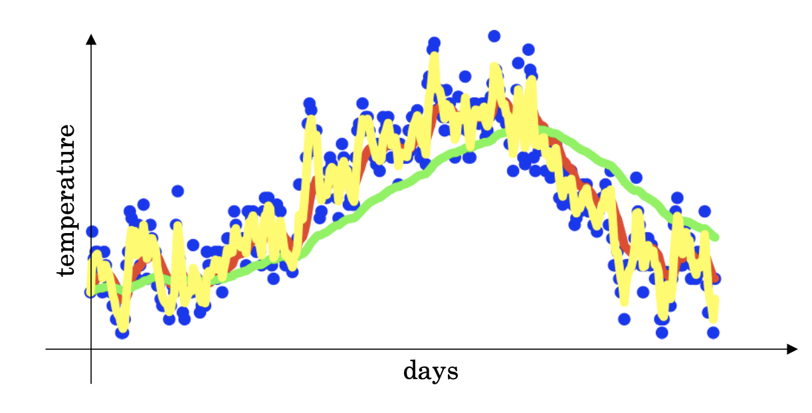

In this picture:

- Red line: $\beta=0.9$
- Green line: $\beta=0.98$
- Yellow line: $\beta=0.5$

## Principle

Unfolding:

$v_0=0$

$v_1=(1-\beta) \ast \theta_1$

$v_2=\beta \ast (1-\beta) \ast \theta_1+(1-\beta)*\theta_2$

$v_3=\beta^2 \ast (1-\beta) \ast \theta_1+ \beta \ast(1-\beta)*\theta_2 + (1-\beta) \ast \theta_3$

......

$v_t=\beta^{t-1} \ast (1-\beta) \ast \theta_1 + \beta^{t-2} \ast \theta_2 + ... + \beta \ast(1-\beta)*\theta_{t-1} + (1-\beta) \ast \theta_t$


With $t$ larger, the weights of the historic average temperature are declined exponentially.

Suppose $\beta=0.9$, $v_{11}=0.9^{10} \ast 0.1 \ast \theta_1 + ...$.

$0.9^{10} \approx 0.35 \approx \frac{1}{e}$

When $\theta_1$ declines to about one third of $v_t$, it can be ignored. In this instance, when $t=11$, $\theta_1$ declines to only one third of the weight of $v_{11}$, so we can say when $\beta=0.9$, we are computing the exponentially weighted average that only foucus on the last 10 days temperature.

Generally, 

$(1-\epsilon)^{\frac{1}{\epsilon}}=\frac{1}{e}$

So, if $\beta=0.98$, we can let $\epsilon=0.02$, and have

$(1-0.02)^{\frac{1}{0.02}}=\frac{1}{e}$

$=0.98^{50}=\frac{1}{e}$

We can conclude that when $\beta=0.98$, we focus on the last 50 days temperature.


## Bias Correction

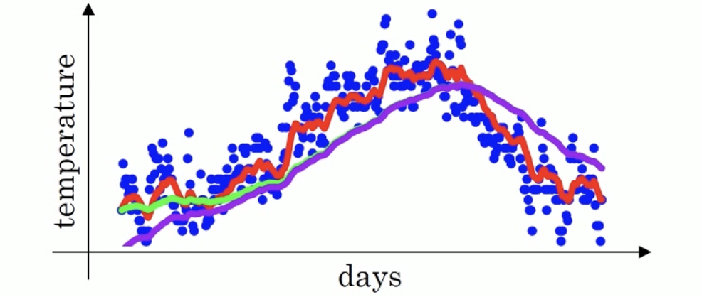

In fact, without any bias correction, we will be having the purple line instead of the green one.

To make the start stage of the curve higher, we can update $v_t$ to $v_t^{corrected}=\frac{v_t}{1-\beta^t}$, so that when $t$ is close to 0, $\beta^t$ will be large (note that $\beta$ is less than 1, and we assume $\beta=0.98$ here). Therefore $1-\beta^t$ will be a decimal that is less than 1 and close to 0, so that the corrected value can be larger. Meanwhile, with $t$ larger, $1-\beta^t$ will be close to 1, so that the purple line overlaps the green line.

# Momentum Gradient Descent

**Problems Need to Be Fixed:** In the traditional gradient descent that we used before, $w$ and $b$ change with $dw$ and $db$ that are derivatives indicating the slope of current point ($w$ and $b$) on the cost function, which will form a choppy path into the final point, especially in high dimensional .

**Idea:** To reduce the bad performance of gradient descent, we can use **exponential weighted averages** to replace $dw$ and $db$ with their averages when applying parameter updating.


## Intuition Understanding

For intuitively understanding, the cost function whose picture looks like a bowl is painted here:

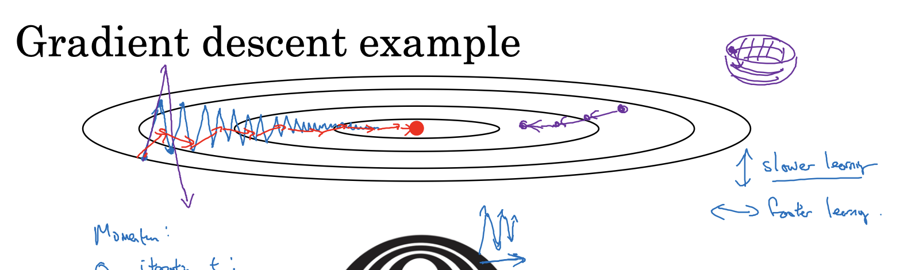

**The red point** is the lowest point (smallest cost). 

For the traditional gradient descent, its descent path is like **the blue line**, which is so choppy that may lead to a slow descent and accidents such as falling into the local lowest point.

**The red line** is the momentum gradient descent, which is more smooth than the blue line and goes forward faster than the blue line, because every movement "velocity" is an average that depends on the historic movement "velocities".

## How to Implement

On iteration `t`:

- Compute $dw$ and $db$ on the current mini-batch.
- $v_{dw}:=\beta v_{dw}+(1-\beta)dw$
- $v_{db}:=\beta v_{db}+(1-\beta)db$

- $w:=w-\alpha v_{dw}$
- $b:=b-\alpha v_{db}$


An analogy between momentum gradient descent and physics ball rolling:

Supposed a ball will roll down on a rough slope, we can compare $v_{dw}$ or $v_{db}$ to the **velocity** of the ball, compare $dw$ or $db$ to the **acceleration** of the ball movement, and compare $\beta$ to the **friction** of the slope.


Notice that we introduced two hype parameters now: $\alpha$ and $\beta$.


# RMSprop

RMSprop stands for root mean square prop. This is another way to accelerate gradient descent.

Here is the implementation of RMSprop, which is similar to momentum gradient descent.

On iteration `t`:

- Compute $dw$ and $db$ on the current mini-batch.
- $S_{dw}:=\beta S_{dw}+(1-\beta)dw^2$ *Note: Attention that the square operation is element-wise.*
- $S_{db}:=\beta S_{db}+(1-\beta)db^2$
- $w:=w-\alpha \frac{dw}{\sqrt{S_{dw}}+\epsilon}$ *Note: $\epsilon$ is used to prevent $S_{dw}$ too close to 0*
- $b:=b-\alpha \frac{db}{\sqrt{S_{db}}+\epsilon}$


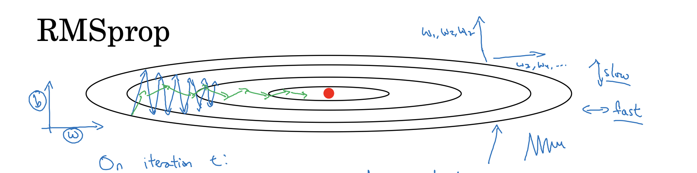

## RMSprop Adjusting Learning Rate Automatically

Supposed that $w$ is the horizontal axis and $b$ is the vertical axis, our purpose is to reduce shakes and go to the red point faster, so we should make $w$ larger and make $b$ smaller. In RMSprop, when $dw$ is large, $S_{dw}$ will be large, so $\frac{dw}{\sqrt{S_{dw}}}$ will be small. Similar as $dw$, $db$ can also be changed "automatically".

If your neural network cannot descend loss efficiently with RMSprop, try a lower $\beta$ hyper parameter, which can make more noise for the gradient process.


# Adam Optimization Algorithm

Adam algorithm is a practical algorithm that is appropriate across various of deep learning architectures. It is basically a combination of momentum gradient descent and RMSprop.


## Implementing Adam Optimization Algorithm

**Remember:** Initialize variables used by Momentum Gradient Descent and RMSprop: $v_{dw}=0$, $s_{dw}=0$, $v_{db}=0$, $s_{db}=0$

On iteration `t`:

- Compute $dw$ and $db$ on the current mini-batch.
- **"Momentum" with hyper parameter $\beta_1$:** $v_{dw}:=\beta_1v_{dw}+(1-\beta_1)dw$, $v_{db}:=\beta_1v_{db}+(1-\beta_1)db$
- **"RMSprop" with hyper parameter $\beta_2$:** $S_{dw}:=\beta_2S_{dw}+(1-\beta_2)dw^2$, $S_{db}:=\beta_2S_{db}+(1-\beta_2)db^2$
- **Bias correction:** $v_{dw}^{corrected}=\frac{v_{dw}}{1-\beta_1^t}$, $v_{db}^{corrected}=\frac{v_{db}}{1-\beta_1^t}$, $s_{dw}^{corrected}=\frac{s_{dw}}{1-\beta_2^t}$, $s_{db}^{corrected}=\frac{s_{db}}{1-\beta^t_2}$
- **Update parameters:** $w:=w-\alpha \frac{v_{dw}^{corrected}}{\sqrt{s_{dw}^{corrected}}+\epsilon}$, $b:=b-\alpha \frac{v_{db}^{corrected}}{\sqrt{s_{db}^{corrected}}+\epsilon}$


## Hyper Parameters

There are common choices of hyper parameters used in Adam algorithm"

$\alpha=\text{needs to be tuned}$

$\beta_1=0.9$

$\beta_2=0.999$

$\epsilon=10^{-8}$


# Learning Rate Decay

Learning rate decay is also a method to accelerate the learning algorithm.

In the early stage of gradient descent, we need a little large learning rate to have a quick descent, but in the final stage, we want a small learning rate to reduce "jumps" around the point of convergence.

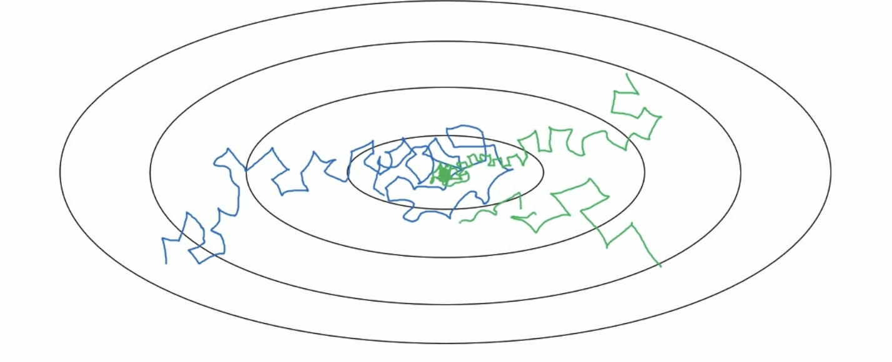

In this picture of cost function, the blue line is the descent path without learning rate decay, but the green line is that.

## Epoch *i*

We can call one iteration as one epoch. One epoch should traverse all mini-batches.

There are some ways to apply learning rate decay:

- $\alpha=\frac{1}{1+(\text{decay-rate})\ast(\text{epoch-num})}\alpha_0$
- $\alpha=\frac{k}{\sqrt{\text{epoch-num}}}\alpha_0$
- Disperse staircase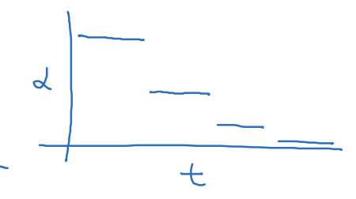
- Manual decay
- ......

# Local Optima in Neural Networks

In neural network (high dimensional cost function), the local optima points in a cost function are saddle points.

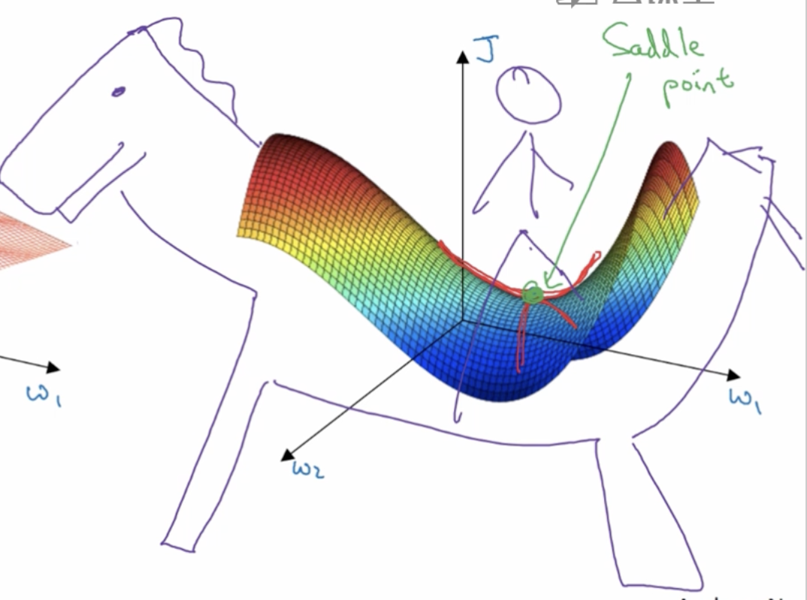

Instead of a hole like this:

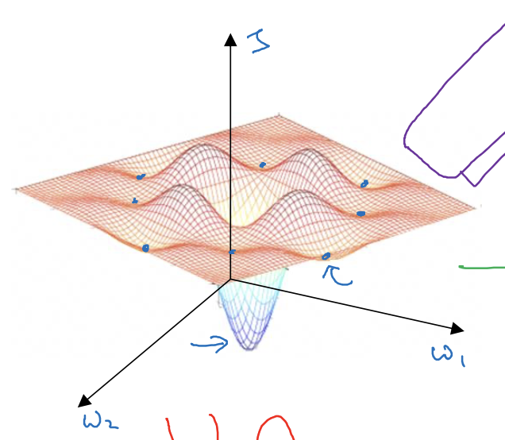

So, the main problem we meet in training neural network is plateaus that will be making learning so slow:

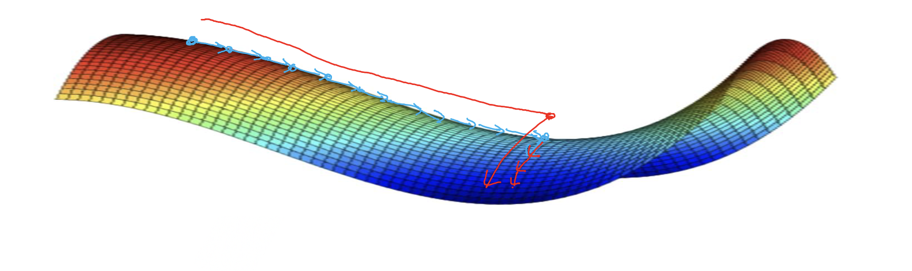

This is why we used many optimization algorithms like RMSprop, momentum gradient descent and Adam optimization algorithm to speed up learning.


# Implementing Mini-batch and Adam Algorithm in Python

```python
# 0. Hyper parameters
beta1 = 0.9
beta2 = 0.999
mini_batch_size = 64
epsilon = 10e-8
num_iteration = 3000
learning_rate = 0.0075

# 1. Initialize parameters for Adam Algorithm
vdW = np.zeros_like(dW)
vdb = np.zeros_like(db)

sdW = np.zeros_like(dW)
sdb = np.zeros_like(db)

# 2. Iteration
for i in range(num_iteration):
  seed += 1  # Make sure mini-batches different on every iteration
  t = 0  # Record the mini-batch traversal times
  for minibatch_X, minibatch_Y in generate_random_mini_batches(X, Y, mini_batch_size, seed):
    forward_propagation(W, b, minibatch_X)
    dW, db = backward_propagation(...)
    
    # 3. Update Adam parameters
    vdW = beta1 * vdW + (1 - beta1) * dW
    vdb = beta1 * vdb + (1 - beta1) * db
    sdW = beta2 * sdw + (1 - beta2) * np.square(dW)
    sdb = beta2 * sdb + (1 - beta2) * np.square(db)
    
    t += 1
    
    # 4. Bias correction
    vdW_corrected = vdW / (1 - np.power(beta1, t))
    vdb_corrected = vdb / (1 - np.power(beta1, t))
    sdW_corrected = sdW / (1 - np.power(beta2, t))
    sdb_corrected = sdb / (1 - np.power(beta2, t))
    
    # 5. Use Adam gradient parameters to update W and b
    adam_dW = vdW_corrected / (np.sqrt(sdW_corrected) + epsilon)
    adam_db = vdb_corrected / (np.sqrt(sdb_corrected) + epsilon)
    
    # 6. Update parameters
    W, b = update_parameters(W, b, adam_dW, adam_db, learning_rate)
```

