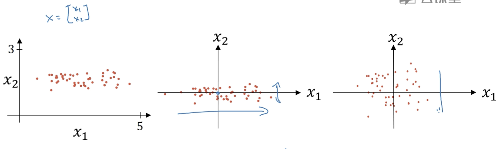

# Tuning Hyperparameters, Batch Norm, Multi-classification & Frameworks

In this chapter, we will learn:

- How to pick an appropriate hyperparameters
- Apply Batch Norm to neural network to make each layer same mean and variance
- Multiclassify with Softmax activation function
- Machine Learning framework - PyTorch (TensorFlow is too outmoded to be used. *Postscript: This article was written in 2024 when Donald Trump won the 47th president-elect of the USA.*)


# Tuning Hyperparameters

It is essential to choose appropriate hyperparameters for our model and methods are introduced here about how to gain the most fitting hyperparameters.


## Choosing Appropriate Hyperparameters by Random Values

### Grid: An inappropriate way to tune hyperparameters

If there are two parameters to be tuned, we can use a grid to choose a hyperparameter combination for test.


In the figure, supposed that Hyperparameter 1 is learning rate ($\alpha$) and Hyperparameter 2 is epsilon ($\epsilon$) of Adam algorithm, we know that $\alpha$ is more important in training process, so we need more choices for Hyperparameter 1.


### Random Values: Recommended way to tune hyperparameters


If we randomly scatter points in the figure, we can have more choices for learning rate instead of only 5 though there are still only 25 combinations.

For more than two hyperparameters, we can add dimensions like the figure showing.


If necessary, we can tune hyperparameters repeatedly to be more precise.


## Deciding Value Ranges of Hyperparameters

### Method 1: Picking values with a same interval

To pick an appropriate value for the number of neurons in layer l ($n^{[l]}$) or the number of layers (#layers or $L$), we can choose them in a number series with a common difference (a same interval).


Python code:

```python
n_l = np.random.randn(50, 100)
```


### Method 2: Picking values with a same ratio

For some small hypermeters like learning rate or $\beta$ in RMSprop, we usually try a new number from another scale when tuning them.

For learning rate, the picking possibilities of range 0.001~0.01 and 0.01~0.1 should be same.


```python
r = -4 * np.random.rand()  # `rand()` can return a random decimal from 0 to 1
learning_rate = 10 ** r. # From 0.0001 to 1
```


For $\beta$ in RMSprop, we usually pick it from 0.9 to 0.999. As $1-\beta\subset[0.001,0.1]$, we can pick a random value for $1-\beta$ like learning rate.

```python
r = np.random.rand() * 2 - 3. # r is in [-3, -1]
one_minus_beta = 10 ** r
beta = 1 - one_minus_beta
```


## Two Ways to Test Model with Different Hyperparameters


# Batch Normalization

In chapter "Utilities of Deep Learning", we have leaned how to normalize inputs to speed up learning. Likewise, we can normalize $a^{[l]}$ (technically $z^{[l]}$) to speed up the training of $w^{[l+1]}$ and $b^{[l+1]}$.

## Z-Score

We can use z-score to describe how many standard deviations a particular value is from the mean of a dataset.

Formula:

$z=\frac{x-\mu}{\sigma}$

Where:

$\mu$ is the mean of the dataset

$\sigma$ is the standard deviation of the dataset (square root of variance $\sigma^2$)


### Distribution of Z-Score

For a series of numbers, their z-scores will be having **mean 0** and **variance 1**.


## Implementation

In forward propagation on layer $l$ (superior notation $[l]$ omitted below), we have $m$ **examples** and $m$ intermediate values: $z^{(1)},...,z^{(m)}$

1. Computing the mean: $\mu=\frac{1}{m}\sum_{i=1}^mz^{(i)}$
2. Computing the variance: $\sigma^2=\frac{1}{m}\sum_{i=1}^m(z^{(i)}-\mu)^2$
3. Normalizing the output (Computing z-score): $z^{(i)}_\text{norm}=\frac{z^{(i)}-\mu}{\sqrt{\sigma^2+\epsilon}}$  *Note: $\epsilon$ is a small value to avoid zero denominator.*
4. Reversing normalization (if we do not want to every layer's outputs have the same mean 0 and variance 1): $\widetilde{z}^{(i)}=\gamma z^{(i)}_\text{norm}+\beta$  *Note: Distinguish between $\beta$ here and $\beta$ in momentum gradient descent and RMSprop.*

Attention that you should replace $\widetilde{Z}^{[l]}$ with $Z^{[l]}$ when computing activation function value.


### Explaination of Reversing Normalization

We may find that if:

$\gamma=\sqrt{\sigma^2+\epsilon}$

$\beta=\mu$

then $\widetilde{z}^{(i)}=z^{(i)}$ i.e. we eliminated the step of normalization.

**Conclusion:** The effect of $\gamma$ and $\beta$ is to explicitly control mean and variance of hidden units, otherwise it is always mean 0 and variance 1.

If we want the layer outputs have other means or variances, we can adjust $\gamma$ and $\beta$. For example, when sigmoid as the output activation function, a lager variance can better take advantage of the non-linearity of sigmoid, instead of only focusing on the linear range in the center of sigmoid.


### Adding Batch Norm (BN) to a Neural Network


We can use gradient descent to descend $\beta$ and $\gamma$ of each layer.

Dimensions of $\gamma$ and $\beta$:

$dim(\gamma^{[l]})=(n^{[l]},1)$

$dim(\beta^{[l]})=(n^{[l]},1)$

The number of  $\gamma$ and $\beta$ is same as the number of neurons.

#### Computing Derivatives of $\beta$ and $\gamma$

Known that:

$\widetilde{Z}^{[l]}=\gamma^{[l]} Z^{[l]}_\text{norm}+\beta^{[l]}$

so

$\frac{\partial \widetilde{Z}^{[l]}}{\partial \gamma^{[l]}}=Z^{[l]}_\text{norm}$

$\frac{\partial L}{\partial \gamma^{[l]}}=\frac{\partial L}{\partial \widetilde{Z}^{[l]}}\frac{\partial \widetilde{Z}^{[l]}}{\partial \gamma^{[l]}}=\frac{\partial L}{\partial \widetilde{Z}^{[l]}}Z^{[l]}_\text{norm}$


$\frac{\partial \widetilde{Z}^{[l]}}{\partial \beta^{[l]}}=1$

$\frac{\partial L}{\partial \beta^{[l]}}=\frac{\partial L}{\partial \widetilde{Z}^{[l]}}\frac{\partial \widetilde{Z}^{[l]}}{\partial \beta^{[l]}}=\frac{\partial L}{\partial \widetilde{Z}^{[l]}}$


Once we computed `dGamma` and `dBeta`, we can update them with:

```python
Gamma[l] = Gamma[l] - learning_rate * dGamma[l]
Beta[l] = Beta[l] - learning_rate * dBeta[l]
```


### Biases Can Be Eliminated in Batch Norm

When calculating $Z^{[l]}$:

$Z^{[l]}=W^{[l]}A^{[l-1]}+b^{[l]}$

In batch norm, we need to compute z-score for $Z^{[l]}$ that $b^{[l]}$ will be eliminated in $Z^{[l]}_\text{norm}$ and $\widetilde{Z}^{[l]}$, so we can cancel the parameter $b$ directly.

In fact, we have used $\beta^{[l]}$ to control the bias of the mean of $\widetilde{Z}^{[l]}$ through:

$\widetilde{Z}^{[l]}=\gamma^{[l]} Z^{[l]}_\text{norm}+\beta^{[l]}$


### Gradient Descent of Batch Norm

```python
for i in range(1, num_iteration + 1):
	for t, (X, Y) in enumerate(minibatches):
  	# TODO: Forward propagation (with computing Z_norm and Z_tilde)
    # TODO: Backward propagation (with computing dGamma and dBeta but without db)
    # Update parameters
    for l in range(1, L + 1):
      W[l] = W[l] - learning_rate * dW[l]
      Beta[l] = Beta[l] - learning_rate * dBeta[l]
      Gamma[l] = Gamma[l] - learning_rate * dGamma[l]
```

Can also implement in Momentum Gradient Descent, RMSprop, or Adam Algorithm...


## Effection of Batch Norm

Batch Norm displaces the output of each hidden layer with its **z-score**, which can effectively elimiate the problem named **Covariate Shift**.


### Covariate Shift Problem

**Main idea:** Supposed the NN has learned the $X\rarr Y$ mapping, if the distribution of $X$ changed, then may need to retrain this NN.

For instance, we have a training data set of all black cats like:


However, the test set is of colorful cats:


Then, our model may cannot classify them correctly.

**Principle:** The change of inputs on distribution may lead to a **huge difference** to layer's outputs. The huge difference affects all layers and finally affects the predicted value $\hat{y}$. However, when applying Batch Norm on the NN, outputs of layers will have mean 0 and variance 1 (on dimension 1), so that the huge difference can be eliminated. Like normalizing inputs, Batch Norm guarantees all output values distributed around $(0, 0)$.




### Batch Norm as Regularization

Batch Norm has a slight **regularization** effect with **mini-batch**.

Each minibatch is generated by randomly picking some training set examples. So, similar to dropout, Batch Norm adds some noise to each hidden layer's activations by computing mean and variance of each minibatch.

Aside, the regularization effect of dropout may be reduced when using a larger minibatch size like 512 instead of 64.


## Batch Norm at Test Time

**Problem:** Batch Norm needs to calculate mean and variance for every mini-batch, which is inefficient at test time because there is only one mini-batch and must calculate mean and variance for a plentiful of data.

**Solution:** Use the **exponently weighted averages** of means and variances at training time. It is efficient way to compute the mean and variance, because what we will do is just: at trainaing time, record the current mean $\mu^{\{t\}}$ at every mini-batch and calculate $\theta_t=\beta \ast \theta_{t-1}+(1-\beta)\ast\mu^{\{t\}}$. Finally, in the last mini-batch, we will get the exponently weighted average and variance of all training data.


**Effection of Using Training Data Averages at Test Time:** It ensures that the model behaves consistently during inference, where computing averages based test set data may not be reliable due to different data distributions from different test set.


# Softmax Regression

We can use softmax as the output layer's activation to achieve multiple classification. Softmax regression generalizes logistic regression to $C$ classes.


## Understanding Softmax

Assuming we have 4 classes (let $C=4$), so we have $Z^{[L]}$ like:


Exponentiate this vector element-wisely:


Softmax is an activation function whose computation is based on the whole vector inputed:


Compared with "Hard max", which is a function outputs only 0 and 1 like: $$\begin{bmatrix}1\\0\\0\\0\end{bmatrix}$$.

## Cross Entropy Loss Function

We have learned binary cross-entropy loss function like:

$L(\hat{y}, y) = -[y log(\hat{y}) + (1-y)log(1-\hat{y})]$

where if $y=1$, bigger $\hat{y}$, smaller loss; and if $y=0$, smaller $\hat{y}$, smaller loss.


For multi-classification problem, we use categorical cross-entropy loss function like:

$L(\hat{y}, y) = -\sum_{j=1}^{C} y_j log(\hat{y}_j)$

Cost function:

$J(w, b) = \frac{\sum_{i=1}^{m}L(\hat{y}^{(i)}, y^{(i)})}{m}$


### One-Hot

To use cross-entropy loss function, our label set must be one-hot form, which is like:


There are 4 classes in this picture, so every $y$ must be a four dimensional vector with only one "1" and others "0".

If you encounter a label set like:

$Y=[1, 2, 0, ...]$

you should turn it into its one-hot form.


## Derivative of Softmax

After calculating, the derivative of softmax is:

$\frac{\partial J}{\partial z^{[L]}}=dz^{[l]}=\hat{y}-y$

which is similar to derivative of sigmoid.


# Build Neural Network with PyTorch

We can use PyTorch to simply build a neural network.

What all we need to do is define a class inheriting `nn.Module`.

```python
# Import necessary libraries
import torch
from torch import nn
from torch.utils.data import TensorDataset, DataLoader  # DataLoader is a good tool to generate mini-batch automatically
```

```python
class MyNeuralNetwork(nn.Module):
  def __init__(self):
    super().__init__()
    self.flatten = nn.Flatten()  # This function can convert a [12, 14, 14] tensor to a [12, 14 * 14] tensor, where 12 indicates the number of examples.
    self.linear_relu_stack = nn.Sequential(
            nn.Linear(14 * 14, 512),  # W1.shape = [512, 14*14], i.e. A0 has 14*14 features; 512 neurons in layer 1
            nn.ReLU(),  # Activation function of layer 1
            nn.Linear(512, 512),  # W2.shape = [512, 512], 512 neurons in layer 2
            nn.ReLU(),
            nn.Linear(512, 3)  # The output layer has 3 neurons (for multi-classification with Softmax)
        )
   
  def forward(self, x):
    # This function should not be called manually.

    x = self.flatten(x)
    logits = self.linear_relu_stack(x)
    return logits
```

Our NN has built, let us prepare our data set and hyperparameters.

```python
model = NeuralNetwork()

# Training set
X_train = X_train.reshape(1080, 64 * 64 * 3)  # 1080 pictures that is 64x64 pixels where one pixel includes RGB 3 channels
Y_train = Y_train.reshape(1080, )  # Y_train is not a one-hot set. It's like [5, 0, 2, ...]

# Test set
X_test = X_test.reshape(120, 64 * 64 * 3)  # 120 test pictures
Y_test = Y_test.reshape(120, )

# Hyperparameters
learning_rate = 0.001
epochs = 100
minibatch_size = 32

# Loss function
loss_fn = nn.CrossEntropyLoss()  # Combining nn.LogSoftmax and nn.NLLLoss

# Optimizer, like SGD, Adam, ...
optimizer = torch.optim.Adam(model.parameters(), lr=learning_rate)
```

Prepare DataLoader (prepare mini-batches)

```python
train_dataset = TensorDataset(X_train, Y_train)
test_dataset = TensorDataset(X_test, Y_test)

train_dataloader = DataLoader(train_dataset, batch_size=minibatch_size, shuffle=True)
test_dataloader = DataLoader(test_dataset, batch_size=minibatch_size, shuffle=True)
```

Before starting gradient descent loop, we must create `train_loop` and `test_loop` which are run at every epoch (iteration).

```python
def train_loop(dataloader, model, loss_fn, optimizer):
    model.train()  # Mark model into training mode
    
    # Start mini-batch loop
    for batch, (X, Y) in enumerate(dataloader):
        # Forward propagation
        pred = model(X)
        loss = loss_fn(pred, Y)
        
        # Backward propagation
        loss.backward()  # Calculating derivatives for leaf nodes in computational graph (referring to https://pytorch.org/tutorials/beginner/basics/autogradqs_tutorial.html#tensors-functions-and-computational-graph)
        optimizer.step()  # Calculate Adam parameters
        optimizer.zero_grad()  # We'd like to reset dw, db and so on at the next mini-batch loop
        
        if batch % 10 == 0:
            print(f"[{batch * minibatch_size + len(X):>5d}/{len(dataloader.dataset):>5d}] Loss: {loss.item():>7f}")
    
def test_loop(dataloader, model, loss_fn):
    model.eval()  # Mark model into evaluation mode
    
    test_loss, correct = 0, 0
    
    with torch.no_grad():  # This is required to prevent computing dw, db and so on
        for X, Y in dataloader:
            pred = model(X)
            test_loss += loss_fn(pred, Y).item()
            correct += (pred.argmax(1) == Y).type(torch.float).sum().item()
    
    test_loss /= len(dataloader)
    correct /= len(dataloader.dataset)
    
    print(f"Test loss: {test_loss:>7f}\nTest accuracy: {correct*100:>0.1f}%\n")
```

Gradient descent loop

```python
for t in range(epochs):
    print(f"Epoch {t+1}/{epochs}:")
    train_loop(train_dataloader, model, loss_fn, optimizer)
    test_loop(test_dataloader, model, loss_fn)
print("Done")
```

Now we can interact with our model

```python
index_of_test_set = int(input(f"Enter the index of test set (0~{m_test-1}): "))
with torch.no_grad():
    pred = model(X_test[index_of_test_set].reshape(1, -1))
    plt.imshow(test_set_x_orig[index_of_test_set])
    print(f"Class: {pred.argmax(1).item()}")
```

