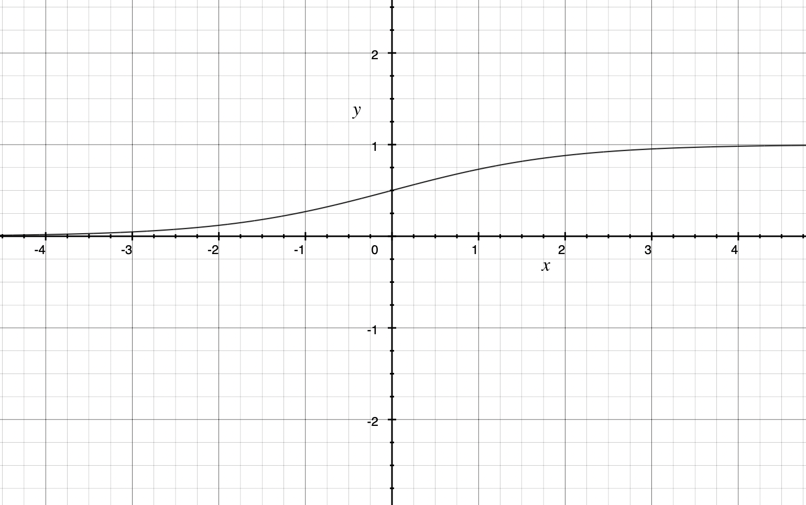
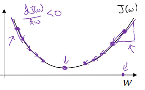
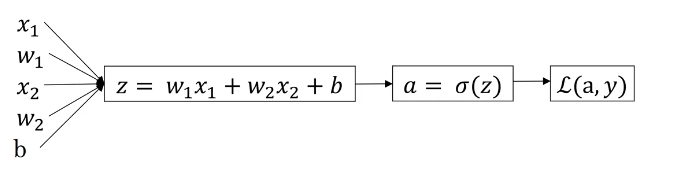

## Binary Classification

**Definition:** For a problem whose results are **discrete**, divide it into two extreme values that are 0 and 1.

### Sigmoid Activation Function

$σ(z) = \frac{1}{1+e^{-z}}​$ 



Greater "$z​$", more tending to 1 result.


## Logistic Regression

Given "$x​$", assume that $\hat{y}=P(y=1|x), 0 \leqslant  \hat{y} \leqslant  1​$ 

$\hat{y} = σ(w^Tx+b)$ 

### Loss Function

Assuming that "$x = A, y = 1;x = B, y = 0​$", when "$x​$" was substituted into the above equation, we hope that "$\hat{y}​$" can tend to 1 or 0 as far as possible.

So, the Loss function is introduced here.

$L(\hat{y}, y) = \frac{(y - \hat{y})^2}{2}​$ (Inappropriate to use it as it's difficult to find the global lowest point.)

$L(\hat{y}, y) = -[y log(\hat{y}) + (1-\hat{y})log(1-\hat{y})]$ (Convex function, whose second derivative is nonnegative, shape-like ∪.)

### Cost Function

There is more than one example in general, so, we can calculate the average of the loss function (substituting all the examples) to ensure the best parameters $w$ and $b$ for the overall examples.

$J(w, b) = \frac{\sum_{i=1}^{m}L(\hat{y}^{(i)}, y^{(i)})}{m}​$ 

## Gradient Descent

Use **Gradient Descent** to reduce the value of the cost function to get better parameters $w$ and $b$.

### Principle

We have learned that the cost function's figure (seam as the loss function's) is convex, so, we need to adjust the two parameters to make the cost function minimum.



If we are at the high point of the figure (e.g. the left point marked with an arrow), to get into the lowest point, we need to make the $w​$ greater. We can make $w​$ minus its partial derivative ($\frac{dJ(w, b)}{dw}​$, the value is negative in the current situation because of the decreasing part around this point). 

### Learning Rate (Represented by ⍺)

The value of the derivative may be too large, so, there may be errors in the result of this process. We can define a small fixed value called the learning rate and multiply it by the value of the derivative, e.g. ⍺ = 0.03.

So, the descent progress can be represented by:

$w := w - ⍺\frac{dJ(w, b)}{dw}​$

$b := b - ⍺\frac{dJ(w, b)}{db}​$ 

Note: In programming code, we can define a variable name `dw` for $\frac{dJ(w, b)}{dw}​$ and `db` for $\frac{dJ(w, b)}{db}​$.

### Implementing the Gradient Descent in Logistic Regression

#### I. When one example with two features



**Cost Function:** For only one example, so the cost function is equal to the loss function.

$J(w, b) = L(a(w, b), y)$

**Gradient Descent Progress**: To demonstrate the progress of gradient descent easily, only one descent progress is demonstrated here.

1. Calculate `dw` and `db`

   $\frac{dL(a, y)}{dw} = \frac{dL(a, y)}{da}\frac{da(z)}{dz}\frac{dz}{dw}$

   $\frac{dL(a, y)}{db} = \frac{dL(a, y)}{da}\frac{da(z)}{dz}\frac{dz}{db}​$

   So, we can calculate $\frac{dL(a, y)}{dz}​$ (which can be represented by `dz` in code) first, and then:

   `dz` = $a - y$

   `dw1` = `dz` * $x_1​$ ($x_1​$ is the result of $\frac{dz}{dw_1}​$)

   `dw2` = similar as above

   `db` = `dz` * 1 (1 is the result of $\frac{dz}{db}$)

2. Adjust $w​$ and $b​$ 

   $w := w - ⍺dw​$ 

   $b := b - ⍺db​$ 

In the actual calculation, the progress above needs to be repeated many times (thousands and thousands of times).

#### II. When m examples with two features

In the actual scenario, the data set usually has the certain number of features but lots of examples.

1. Calculate `dw` and `db`

   Due to m examples now, we can define the $i^{th}​$ example's `dw1` as $dw_1^{(i)}​$ (corresponding to $w_1^{(i)}​$), accordingly $dw_2^{(i)}​$ corresponding to $w_2^{(i)}​$ , and $db^{(i)}​$ corresponding to $b^{(i)}​$.

   So, for $i^{th}$ example, we have:

   $dw_1^{(i)} = \frac{dL(σ(z^{(i)}), y^{(i)})}{dz^{(i)}}x_1^{(i)}, \text{where } z^{(i)} = w_1^{(i)}x_1^{(i)} + w_2^{(i)}x_2^{(i)} + b^{(i)}​$. 

   $dw_2^{(i)} = \text{similar as above}​$

   $db^{(i)} = \frac{dL(σ(z^{(i)}), y^{(i)})}{dz^{(i)}}$

   As we use **average** to measure the overall examples, the `dw` and `db` of the cost function should be:

   $dw_1 = \frac{dJ(w, b)}{dw_1} =\frac{1}{m} \frac{dL(a^{(1)},y^{(1)}) + dL(a^{(2)},y^{(2)}) +…+dL(a^{(m)},y^{(m)}) }{dw_1}=\frac{1}{m}(x_1^{(1)}(a^{(1)}-y^{(1)}) + x_1^{(2)}(a^{(2)}-y^{(2)}) +…+ x_1^{(m)}(a^{(m)}-y^{(m)}))$

   $\text{where }a^{(i)}=σ(w_1x_1^{(i)}+w_2x_2^{(i)}+b)$

   The $w_1,w_2,b$ that appeared above the equation are cost function's parameters ($J(w_1,w_2,b)$), all of them set to 0 in default.

2. Adjust $w$ and $b$

   $w := w - ⍺dw$ 

   $b := b - ⍺db$ 

3. Implementing in Pseudocode

   ```pseudocode
   w1 = 0;w2 = 0;b = 0
   
   Loop 5000 times: # 5000 is the number of descent times
   	dw1 = 0;dw2 = 0;db = 0
   	For i=1 to m:
   		z_i = w1 * x1[i] + w2 * x2[i] + b
   		a_i = sigmoid(z_i)
   		dz_i = a_i - y[i]
   		dw1 += dz_i * x1[i]
   		dw2 += dz_i * x2[i]
   		db += dz_i
   	dw1 /= m
   	dw2 /= m
   	db /= m
   	
   	w1 := w1 - ⍺ * dw1
   	w2 := w2 - ⍺ * dw2
   	b := b - ⍺ * db
   ```

   

## Applying the Matrix

If add every example's features to weights and bases over and over again (with loop in program), the efficiency will be so low.

Recommended to use matrix to deal with accumulation problems.

### Converting the Data Set to Matrix

Assume there is a data set with $m$ examples and $n$ features.

$X = \begin{bmatrix}
x_1^{(1)} & x_1^{(2)} & x_1^{(3)} & \cdots  & x_1^{(m)} \\
x_2^{(1)} & x_2^{(2)} & x_2^{(3)} & \cdots & x_2^{(m)} \\
x_3^{(1)} & x_3^{(2)} & x_3^{(3)} & \cdots & x_3^{(m)} \\
x_4^{(1)} & x_4^{(2)} & x_4^{(3)} & \cdots & x_4^{(m)} \\
\vdots  & \vdots  & \vdots & \ddots  & \vdots    \\
x_n^{(1)} & x_n^{(2)} & x_n^{(3)} & \cdots & x_n^{(m)}
\end{bmatrix}$

One column is one example, and one row is one type of feature.

$Y = \begin{bmatrix}
y^{(1)} & y^{(2)} & y^{(3)} & \cdots  & y^{(m)}
\end{bmatrix}​$

$W = \begin{bmatrix}
w_1 \\
w_2 \\
w_3 \\w_4\\
\vdots  \\
w_n \\\end{bmatrix}$

### Using the Matrix in Calculation

1. Calculate Z parameter of sigmoid

   $z^{(i)} = w_1x_1^{(i)} + w_2x_2^{(i)} +…+ w_nx_n^{(i)} + b$

   $Z = W^TX+b =\begin{bmatrix}
   z^{(1)} & z^{(2)} & z^{(3)} & \cdots  & z^{(m)}
   \end{bmatrix}$

2. Calculate derivative parameters

   $dz = A - Y = \begin{bmatrix}
   a^{(1)} - y^{(1)} & a^{(2)} - y^{(2)} & a^{(3)} - y^{(3)} & \cdots  & a^{(m)} - y^{(m)}
   \end{bmatrix}$

   $dw = X \bullet dz^T / m$ (`dw`'s shape must be n*1)

   $db = dz \bullet \begin{bmatrix}
   1 \\
   1 \\
   1 \\
   \vdots  \\
   1
   \end{bmatrix} / m​$ (`db`'s shape must be 1*1)

### Implementing in Python

```python
W = np.zeors((n, 1))
b = 0
for _ in range(5000): # 5000 is the number of descent times
  Z = np.dot(W.T, X) + b
  A = sigmoid(Z)
  dz = A - Y
  dw = np.dot(X, dz.T) / m
  db = np.sum(dz) / m
  
  W = W - learning_rate * dw
  b = b - learning_rate * db
```


## Testing the Model with Test Set

We have trained m*1 matrix weights $W$ and basis $b$. Then we need to test our model with test set.

Assuming that the test set is $X_t$, we can predict one of the examples in test set by:

$X_i\text{ is the }i^{th}\text{ column of }X_t​$ 

$\hat{y_i}=σ(W^TX_i+b)​$

The result is a decimal, the closer to 1, the more precise.


